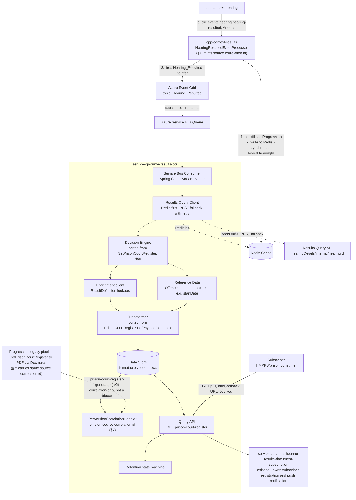
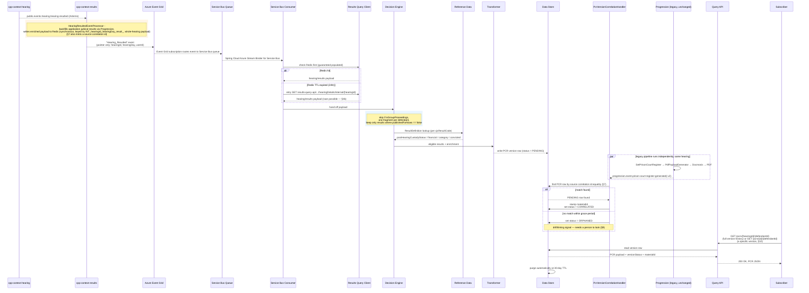
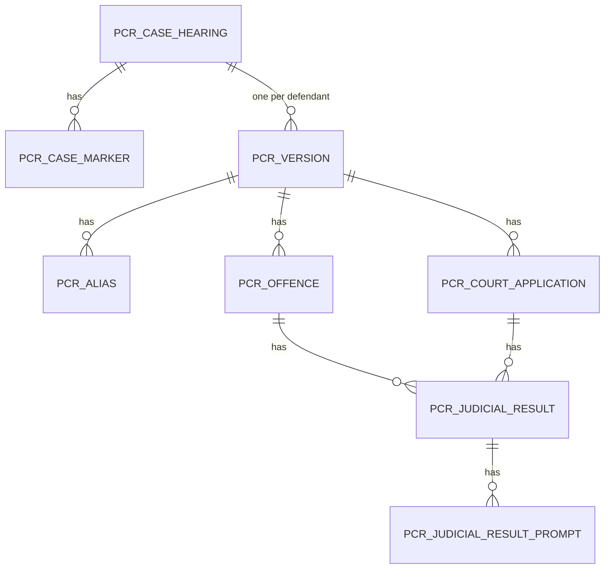

# Prison Court Register (PCR) API Marketplace Service — Design

**Trigger:** Azure Event Grid's `Hearing_Resulted` notification — the same one the legacy Function App already listens to.

**Repos:** `api-cp-crime-results-pcr` (OpenAPI spec) + `service-cp-crime-results-pcr` (Spring Boot service), Modern-by-Default pattern, scaffolded from `api-hmcts-crime-template` / `service-hmcts-crime-springboot-template`.

**Status:** Draft, 16 Jul 2026, built from the epic/stories.

---

## 1. Purpose

Give API Marketplace subscribers (HMPPS/prisons) programmatic, pull-based access to Prison Court Register (PCR) source data — the same underlying content currently distributed as a PDF via the legacy Function App → Progression → Docmosis pipeline — with a way to verify the API payload and the PDF represent the same version of the same PCR.

This is **not** a replacement for existing email/post distribution, and does **not** rebuild subscriber management. It is a new read channel that plugs into the existing subscription/callback infrastructure.

---

## 2. Unit of work: one PCR per defendant per hearing

Today's PCR generation is per defendant, per hearing — `SetPrisonCourtRegister` builds one register fragment per defendant present at a hearing, and within that fragment, all of that defendant's cases/applications *at that hearing* are nested together. A hearing with multiple defendants produces multiple, separate PCR records — never one merged record.

The API preserves this end-to-end: Decision Engine emits one candidate per `(hearingId, defendantId)`; the Data Store keys each version row by `(id, defendantId)` — the actual correlation identity, per §7/§8a — grouped under its `(hearingId, defendantId)` pair; the Query API returns one PCR resource per `(hearingId, defendantId)`, each with its own version history.

---

## 3. Architecture overview

### 3a. Components

### 3b. Sequence — one hearing, end to end

---

## 4. Trigger — Event Grid `Hearing_Resulted`

### 4a. What's confirmed, from tracing the actual code and tech arch's own confirmation

- `Hearing_Resulted` is published by **Results context**, not Hearing context — `HearingResultedEventProcessor.handleHearingResultedPublicEvent` (in `cpp-context-results`, reacting to `public.events.hearing.hearing-resulted`) fires it via `sendEventToGrid`. The name describes what happened, not who's publishing it.
- The event itself is an ID pointer only — `hearingId`, `hearingDay`, `userId`, nothing else (`PrisonCourtRegisterEventGridTrigger/index.js` confirms this is the entire `eventGridEvent.data` shape). It does not carry PCR content.
- The Progression application-results backfill (`applicationResultsEnricher.enrichIfApplicationResultsMissing`) runs **before** the Redis write and **before** the Event Grid publish, in the same method, synchronously. So by the time `Hearing_Resulted` fires, that backfill is already done — this service does not need to replicate it.
- **Redis is written synchronously, in the same method that fires the Event Grid event — guaranteed populated by send time.** The Results context viewstore (what the REST query API reads from) is updated *asynchronously*, separately. Confirmed directly with tech arch: "you can guarantee that the data is in redis by the time you receive the event grid event, but you can't guarantee that the data is available via REST." That's a real race, not a theoretical one, if this service queries REST without checking Redis first.
- Confirmed query endpoint for the REST fallback: `GET {RESULTS_CONTEXT_API_BASE_URI}/results-query-api/query/api/rest/results/hearingDetails/internal/{hearingId}`, `Accept: application/vnd.results.hearing-details-internal+json`.
- **Confirmed Redis key and TTL, from the actual write and read sides — not `(hearingId, defendantId)`.** Write side: `HearingResultedEventProcessor.java` (`cpp-context-results`) builds `cacheKeyInternal = "INT_" + hearingId + "_" + hearingDay + "_result_"` and calls `RedisCacheService.add(key, internalHearingPayload)`; `RedisCacheService` sets it with `redisInternalCacheKeyTTL` (default `86400` seconds — the 24hr TTL referenced below is correct). Read side: the legacy Function App's `HearingResultedCacheQuery/index.js` derives the identical key (`getCacheKey`) before its `GET`. The key is scoped to `hearingId` (+ `hearingDay`) only — the cached value is the **whole hearing's internal payload** (every prosecution case, every defendant), not partitioned per defendant. Any correlation or lookup reasoning that assumes a defendant-scoped Redis key is working from an incorrect premise.

### 4b. What this requires

**Two-step data retrieval.** The event is a pointer, not a payload. This service needs a **Results Query Client** that fetches the actual content after receiving the pointer, before the Decision Engine has anything to run against.

**Redis first, REST as fallback with retry — not something to route around.** Mirrors the Function App's own `HearingResultedCacheQuery` exactly: check Redis first (guaranteed populated), fall back to the REST endpoint above only if the Redis entry has expired (24-hour TTL), and retry that REST call since it can race against the asynchronous viewstore update.

**What that race actually resolves to needs confirming, not assuming.** If the REST call lands inside the window before the viewstore has caught up, there are two very different outcomes, and retry logic can only be built around whichever one is real:
1. **Fails cleanly** — an error or 404 — so the PCR service knows unambiguously to retry or flag it.
2. **Returns something anyway** — an incomplete or stale version of the hearing's results, with no error — so the PCR service treats it as good data, builds a PCR from it, and nobody finds out until someone notices the content is wrong.

Tech arch's own words were "I assume that if the data didn't get into the viewstore by then it fails completely" — that's option 1, but "assume" is the operative word: it's an expectation, not something verified against the actual code or confirmed with the Results team. Confirm which one actually happens (§13, item 2) before building retry logic around option 1. If it's option 2, "did the call succeed" isn't sufficient trust for this service's two-step retrieval — the Results Query Client would need a way to tell "got a response" apart from "got a *complete* one."

**How a Spring Boot service actually receives an Event Grid event — decided.** Checked against Microsoft's own guidance: [Use Azure Event Grid in Spring - Java on Azure | Microsoft Learn](https://learn.microsoft.com/en-us/azure/developer/java/spring-framework/configure-spring-boot-initializer-java-app-with-event-grid). Event Grid doesn't offer a "subscribe like JMS" pull model, and there's no reference pattern in that doc (or elsewhere) for a Spring Boot service receiving Event Grid pushes directly via its own HTTPS webhook — Microsoft's own documented pattern is publish-to-Event-Grid, route the Event Grid subscription into a Service Bus queue, and consume from that queue using ordinary Spring Cloud Azure tooling (`spring-cloud-azure-starter-eventgrid` for publishing, `spring-cloud-azure-stream-binder-servicebus` for consuming). Going with that: the Event Grid subscription for `Hearing_Resulted` routes into a Service Bus queue, and this service consumes it via `spring-cloud-azure-stream-binder-servicebus` — the same library family already used elsewhere, no webhook endpoint or validation handshake to build or secure.

### 4c. Alternatives considered — why not subscribe to Event Grid directly

The obvious "simpler" question is whether this service can subscribe to the `Hearing_Resulted` Event Grid topic directly and drop the Service Bus queue in between. It can't, cleanly — Event Grid is **push-only**, with no JMS/AMQP-style pull subscription. "Direct" therefore has exactly one shape: this service stands up its own public HTTPS webhook and registers it as an Event Grid event handler. That pulls a whole surface *into* the application:

| | Event Grid → Service Bus → consume (chosen) | Direct Event Grid webhook (rejected) |
|---|---|---|
| Code in this service | Consume from a Service Bus queue — tooling already used here | New public HTTPS endpoint, owned and secured by this service |
| Registration | None — infra routing rule (§13 item 1) | Must implement the Event Grid **subscription-validation handshake** |
| Delivery guarantees | Broker gives durability, buffering, retry, dead-lettering | Event Grid retries on a fixed schedule then drops; no buffering unless you add a queue anyway |
| Scale-out | Competing-consumer semantics for free | Hand-rolled |
| New Azure integration | **None** — this service already talks to Service Bus, not Event Grid | New Event Grid integration surface on the consume side |

The decisive point: this service is a **pure consumer** — it never publishes to Event Grid (`cpp-context-results` is the publisher, §4a) — and it already has Service Bus integration established but no Event Grid integration. The Service Bus route therefore needs *zero* Event Grid code in this service; the Event Grid → Service Bus link is a subscription routing rule the platform team configures, not application code. Going direct would trade that routing rule (free) for a webhook/validation/retry surface (not free). The Event Grid topic itself is an upstream dependency either way (§13 item 2), so the intermediary adds no dependency risk. Direct-webhook stays as a fallback only if the Event Grid → Service Bus routing rule can't be provisioned.

**Versioning data source needs investigation.** There's no JMS envelope here to read a `Metadata` interface from. Whatever fills the `sourceEventPosition`/`sharedTime` role has to come from the Results Query Client's response instead (Redis payload or REST fallback), and that response's shape for this purpose hasn't been checked yet — see §7 and §13.

**Two legacy infrastructure dependencies, not one.** Both the Event Grid subscription itself and the Redis cache it relies on are plausibly provisioned as part of the Function App's own Azure resources. If the Function App is retired, this service's trigger *and* its primary data lookup could both disappear at once — worth resolving before this is built on, not after.

---

## 5. Function App analysis — what to port, what not to

Went through the actual Function App code, not assumptions, to separate genuine PCR decision/transform logic from generic NOWS infrastructure that happens to sit alongside it. This is about what happens *after* the service has the hearing/results payload in hand.

### 5a. Port this — genuine PCR decision logic

| Component | What it does | Port as |
|---|---|---|
| `PrisonCourtRegisterOrchestrator` | Skips the whole hearing if `isGroupProceedings == true` | A guard clause at the top of the new service's handler |
| `SetPrisonCourtRegister` / `DefendantContextService.getDefendantContextBaseList()` | Builds one register fragment per defendant on the hearing | The Decision Engine's per-defendant fan-out |
| `RegisterFragmentService.filterJudicialResultsApplicableForRegisters` | Keeps only judicial results where `!judicialResult.publishedForNows` | The actual PCR-eligibility rule — a `ResultDefinition.publishedForNows == false` check per result |
| `RegisterFragmentService.getLatestOrderedDate` / `getHearingDate` | Picks the `registerDate`/hearing date to stamp on the fragment | Small, direct port — date-sorting logic only |
| `PrisonCourtRegisterPdfPayloadGenerator` | The full field mapping to the printed register's shape | The Transformer (§6) |

### 5b. Do not port — belongs to generic NOWS infrastructure or a different concern

| Component | What it actually does | Why it's out of scope here |
|---|---|---|
| `VocabularyService` | Computes ~18 generic flags (custody-location-is-police/prison, appeared-by-video, youth/adult defendant, Welsh/English hearing, CPS-prosecuted, major-creditor lists) | Confirmed by reading `PrisonCourtRegisterPdfPayloadGenerator`: it never reads `vocabulary`. This is shared NOWS document-generation infrastructure computed for many template types, not PCR-specific content. |
| `PrisonCourtRegisterSubscriptions` | Matches a built PCR fragment against `now_subscriptions.isPrisonCourtRegisterSubscription`, using the vocabulary flags above as match criteria | This is subscriber *matching* — deciding which prisons should be notified — not PCR *content*. Stays owned by whatever already does subscriber matching today; this service's job is to expose content via a URL that gets wired into the existing callback, not to replicate who gets called. |
| `PrisonCourtRegisterHandler` / `PrisonCourtRegisterEventProcessor` (Progression side) | Aggregate persistence, actually generating the PDF via Docmosis, sending notification emails | Stays in Progression untouched — this service reads Progression's *output* (§7) for version correlation, never its internals. |

---

## 6. Transformation and enrichment

**Base shape:** ports `PrisonCourtRegisterPdfPayloadGenerator`'s field mapping faithfully — court/custody details, defendant details, offences, applications (full field list already documented in `PCR-HMPPS-FIELD-MAPPING.md`). Source of this data is the Results Query Client's response (§4b), not an event-carried payload. `registerDate` is deliberately excluded — a generation timestamp, not a case fact.

**Deliberately not included, despite being confirmed present in CP's real PCR payload** (`PrisonCourtRegisterPdfPayloadGenerator.java`, cross-validated against the Function App's outbound mapper): prosecution/defence counsel, attending solicitor name, `defendantResults[]`/`caseResults[]` (hearing/case-level free-text results), `gender`/`nationality`, `ljaName`/`courtHouseAddress`, `allocationDecision`/`indicatedPleaValue`. Each exists in CP; none has an identified consumer requirement — unlike `name`/`dateOfBirth`/`address`, which are justified by HMPPS's own Core Person Record matching signals. Full decision record in `api-cp-crime-results-pcr`'s `PCR-HMPPS-FIELD-MAPPING.md` §6. Revisit only if a real requirement surfaces.

**Identity/correlation fields, alongside the ported content:**
- `hearingId`, `defendantId`: the grouping/resource key (§2) — one PCR resource per pair, exposing its full version history.
- Source correlation id (§7; id shape TBC — ULID vs UUID+`sharedResultTime`): a per-version id read from the source payload, *not* minted by this service — not currently present in Redis's payload, propagated in per §7. It's the per-version resource id, the HRDS notification value, and the correlation token; carry it through verbatim, never derive or regenerate it.
- `versionStatus` (`PENDING` / `CORRELATED` / `ORPHANED`) and `materialId`: correlation state, not set by the transformer — the transformer writes the row as `PENDING` and never touches these afterwards.

**Fixed on the way in, not carried forward as bugs:**
- Aliases become a structured array (`{title, firstName, middleName, lastName}`), not the legacy generator's pre-joined display string.
- `applications[].result[]` becomes `{resultCode, resultText}` pairs, matching every other result block, instead of the legacy shape's plain-string-only inconsistency.
- `pleaDate` exposed as its own field rather than string-concatenated onto `pleaValue`.

**Enrichment beyond what the legacy generator does today** — deliberate additions, not scope creep, each tied to a concrete need already identified in `PCR-HMPPS-FIELD-MAPPING.md`:
- `postHearingCustodyStatus` / `financial` / `category` / `convicted` per result, from Reference Data's `ResultDefinition`, keyed on `cjsResultCode`. The legacy generator strips these before they reach the document; this service keeps them, since they're the clearest structured signal for anything downstream that needs to classify custodial vs. non-custodial without parsing `resultText`.
- `judicialResultPrompts[]` (raw label/value/promptReference/type), sourced from the judicial-result domain object directly — not from the legacy generator, which discards prompts entirely. Needed for any consumer building their own logic on top of structured signals like the terrorism/foreign-power/domestic-violence flags, which only exist at this level.
- `custodyLocation`: include it, but be explicit in the API's own documentation that whether it's ever printed on the register could not be independently confirmed — the actual template and its rendering are owned by an external `systemdocgenerator` service, not available for inspection. Don't let a consumer assume it's document-verified just because it's present, and don't assert it's confirmed-unprinted either — both are unverified.

**Decision needed, not yet made:** whether to carry the confirmed-dead legacy fields (`officerInCase`, `parentGuardianName`/`Address1`, and the template's unpopulated `parentGuardianAddress2-5`/`PostCode`) through as permanently-empty fields, or drop them from this service's own model entirely.

---

## 7. Versioning: correlating the API payload with the PDF

The API exposes full version history, not just the latest PCR — a `(hearingId, defendantId)` key has multiple versions once amendments exist, so the key alone can't say which JSON version matches which PDF. Each version needs its own id that **both branches get from the same source event** — minted once at the source, above the fork, and passed down both paths.

- **Data model:** each payload is its own immutable row.
- **New component:** a `PcrVersionCorrelationHandler` — the only code that knows Progression's event exists — subscribes to `prison-court-register-generated-v2`, joins on id equality, and sets `CORRELATED` or `ORPHANED`.
- **Propagation:** source → Redis → Function App → Progression → `prison-court-register-generated-v2` (new field) → HRDS. A four-repo effort (§13) — scope it as such.
- **Generation point:** `cpp-context-results`, just before the Redis write. Confirm the fork to Progression is downstream of it.
- **Freshness:** a fresh id per `Hearing_Resulted` emission (incl. reshare), not a stable per-hearing id.
- **The id is hearing-scoped, not defendant-scoped — every use of it as an identifier must pair it with `defendantId`.** The Redis write it's minted "just before" covers the *whole hearing's payload, every defendant together* (confirmed — one write, not one per defendant), while Progression's PCR generation is genuinely per-defendant (one `add-prison-court-register` command per defendant, singular `defendant` object). So every defendant on a multi-defendant hearing gets the **same** id. The real identity is the composite `(id, defendantId)`, never `id` alone — see §8a and §10.

The id shape is the only open choice:

**Option A (recommended) — ULID.** One field does everything: unique (80 random bits), carries shared time (timestamp prefix), sorts chronologically, and doubles as the resource id. Correlation is a direct equality join on it.

**Option B — UUID `resultEventId` + `sharedResultTime`.** Two fields: a UUID for identity, a separate timestamp for ordering. Same propagation, functionally equivalent. Prefer it only if the public id must not encode a timestamp.

### 7a. Ruled out

- **Correlating on `(hearingId, defendantId)` alone.** Only ever identifies one version per key — doesn't survive amendments, which the API needs to expose.
- **Service-local id.** An id minted inside this service can't correlate — Progression never sees it.
- **Progression's `recorded_date`.** Local persistence bookkeeping, not source correlation data.

### 7b. Open items

- ULID vs UUID+`sharedResultTime` — id shape not locked.
- Should the API serve a version before it reaches `CORRELATED`, or withhold until correlated? (§13)

---

## 8. APIM / Modern-by-Default layering

Mapping the above onto the Spring Boot service pattern, not the legacy Azure Functions/CQRS shape:

| Layer | Responsibility | Ports from |
|---|---|---|
| **Service Bus Consumer** | Receives the `Hearing_Resulted` pointer off the Service Bus queue the Event Grid subscription routes into, via `spring-cloud-azure-stream-binder-servicebus` | New — no equivalent in the legacy pipeline; this is Azure Functions' `EventGridTrigger` binding, which Spring Boot has no direct equivalent of |
| **Results Query Client** | Follow-up lookup to fetch the actual hearing/results payload — Redis first (guaranteed populated by the time `Hearing_Resulted` fires), REST fallback with retry if the Redis entry has expired (24hr TTL) | New — mirrors what `HearingResultedCacheQuery` does today, Redis-first pattern included |
| **Decision Engine** | Group-proceedings skip, per-defendant fan-out, `publishedForNows` eligibility filter | `PrisonCourtRegisterOrchestrator` + `SetPrisonCourtRegister` + `RegisterFragmentService` (§5a) |
| **Enrichment client** | Reference Data calls for `ResultDefinition` fields | To be analysed in the design |
| **Offence metadata client** | Reference Data calls for offence metadata (e.g. `startDate`) | To be analysed in the design |
| **Transformer** | Field mapping to the PCR source payload shape | `PrisonCourtRegisterPdfPayloadGenerator`, with the fixes and additions in §6 |
| **Correlation** | Joins the JSON row to Progression's PDF fact on source correlation id equality via `PcrVersionCorrelationHandler` (id shape TBC, §7); stamps `materialId`/`versionStatus` | New — SRP-isolated component per §7 |
| **Data store** | Immutable version rows, keyed `(id, defendantId)` — schema in §8a | New |
| **Query API (controller)** | `GET` endpoint(s), version history, not a single current blob | New |
| **Retention** | Automatic 30-day TTL purge | New |

No component here talks to Progression except the Version/Correlation handler — everything else only ever reads `versionStatus`/`materialId` once set.

### 8a. Data model — Data Store schema

Normalized, not a JSON blob — matches how CP itself models this domain (`cpp-context-hearing`/`cpp-context-results` use fully normalized JPA entities — `ProsecutionCase`/`Defendant`/`Offence`/`JudicialResult`/`JudicialResultPrompt` are all separate real entity classes there, not JSON columns). The confirmed access patterns (§10) never need partial/granular querying inside a version's content, but normalizing still keeps the schema consistent with CP's own convention and avoids repeating case-level fields identically across every defendant on a hearing.

- **`pcr_case_hearing`** — shared "case at a hearing" parent, avoiding repeating `case_urn`/`hearing_id`/`event_id` identically across every defendant on the same hearing. Also owns the hearing's own facts (`HearingDetails`, minus `nextHearing` — see below) since those are identical for every defendant at that hearing, same reasoning as `caseMarkers`: `id` (surrogate PK), `case_urn`, `hearing_id`, `event_id`, `court_house_code`, `court_house_name`, `hearing_date`, `hearing_outcome`, `warrant_type`, `overall_conviction_date`, `created_at`, `expires_at` — unique on `(case_urn, hearing_id)`. Note: `hearing_outcome`/`warrant_type`/`overall_conviction_date` still have no confirmed CP source (§1's original mapping showed `—` for all three) — these columns exist to match the current API contract, but if that's ever corrected to drop the fields, drop the columns with it.
- **`pcr_case_marker`** — child of `pcr_case_hearing` (case-level, not per-defendant). `id`, `case_hearing_id` (FK), `code`, `description`.
- **`pcr_version`** — one row per defendant's PCR version at that case+hearing; the actual "immutable version row" from §7. `id` + `defendant_id` (composite PK, per the identity note above), `case_hearing_id` (FK), `version_status`, `material_id`, `custody_location`, defendant identity fields (`master_defendant_id`, `title`, `first_name`, `middle_name`, `last_name`, `date_of_birth`, `address_1..5`, `post_code` — embedded, genuinely 1:1, no independent lifecycle), next-appearance fields (embedded, nullable, 1:1 — kept per-defendant rather than promoted to `pcr_case_hearing`, since which offence's next appearance wins is still unconfirmed and may genuinely vary — see §7 of the original field-mapping analysis), `created_at`.
- **`pcr_alias`** — child of `pcr_version` (many per version). `id`, `version_id`+`defendant_id` (composite FK), `title`, `first_name`, `middle_name`, `last_name`.
- **`pcr_offence`** — child of `pcr_version` (many per version). `id` (CP's own offence UUID), `version_id`+`defendant_id` (composite FK), `code`, `title`, `wording`, `start_date`, `end_date`, `listing_number`, `conviction_date`, `plea_value`, `plea_date`, `verdict_code`. (`terrorRelated`/`foreignPowerRelated` deliberately have no column — dropped from the API contract as derived duplicates of `judicialResultPrompts[]`; the raw signal lives only in `pcr_judicial_result_prompt`.)
- **`pcr_court_application`** — child of `pcr_version` (many per version). `id` (CP's own application UUID), `version_id`+`defendant_id` (composite FK), `reference`, `type`, `decision`, `decision_date`, `response`, `response_date`.
- **`pcr_judicial_result`** — child of **either** `pcr_offence` **or** `pcr_court_application` (polymorphic, mirroring the OpenAPI spec's own reuse of `JudicialResult` for both). `id` (surrogate PK), `offence_id` (FK, nullable), `court_application_id` (FK, nullable), a `CHECK` that exactly one parent FK is set, `result_code`, `result_text`, `post_hearing_custody_status`, `financial`, `category`, `convicted`, plus the flattened sentence fields (`concurrent`, `consecutive_to_date`, `consecutive_to_court_name`, `fine_amount`, `imprisonment_period`, `total_custodial_period`).
- **`pcr_judicial_result_prompt`** — child of `pcr_judicial_result` (many per result). `id`, `judicial_result_id` (FK), `label`, `value`, `prompt_reference`, `type`.

**Retention/cascade:** `pcr_version` rows are deleted by their own `expires_at` (§11's TTL-only rule), cascading to their `pcr_alias`/`pcr_offence`/`pcr_court_application`/`pcr_judicial_result`/`pcr_judicial_result_prompt` children. A secondary sweep deletes `pcr_case_hearing` rows once they have zero remaining `pcr_version` children — its lifetime isn't tied to any single defendant's TTL, since siblings on the same hearing may have been generated (and so expire) at slightly different times.

---

## 9. Drift detection via Integration test suite

This is a reimplementation of existing logic, not a call-through, so drift is possible, but the goal is knowing when it happens, not proving upfront it never will.

- **Before launch:** golden-master tests in the service's own integration test suite. Pick real past hearings that already have both a `Hearing_Resulted` occurrence and a generated PDF; feed the resulting Results-query payload through the service's real code path; assert the output matches Progression's own stored `prison_court_register.payload` for that hearing. No mandatory dual-running period as a launch gate.
- **After launch:** the correlator's `ORPHANED` status (§7) is the live version of the same check, for free — a PCR record with no matching PDF fact (or vice versa) is exactly the disagreement the golden-master tests were looking for, just caught automatically. Needs someone actually watching the `ORPHANED` list, not just logging it.

---

## 10. Query API

`GET` endpoint returns the PCR JSON, exposing full version history:
- `GET /pcrs/{hearingId}/{defendantId}` — the resource for that pair, with its full version history, each version tagged with its source correlation id (§7) and `versionStatus`.
- `GET /pcrs/{id}/{defendantId}` — a specific version, addressed by the composite `(id, defendantId)` identity (§7, §8a) — `id` alone is ambiguous on a multi-defendant hearing, since every defendant on it shares the same source correlation id. This pair is what's carried in the notification callback.

URL wired into `service-cp-crime-hearing-results-document-subscription`'s existing subscriber callback payload — that service continues to own subscriber registration and push notification.

---

## 11. Retention

- Retention window: **30 days, fixed.** Purge happens automatically once 30 days have passed. API Marketplace does not maintain PCR data beyond that window.

---

## 12. MVP scope

Story 3's non-amendment phase-1 slice (mirror the Function App, no amendments) ships first, specifically to get early HMPPS feedback on the payload shape before the full service — including amendment handling, versioning, retention — is built.

---

## 13. Cross-team dependencies & open items

| # | Item | Owner / needs input from |
|---|---|---|
| 1 | Provision the Event Grid subscription to route `Hearing_Resulted` into a Service Bus queue, and set up this service's `spring-cloud-azure-stream-binder-servicebus` consumer against it | This team + platform/Azure infra owner |
| 2 | Confirm whether the REST fallback fails cleanly (error/404) or returns an incomplete/stale result with no error when it lands before the viewstore has caught up — read the Results query API's actual code or ask the Results team directly, don't build retry logic around tech arch's "I assume it fails" without checking. If it's the latter, the Results Query Client needs a way to detect an incomplete result, not just a failed call | Results context team |
| 3 | Mint a source correlation id once at source and propagate it end-to-end: Results (source), Redis payload, the legacy Function App, Progression's `PrisonCourtRegisterDocumentRequest` + `prison-court-register-generated-v2` schema, HRDS. Four-repo "rebuild at each hop" effort (§7) — scope as such, not "just add a field" | This team + Results + Progression + Function App owners |
| 4 | Confirm the source mints a **fresh id per `Hearing_Resulted` emission** (incl. reshare), not a stable per-hearing id | Results context team |
| 5 | Id shape: ULID (§7 Option A) vs UUID + `sharedResultTime` (Option B). Not locked | Product/tech-arch decision |
| 6 | Serve pre-`CORRELATED` (provisional) versions, or withhold until correlated? | Product/tech-arch decision, unresolved |
| 7 | Carry the confirmed-dead legacy fields through as always-empty, or drop them from this service's model? | Product decision, unresolved |

---

## 14. Explicitly out of scope

- Rebuilding subscriber registration, matching-rule storage, or push notification — owned by `service-cp-crime-hearing-results-document-subscription` and `now_subscriptions`. Includes `VocabularyService`/`PrisonCourtRegisterSubscriptions`-style matching logic — confirmed not needed here (§5b).
- Changing or retiring existing email/post PCR distribution — additional channel, not a replacement.
- PII redaction — separate, explicitly deferred discussion (Story 1.3).
- CPS-flag/police-flag reference-data lookups — feed a separate VEP/police-notification path, confirmed not needed for prison services.
- `eventTypes` lookup check (RAID log) — deferred, tracked as a risk, not a blocker.

---

## 15. References

- [Use Azure Event Grid in Spring - Java on Azure | Microsoft Learn](https://learn.microsoft.com/en-us/azure/developer/java/spring-framework/configure-spring-boot-initializer-java-app-with-event-grid) — source for the Event Grid → Service Bus → Spring Cloud Stream Binder consumption pattern used in §4b/§8.
