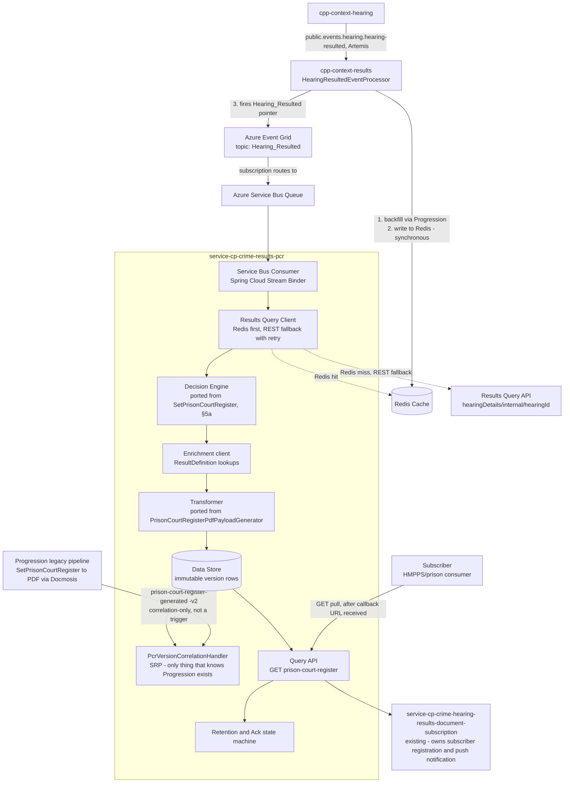
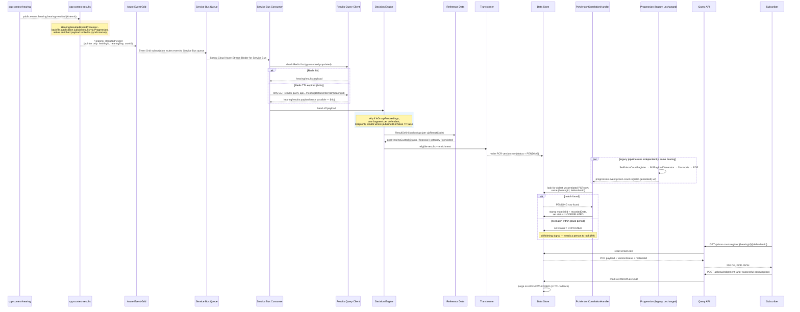

# Prison Court Register (PCR) API Marketplace Service — Design

**Trigger:** Azure Event Grid's `Hearing_Resulted` notification — the same one the legacy Function App already listens to.

**Repos:** `api-cp-crime-results-pcr` (OpenAPI spec) + `service-cp-crime-results-pcr` (Spring Boot service), Modern-by-Default pattern, scaffolded from `api-hmcts-crime-template` / `service-hmcts-crime-springboot-template`.

**Status:** Draft, 16 Jul 2026, built from the epic/stories in `2026-07-16-pcr-epic-requirements.md`.

---

## 1. Purpose

Give API Marketplace subscribers (HMPPS/prisons) programmatic, pull-based access to Prison Court Register (PCR) source data — the same underlying content currently distributed as a PDF via the legacy Function App → Progression → Docmosis pipeline — with a way to verify the API payload and the PDF represent the same version of the same PCR.

This is **not** a replacement for existing email/post distribution, and does **not** rebuild subscriber management. It is a new read channel that plugs into the existing subscription/callback infrastructure.

---

## 2. Unit of work: one PCR per defendant per hearing

Today's PCR generation is per defendant, per hearing — `SetPrisonCourtRegister` builds one register fragment per defendant present at a hearing, and within that fragment, all of that defendant's cases/applications *at that hearing* are nested together. A hearing with multiple defendants produces multiple, separate PCR records — never one merged record.

The API preserves this end-to-end: Decision Engine emits one candidate per `(hearingId, defendantId)`; the Data Store keys every row the same way; the Query API returns one PCR resource per `(hearingId, defendantId)`, each with its own version history.

---

## 3. Architecture overview

### 3a. Components

### 3b. Sequence — one hearing, end to end

---

## 4. Trigger — Event Grid `Hearing_Resulted`

### 4a. What's confirmed, from tracing the actual code and tech arch's own confirmation

- `Hearing_Resulted` is published by **Results context**, not Hearing context — `HearingResultedEventProcessor.handleHearingResultedPublicEvent` (in `cpp-context-results`, reacting to `public.events.hearing.hearing-resulted`) fires it via `sendEventToGrid`. The name describes what happened, not who's publishing it.
- The event itself is an ID pointer only — `hearingId`, `hearingDay`, `userId`, nothing else (`PrisonCourtRegisterEventGridTrigger/index.js` confirms this is the entire `eventGridEvent.data` shape). It does not carry PCR content.
- The Progression application-results backfill (`applicationResultsEnricher.enrichIfApplicationResultsMissing`) runs **before** the Redis write and **before** the Event Grid publish, in the same method, synchronously. So by the time `Hearing_Resulted` fires, that backfill is already done — this service does not need to replicate it.
- **Redis is written synchronously, in the same method that fires the Event Grid event — guaranteed populated by send time.** The Results context viewstore (what the REST query API reads from) is updated *asynchronously*, separately. Confirmed directly with tech arch: "you can guarantee that the data is in redis by the time you receive the event grid event, but you can't guarantee that the data is available via REST." That's a real race, not a theoretical one, if this service queries REST without checking Redis first.
- Confirmed query endpoint for the REST fallback: `GET {RESULTS_CONTEXT_API_BASE_URI}/results-query-api/query/api/rest/results/hearingDetails/internal/{hearingId}`, `Accept: application/vnd.results.hearing-details-internal+json`.

### 4b. What this requires

**Two-step data retrieval.** The event is a pointer, not a payload. This service needs a **Results Query Client** that fetches the actual content after receiving the pointer, before the Decision Engine has anything to run against.

**Redis first, REST as fallback with retry — not something to route around.** Mirrors the Function App's own `HearingResultedCacheQuery` exactly: check Redis first (guaranteed populated), fall back to the REST endpoint above only if the Redis entry has expired (24-hour TTL), and retry that REST call since it can race against the asynchronous viewstore update. Tech arch's own assumption is that the REST fallback fails outright if the data hasn't reached the viewstore yet, rather than returning something partial or stale — worth confirming directly (§13, item 3a) rather than discovering it in production.

**How a Spring Boot service actually receives an Event Grid event — decided.** Checked against Microsoft's own guidance: [Use Azure Event Grid in Spring - Java on Azure | Microsoft Learn](https://learn.microsoft.com/en-us/azure/developer/java/spring-framework/configure-spring-boot-initializer-java-app-with-event-grid). Event Grid doesn't offer a "subscribe like JMS" pull model, and there's no reference pattern in that doc (or elsewhere) for a Spring Boot service receiving Event Grid pushes directly via its own HTTPS webhook — Microsoft's own documented pattern is publish-to-Event-Grid, route the Event Grid subscription into a Service Bus queue, and consume from that queue using ordinary Spring Cloud Azure tooling (`spring-cloud-azure-starter-eventgrid` for publishing, `spring-cloud-azure-stream-binder-servicebus` for consuming). Going with that: the Event Grid subscription for `Hearing_Resulted` routes into a Service Bus queue, and this service consumes it via `spring-cloud-azure-stream-binder-servicebus` — the same library family already used elsewhere, no webhook endpoint or validation handshake to build or secure.

**Versioning data source needs investigation.** There's no JMS envelope here to read a `Metadata` interface from. Whatever fills the `sourceEventPosition`/`sharedTime` role has to come from the Results Query Client's response instead (Redis payload or REST fallback), and that response's shape for this purpose hasn't been checked yet — see §7 and §13.

**Two legacy infrastructure dependencies, not one.** Both the Event Grid subscription itself and the Redis cache it relies on are plausibly provisioned as part of the Function App's own Azure resources. If the Function App is retired, this service's trigger *and* its primary data lookup could both disappear at once — worth resolving before this is built on, not after (§13, item 2).

---

## 5. Function App analysis — what to port, what not to

Went through the actual Function App code, not assumptions, to separate genuine PCR decision/transform logic from generic NOWS infrastructure that happens to sit alongside it. This is about what happens *after* the service has the hearing/results payload in hand.

### 5a. Port this — genuine PCR decision logic

| Component | What it does | Port as |
|---|---|---|
| `PrisonCourtRegisterOrchestrator` | Skips the whole hearing if `isGroupProceedings == true` | A guard clause at the top of the new service's handler |
| `SetPrisonCourtRegister` / `DefendantContextService.getDefendantContextBaseList()` | Builds one register fragment per defendant on the hearing | The Decision Engine's per-defendant fan-out |
| `RegisterFragmentService.filterJudicialResultsApplicableForRegisters` | Keeps only judicial results where `!judicialResult.publishedForNows` | The actual PCR-eligibility rule — a `ResultDefinition.publishedForNows == false` check per result |
| `RegisterFragmentService.getLatestOrderedDate` / `getHearingDate` | Picks the `registerDate`/hearing date to stamp on the fragment | Small, direct port — date-sorting logic only |
| `PrisonCourtRegisterPdfPayloadGenerator` | The full field mapping to the printed register's shape | The Transformer (§6) |

### 5b. Do not port — belongs to generic NOWS infrastructure or a different concern

| Component | What it actually does | Why it's out of scope here |
|---|---|---|
| `VocabularyService` | Computes ~18 generic flags (custody-location-is-police/prison, appeared-by-video, youth/adult defendant, Welsh/English hearing, CPS-prosecuted, major-creditor lists) | Confirmed by reading `PrisonCourtRegisterPdfPayloadGenerator`: it never reads `vocabulary`. This is shared NOWS document-generation infrastructure computed for many template types, not PCR-specific content. |
| `PrisonCourtRegisterSubscriptions` | Matches a built PCR fragment against `now_subscriptions.isPrisonCourtRegisterSubscription`, using the vocabulary flags above as match criteria | This is subscriber *matching* — deciding which prisons should be notified — not PCR *content*. Stays owned by whatever already does subscriber matching today; this service's job is to expose content via a URL that gets wired into the existing callback, not to replicate who gets called. |
| `PrisonCourtRegisterHandler` / `PrisonCourtRegisterEventProcessor` (Progression side) | Aggregate persistence, actually generating the PDF via Docmosis, sending notification emails | Stays in Progression untouched — this service reads Progression's *output* (§7) for version correlation, never its internals. |

---

## 6. Transformation and enrichment

**Base shape:** ports `PrisonCourtRegisterPdfPayloadGenerator`'s field mapping faithfully — registerDate, court/custody details, defendant details, prosecution/defence counsel, defendant/case results, offences, applications (full field list already documented in `PCR-HMPPS-FIELD-MAPPING.md`). Source of this data is the Results Query Client's response (§4b), not an event-carried payload.

**Fixed on the way in, not carried forward as bugs:**
- Aliases and counsel names become structured arrays (`{title, firstName, middleName, lastName}` / `{name, status}`), not the legacy generator's pre-joined display strings.
- `applications[].result[]` becomes `{resultCode, resultText}` pairs, matching every other result block, instead of the legacy shape's plain-string-only inconsistency.
- `pleaDate` exposed as its own field rather than string-concatenated onto `pleaValue`.

**Enrichment beyond what the legacy generator does today** — deliberate additions, not scope creep, each tied to a concrete need already identified in `PCR-HMPPS-FIELD-MAPPING.md`:
- `postHearingCustodyStatus` / `financial` / `category` / `convicted` per result, from Reference Data's `ResultDefinition`, keyed on `cjsResultCode`. The legacy generator strips these before they reach the document; this service keeps them, since they're the clearest structured signal for anything downstream that needs to classify custodial vs. non-custodial without parsing `resultText`.
- `judicialResultPrompts[]` (raw label/value/promptReference/type), sourced from the judicial-result domain object directly — not from the legacy generator, which discards prompts entirely. Needed for any consumer building their own logic on top of structured signals like the terrorism/foreign-power/domestic-violence flags, which only exist at this level.
- `custodyLocation`: include it, but be explicit in the API's own documentation that it's generated today and never actually printed on the register — don't let a consumer assume it's document-verified just because it's present.

**Decision needed, not yet made:** whether to carry the confirmed-dead legacy fields (`officerInCase`, `parentGuardianName`/`Address1`, and the template's unpopulated `parentGuardianAddress2-5`/`PostCode`) through as permanently-empty fields, or drop them from this service's own model entirely.

---

## 7. Versioning: correlating the API payload with the PDF

- **Join key:** `(hearingId, defendantId)`.
- **Data model:** every JSON payload is its own immutable version row, in arrival order — not a mutable record overwritten on amendment.
- **Correlation component (SRP-isolated):** `PcrVersionCorrelationHandler` is the only code allowed to know Progression's event exists. It subscribes to `progression.event.prison-court-register-generated`(-v2) — correlation only, never a trigger — and FIFO-pairs the oldest uncorrelated JSON row with the oldest uncorrelated PDF fact per `(hearingId, defendantId)`. On match: stamps `materialId` + `recordedDate`, sets `versionStatus = CORRELATED`. On a persistent one-sided backlog: `ORPHANED` — a live drift signal, not just a stuck state (§9).
- **`sourceEventPosition`/`sharedTime` — open, not confirmed.** There's no JMS envelope here to read `Metadata` from. Whatever fills this role has to come from the Results Query Client's response (Redis payload or REST fallback), and that hasn't been checked yet.
- **Progression-side dependency:** `recorded_date` needs propagating into `prison-court-register-generated`(-v2) — its current timestamp comes from the messaging envelope, not the actual recorded date.
- **Open question:** should the Query API serve a version before it reaches `CORRELATED`? Needs a decision before the Query API contract is finalised, not assumed either way.

---

## 8. APIM / Modern-by-Default layering

Mapping the above onto the Spring Boot service pattern, not the legacy Azure Functions/CQRS shape:

| Layer | Responsibility | Ports from |
|---|---|---|
| **Service Bus Consumer** | Receives the `Hearing_Resulted` pointer off the Service Bus queue the Event Grid subscription routes into, via `spring-cloud-azure-stream-binder-servicebus` | New — no equivalent in the legacy pipeline; this is Azure Functions' `EventGridTrigger` binding, which Spring Boot has no direct equivalent of |
| **Results Query Client** | Follow-up lookup to fetch the actual hearing/results payload — Redis first (guaranteed populated by the time `Hearing_Resulted` fires), REST fallback with retry if the Redis entry has expired (24hr TTL) | New — mirrors what `HearingResultedCacheQuery` does today, Redis-first pattern included |
| **Decision Engine** | Group-proceedings skip, per-defendant fan-out, `publishedForNows` eligibility filter | `PrisonCourtRegisterOrchestrator` + `SetPrisonCourtRegister` + `RegisterFragmentService` (§5a) |
| **Enrichment client** | Reference Data calls for `ResultDefinition` fields | New — legacy generator doesn't make this call today |
| **Transformer** | Field mapping to the PCR source payload shape | `PrisonCourtRegisterPdfPayloadGenerator`, with the fixes and additions in §6 |
| **Version/Correlation handler** | FIFO-pairs JSON rows against Progression's PDF-generated event | New — `PcrVersionCorrelationHandler`, SRP-isolated per §7 |
| **Data store** | Immutable version rows, keyed `(hearingId, defendantId)` | New |
| **Query API (controller)** | `GET` endpoint(s), version history, not a single current blob | New |
| **Retention/Ack** | Per-subscriber state machine + TTL fallback purge | New |
| **Drift alerting** | Watches `versionStatus = ORPHANED` and raises it, rather than leaving it as an unread row | New — cheap, since the correlator already produces this state (§9) |

No component here talks to Progression except the Version/Correlation handler — everything else only ever reads `versionStatus`/`materialId` once set.

---

## 9. Drift detection

Per `2026-07-16-pcr-epic-requirements.md` Story 7 — this is a reimplementation of existing logic, not a call-through, so drift is possible, but the goal is knowing when it happens, not proving upfront it never will.

- **Before launch:** golden-master tests in the service's own integration test suite. Pick real past hearings that already have both a `Hearing_Resulted` occurrence and a generated PDF; feed the resulting Results-query payload through the service's real code path; assert the output matches Progression's own stored `prison_court_register.payload` for that hearing. No mandatory dual-running period as a launch gate.
- **After launch:** the correlator's `ORPHANED` status (§7) is the live version of the same check, for free — a PCR record with no matching PDF fact (or vice versa) is exactly the disagreement the golden-master tests were looking for, just caught automatically. Needs someone actually watching the `ORPHANED` list, not just logging it.

---

## 10. Query API

`GET` endpoint returns the PCR JSON, keyed by `(hearingId, defendantId)`, exposing version history. URL wired into `service-cp-crime-hearing-results-document-subscription`'s existing subscriber callback payload — that service continues to own subscriber registration and push notification.

---

## 11. Retention & acknowledgement

Per the epic's Stories 5/6:

- Per-subscriber acknowledgement: `ISSUED → RETRIEVED → ACKNOWLEDGED → PURGED`, tracked independently per subscriber. One subscriber acking has no effect on another subscriber who hasn't retrieved yet.
- Acknowledgement is a separate, explicit call — never inferred from the `GET` itself. Collapsing them risks purging a payload before the subscriber has durably confirmed receipt.
- TTL-based purge as fallback for anything never acknowledged. Exact retention window is an open policy decision, needs sign-off from whoever owns records-management/retention standards.

---

## 12. MVP scope

Story 3's non-amendment phase-1 slice (mirror the Function App, no amendments) ships first, specifically to get early HMPPS feedback on the payload shape before the full service — including amendment handling, versioning, retention/ack — is built.

---

## 13. Cross-team dependencies & open items

| # | Item | Owner / needs input from |
|---|---|---|
| 1 | Provision the Event Grid subscription to route `Hearing_Resulted` into a Service Bus queue, and set up this service's `spring-cloud-azure-stream-binder-servicebus` consumer against it | This team + platform/Azure infra owner |
| 2 | Do the Event Grid subscription for `Hearing_Resulted` *and* the Redis cache it depends on survive Function App retirement, or are both provisioned as part of that app's own infra? | Whoever owns the Function App's Azure resources |
| 3 | Confirm what the Results Query Client's response actually carries for versioning purposes — is there an equivalent to `sourceEventPosition`/`sharedTime` available from either the Redis payload or the REST fallback? | Investigation needed — not yet checked |
| 3a | Confirm the assumption that the REST fallback fails outright if the data hasn't reached the Results viewstore yet (rather than returning a partial/stale result) — tech arch's own words were "I assume," not confirmed | Results context team |
| 4 | Propagate `recorded_date` into `prison-court-register-generated`(-v2) | Progression team |
| 5 | Propagate `resultEventId`/`sharedTime` through Progression and hearing-nows' own processing (not just consume-and-discard) | Progression + hearing-nows teams |
| 6 | Add `eventId` to HRDS's inbound/outbound notifications | HRDS (Results Subscription Service) owners |
| 7 | Retention TTL policy | Records-management/retention policy owner |
| 8 | How the callback payload gets extended to carry this service's URL | `service-cp-crime-hearing-results-document-subscription` owners |
| 9 | Serve pre-`CORRELATED` (provisional) versions, or withhold until correlated? | Product/tech-arch decision, unresolved |
| 10 | Carry the confirmed-dead legacy fields through as always-empty, or drop them from this service's model? | Product decision, unresolved |

---

## 14. Explicitly out of scope

- Rebuilding subscriber registration, matching-rule storage, or push notification — owned by `service-cp-crime-hearing-results-document-subscription` and `now_subscriptions`. Includes `VocabularyService`/`PrisonCourtRegisterSubscriptions`-style matching logic — confirmed not needed here (§5b).
- Changing or retiring existing email/post PCR distribution — additional channel, not a replacement.
- PII redaction — separate, explicitly deferred discussion (Story 1.3).
- CPS-flag/police-flag reference-data lookups — feed a separate VEP/police-notification path, confirmed not needed for prison services.
- `eventTypes` lookup check (RAID log) — deferred, tracked as a risk, not a blocker.

---

## 15. References

- [Use Azure Event Grid in Spring - Java on Azure | Microsoft Learn](https://learn.microsoft.com/en-us/azure/developer/java/spring-framework/configure-spring-boot-initializer-java-app-with-event-grid) — source for the Event Grid → Service Bus → Spring Cloud Stream Binder consumption pattern used in §4b/§8.
