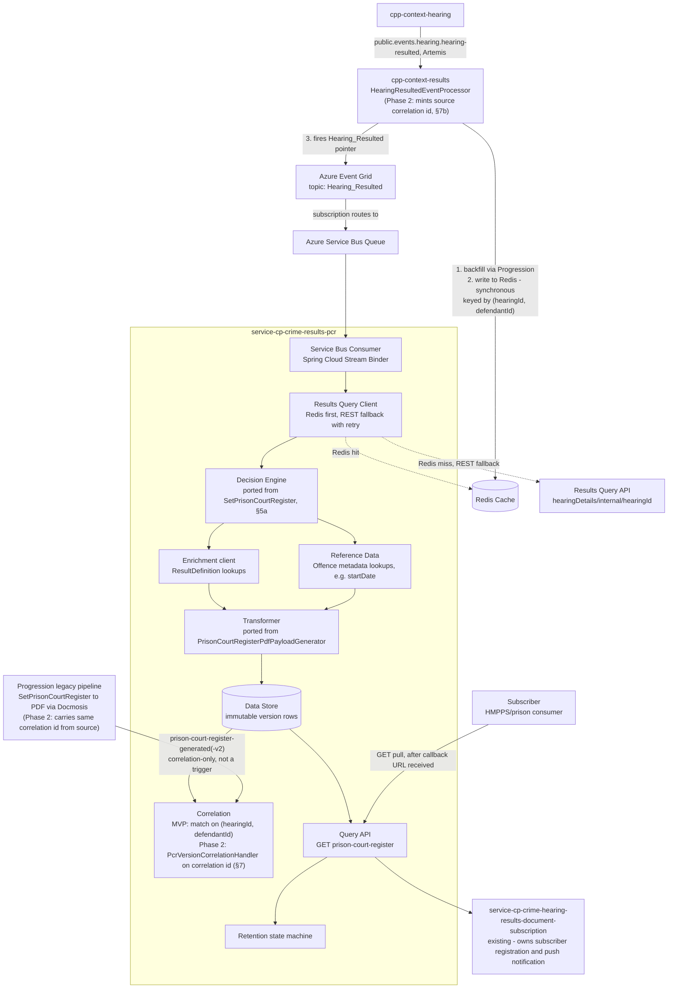
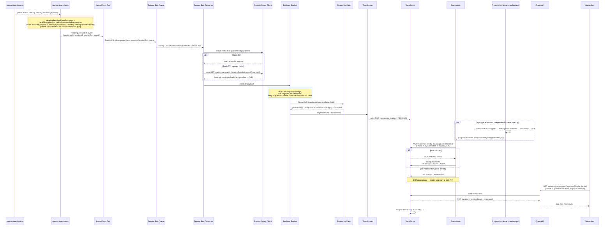

# Prison Court Register (PCR) API Marketplace Service — Design

**Trigger:** Azure Event Grid's `Hearing_Resulted` notification — the same one the legacy Function App already listens to.

**Repos:** `api-cp-crime-results-pcr` (OpenAPI spec) + `service-cp-crime-results-pcr` (Spring Boot service), Modern-by-Default pattern, scaffolded from `api-hmcts-crime-template` / `service-hmcts-crime-springboot-template`.

**Status:** Draft, 16 Jul 2026, built from the epic/stories.

---

## 1. Purpose

Give API Marketplace subscribers (HMPPS/prisons) programmatic, pull-based access to Prison Court Register (PCR) source data — the same underlying content currently distributed as a PDF via the legacy Function App → Progression → Docmosis pipeline — with a way to verify the API payload and the PDF represent the same version of the same PCR.

This is **not** a replacement for existing email/post distribution, and does **not** rebuild subscriber management. It is a new read channel that plugs into the existing subscription/callback infrastructure.

---

## 2. Unit of work: one PCR per defendant per hearing

Today's PCR generation is per defendant, per hearing — `SetPrisonCourtRegister` builds one register fragment per defendant present at a hearing, and within that fragment, all of that defendant's cases/applications *at that hearing* are nested together. A hearing with multiple defendants produces multiple, separate PCR records — never one merged record.

The API preserves this end-to-end: Decision Engine emits one candidate per `(hearingId, defendantId)`; the Data Store keys every row the same way; the Query API returns one PCR resource per `(hearingId, defendantId)`, each with its own version history.

---

## 3. Architecture overview

### 3a. Components

### 3b. Sequence — one hearing, end to end

---

## 4. Trigger — Event Grid `Hearing_Resulted`

### 4a. What's confirmed, from tracing the actual code and tech arch's own confirmation

- `Hearing_Resulted` is published by **Results context**, not Hearing context — `HearingResultedEventProcessor.handleHearingResultedPublicEvent` (in `cpp-context-results`, reacting to `public.events.hearing.hearing-resulted`) fires it via `sendEventToGrid`. The name describes what happened, not who's publishing it.
- The event itself is an ID pointer only — `hearingId`, `hearingDay`, `userId`, nothing else (`PrisonCourtRegisterEventGridTrigger/index.js` confirms this is the entire `eventGridEvent.data` shape). It does not carry PCR content.
- The Progression application-results backfill (`applicationResultsEnricher.enrichIfApplicationResultsMissing`) runs **before** the Redis write and **before** the Event Grid publish, in the same method, synchronously. So by the time `Hearing_Resulted` fires, that backfill is already done — this service does not need to replicate it.
- **Redis is written synchronously, in the same method that fires the Event Grid event — guaranteed populated by send time.** The Results context viewstore (what the REST query API reads from) is updated *asynchronously*, separately. Confirmed directly with tech arch: "you can guarantee that the data is in redis by the time you receive the event grid event, but you can't guarantee that the data is available via REST." That's a real race, not a theoretical one, if this service queries REST without checking Redis first.
- Confirmed query endpoint for the REST fallback: `GET {RESULTS_CONTEXT_API_BASE_URI}/results-query-api/query/api/rest/results/hearingDetails/internal/{hearingId}`, `Accept: application/vnd.results.hearing-details-internal+json`.

### 4b. What this requires

**Two-step data retrieval.** The event is a pointer, not a payload. This service needs a **Results Query Client** that fetches the actual content after receiving the pointer, before the Decision Engine has anything to run against.

**Redis first, REST as fallback with retry — not something to route around.** Mirrors the Function App's own `HearingResultedCacheQuery` exactly: check Redis first (guaranteed populated), fall back to the REST endpoint above only if the Redis entry has expired (24-hour TTL), and retry that REST call since it can race against the asynchronous viewstore update.

**What that race actually resolves to needs confirming, not assuming.** If the REST call lands inside the window before the viewstore has caught up, there are two very different outcomes, and retry logic can only be built around whichever one is real:
1. **Fails cleanly** — an error or 404 — so the PCR service knows unambiguously to retry or flag it.
2. **Returns something anyway** — an incomplete or stale version of the hearing's results, with no error — so the PCR service treats it as good data, builds a PCR from it, and nobody finds out until someone notices the content is wrong.

Tech arch's own words were "I assume that if the data didn't get into the viewstore by then it fails completely" — that's option 1, but "assume" is the operative word: it's an expectation, not something verified against the actual code or confirmed with the Results team. Confirm which one actually happens (§13, item 2) before building retry logic around option 1. If it's option 2, "did the call succeed" isn't sufficient trust for this service's two-step retrieval — the Results Query Client would need a way to tell "got a response" apart from "got a *complete* one."

**How a Spring Boot service actually receives an Event Grid event — decided.** Checked against Microsoft's own guidance: [Use Azure Event Grid in Spring - Java on Azure | Microsoft Learn](https://learn.microsoft.com/en-us/azure/developer/java/spring-framework/configure-spring-boot-initializer-java-app-with-event-grid). Event Grid doesn't offer a "subscribe like JMS" pull model, and there's no reference pattern in that doc (or elsewhere) for a Spring Boot service receiving Event Grid pushes directly via its own HTTPS webhook — Microsoft's own documented pattern is publish-to-Event-Grid, route the Event Grid subscription into a Service Bus queue, and consume from that queue using ordinary Spring Cloud Azure tooling (`spring-cloud-azure-starter-eventgrid` for publishing, `spring-cloud-azure-stream-binder-servicebus` for consuming). Going with that: the Event Grid subscription for `Hearing_Resulted` routes into a Service Bus queue, and this service consumes it via `spring-cloud-azure-stream-binder-servicebus` — the same library family already used elsewhere, no webhook endpoint or validation handshake to build or secure.

### 4c. Alternatives considered — why not subscribe to Event Grid directly

The obvious "simpler" question is whether this service can subscribe to the `Hearing_Resulted` Event Grid topic directly and drop the Service Bus queue in between. It can't, cleanly — Event Grid is **push-only**, with no JMS/AMQP-style pull subscription. "Direct" therefore has exactly one shape: this service stands up its own public HTTPS webhook and registers it as an Event Grid event handler. That pulls a whole surface *into* the application:

| | Event Grid → Service Bus → consume (chosen) | Direct Event Grid webhook (rejected) |
|---|---|---|
| Code in this service | Consume from a Service Bus queue — tooling already used here | New public HTTPS endpoint, owned and secured by this service |
| Registration | None — infra routing rule (§13 item 1) | Must implement the Event Grid **subscription-validation handshake** |
| Delivery guarantees | Broker gives durability, buffering, retry, dead-lettering | Event Grid retries on a fixed schedule then drops; no buffering unless you add a queue anyway |
| Scale-out | Competing-consumer semantics for free | Hand-rolled |
| New Azure integration | **None** — this service already talks to Service Bus, not Event Grid | New Event Grid integration surface on the consume side |

The decisive point: this service is a **pure consumer** — it never publishes to Event Grid (`cpp-context-results` is the publisher, §4a) — and it already has Service Bus integration established but no Event Grid integration. The Service Bus route therefore needs *zero* Event Grid code in this service; the Event Grid → Service Bus link is a subscription routing rule the platform team configures, not application code. Going direct would trade that routing rule (free) for a webhook/validation/retry surface (not free). The Event Grid topic itself is an upstream dependency either way (§13 item 2), so the intermediary adds no dependency risk. Direct-webhook stays as a fallback only if the Event Grid → Service Bus routing rule can't be provisioned.

**Versioning data source needs investigation.** There's no JMS envelope here to read a `Metadata` interface from. Whatever fills the `sourceEventPosition`/`sharedTime` role has to come from the Results Query Client's response instead (Redis payload or REST fallback), and that response's shape for this purpose hasn't been checked yet — see §7 and §13.

**Two legacy infrastructure dependencies, not one.** Both the Event Grid subscription itself and the Redis cache it relies on are plausibly provisioned as part of the Function App's own Azure resources. If the Function App is retired, this service's trigger *and* its primary data lookup could both disappear at once — worth resolving before this is built on, not after.

---

## 5. Function App analysis — what to port, what not to

Went through the actual Function App code, not assumptions, to separate genuine PCR decision/transform logic from generic NOWS infrastructure that happens to sit alongside it. This is about what happens *after* the service has the hearing/results payload in hand.

### 5a. Port this — genuine PCR decision logic

| Component | What it does | Port as |
|---|---|---|
| `PrisonCourtRegisterOrchestrator` | Skips the whole hearing if `isGroupProceedings == true` | A guard clause at the top of the new service's handler |
| `SetPrisonCourtRegister` / `DefendantContextService.getDefendantContextBaseList()` | Builds one register fragment per defendant on the hearing | The Decision Engine's per-defendant fan-out |
| `RegisterFragmentService.filterJudicialResultsApplicableForRegisters` | Keeps only judicial results where `!judicialResult.publishedForNows` | The actual PCR-eligibility rule — a `ResultDefinition.publishedForNows == false` check per result |
| `RegisterFragmentService.getLatestOrderedDate` / `getHearingDate` | Picks the `registerDate`/hearing date to stamp on the fragment | Small, direct port — date-sorting logic only |
| `PrisonCourtRegisterPdfPayloadGenerator` | The full field mapping to the printed register's shape | The Transformer (§6) |

### 5b. Do not port — belongs to generic NOWS infrastructure or a different concern

| Component | What it actually does | Why it's out of scope here |
|---|---|---|
| `VocabularyService` | Computes ~18 generic flags (custody-location-is-police/prison, appeared-by-video, youth/adult defendant, Welsh/English hearing, CPS-prosecuted, major-creditor lists) | Confirmed by reading `PrisonCourtRegisterPdfPayloadGenerator`: it never reads `vocabulary`. This is shared NOWS document-generation infrastructure computed for many template types, not PCR-specific content. |
| `PrisonCourtRegisterSubscriptions` | Matches a built PCR fragment against `now_subscriptions.isPrisonCourtRegisterSubscription`, using the vocabulary flags above as match criteria | This is subscriber *matching* — deciding which prisons should be notified — not PCR *content*. Stays owned by whatever already does subscriber matching today; this service's job is to expose content via a URL that gets wired into the existing callback, not to replicate who gets called. |
| `PrisonCourtRegisterHandler` / `PrisonCourtRegisterEventProcessor` (Progression side) | Aggregate persistence, actually generating the PDF via Docmosis, sending notification emails | Stays in Progression untouched — this service reads Progression's *output* (§7) for version correlation, never its internals. |

---

## 6. Transformation and enrichment

**Base shape:** ports `PrisonCourtRegisterPdfPayloadGenerator`'s field mapping faithfully — registerDate, court/custody details, defendant details, prosecution/defence counsel, defendant/case results, offences, applications (full field list already documented in `PCR-HMPPS-FIELD-MAPPING.md`). Source of this data is the Results Query Client's response (§4b), not an event-carried payload.

**Identity/correlation fields, alongside the ported content:**
- `hearingId`, `defendantId`: the grouping key for version history (§2) **and the MVP correlation/resource key** (§7a) — matched against Progression's `prison-court-register-generated` event, which already carries the same pair.
- Source correlation id — **Phase 2 only** (id shape TBC — ULID vs UUID+`sharedResultTime`, §7b): a per-version identifier read from the source payload, *not* minted by this service. **Absent in the MVP** (Redis carries no such field today). When introduced, it becomes the per-version resource id + HRDS notification value + the token correlated against Progression's PDF fact; carry the source value through verbatim, never derive or regenerate it.
- `versionStatus` (`PENDING` / `CORRELATED` / `ORPHANED`) and `materialId`: correlation state, not set by the transformer — the transformer writes the row as `PENDING` and never touches these afterwards.

**Fixed on the way in, not carried forward as bugs:**
- Aliases and counsel names become structured arrays (`{title, firstName, middleName, lastName}` / `{name, status}`), not the legacy generator's pre-joined display strings.
- `applications[].result[]` becomes `{resultCode, resultText}` pairs, matching every other result block, instead of the legacy shape's plain-string-only inconsistency.
- `pleaDate` exposed as its own field rather than string-concatenated onto `pleaValue`.

**Enrichment beyond what the legacy generator does today** — deliberate additions, not scope creep, each tied to a concrete need already identified in `PCR-HMPPS-FIELD-MAPPING.md`:
- `postHearingCustodyStatus` / `financial` / `category` / `convicted` per result, from Reference Data's `ResultDefinition`, keyed on `cjsResultCode`. The legacy generator strips these before they reach the document; this service keeps them, since they're the clearest structured signal for anything downstream that needs to classify custodial vs. non-custodial without parsing `resultText`.
- `judicialResultPrompts[]` (raw label/value/promptReference/type), sourced from the judicial-result domain object directly — not from the legacy generator, which discards prompts entirely. Needed for any consumer building their own logic on top of structured signals like the terrorism/foreign-power/domestic-violence flags, which only exist at this level.
- `custodyLocation`: include it, but be explicit in the API's own documentation that it's generated today and never actually printed on the register — don't let a consumer assume it's document-verified just because it's present.

**Decision needed, not yet made:** whether to carry the confirmed-dead legacy fields (`officerInCase`, `parentGuardianName`/`Address1`, and the template's unpopulated `parentGuardianAddress2-5`/`PostCode`) through as permanently-empty fields, or drop them from this service's own model entirely.

---

## 7. Versioning: correlating the API payload with the PDF

Correlation is **phased**, tracking the MVP boundary in §12:

- **Phase 1 (MVP, no amendments):** correlate on the `(hearingId, defendantId)` key that Redis already carries. No source-minted id, no new cross-repo propagation, no separate correlation handler.
- **Phase 2 (amendments/versioning):** once a single `(hearingId, defendantId)` can have multiple versions, the key alone can't say which JSON version pairs with which PDF. Only then does a **source-minted correlation id** (§7b) become necessary, along with a dedicated handler.

Nothing in Phase 2 exists today — no id is written into Redis, and there is no `PcrVersionCorrelationHandler`. It is deliberately deferred, not assumed.

### 7a. Phase 1 (MVP) — correlate on `(hearingId, defendantId)`

The MVP mirrors the Function App with no amendments (§12), so there is exactly **one PCR per `(hearingId, defendantId)`** — no versions. That makes correlation to the PDF a straight **key-equality match on `(hearingId, defendantId)`**, using data that already exists:

- **Redis is keyed by `(hearingId, defendantId)` today** — this service reads the payload by that key (via the Results Query Client, §4b); no new id field is required in the Redis payload.
- **Progression's `prison-court-register-generated` event already carries `(hearingId, defendantId)`**, so the JSON row and the PDF fact match on the same key.
- **No new source-side work, no new schema field, no `PcrVersionCorrelationHandler`** — matching is a lookup on the existing key. `materialId` is stamped when the PDF fact for that key arrives; `ORPHANED` still means "one side present, the other missing" and remains the live drift signal (§9).

This is sufficient *only* because there is one version per key in the MVP. It does **not** survive amendments — that's Phase 2.

### 7b. Phase 2 (amendments) — why a source-minted correlation id becomes necessary

Once amendments/reshares exist, a single `(hearingId, defendantId)` has **multiple versions**, and key-equality can no longer tell which JSON version corresponds to which PDF. Correlation then needs a per-version token that **both branches derive from the same upstream event** — i.e. minted once at the source, above the fork where the Results/Redis path and the Progression path diverge, and propagated down both.

- **Data model:** every JSON payload becomes its own immutable version row in arrival order — not a mutable record overwritten on amendment.
- **New component:** a `PcrVersionCorrelationHandler` (SRP-isolated — the only code that knows Progression's event exists) subscribes to `prison-court-register-generated-v2`, correlation-only, never a trigger, and joins on **correlation-id equality**. On match: stamps `materialId`, sets `versionStatus = CORRELATED`. On a persistent one-sided backlog: `ORPHANED`.
- **Propagation path:** source → Redis payload → Function App → Progression's `PrisonCourtRegisterDocumentRequest` → `prison-court-register-generated-v2` (new field) → HRDS. A four-repo, ~9-code-location, "rebuild explicitly at each hop" effort (§13) — scope it as such.
- **Generation point:** the natural spot is `cpp-context-results`, where the enriched payload is assembled just before the synchronous Redis write (`HearingResultedEventProcessor`) — both branches draw from there. Confirm by tracing that the fork to Progression is genuinely downstream of that write.
- **Freshness:** a fresh id per `Hearing_Resulted` emission (incl. reshare/amendment), *not* a stable per-hearing id — confirm the source mints per emission.

The id shape is the choice below (Option A vs B); everything above is common to both.

#### Option A (recommended) — a single ULID

A ULID minted at source collapses three needs into one field:

| Need | ULID provides |
|---|---|
| Structural uniqueness | 80 random bits — collision-free, no reliance on timestamp uniqueness |
| Shared time | 48-bit millisecond timestamp prefix — the same value on both branches, since stamped once at source |
| Version ordering | Lexicographically sortable = chronological, for free |
| Resource identity | Doubles as the API resource id and the field carried in the HRDS notification |

Correlation is a direct equality join on the ULID; Phase 1's `(hearingId, defendantId)` matching remains the fallback for any pre-Phase-2 record.

#### Option B — UUID `resultEventId` + separate `sharedResultTime`

Propagate **two** fields instead of one — a UUID `resultEventId` for identity, plus a separate `sharedResultTime` — along the same path.

- **Correlation:** join on `resultEventId` equality; ordering comes from `sharedResultTime` (or a sequence), not from the id.
- **vs Option A:** functionally equivalent, differences in A's favour — two fields to keep in lockstep across every schema vs one; a UUID is opaque so `sharedResultTime` is mandatory to recover ordering, whereas the ULID folds identity/time/order together; a UUID works as a resource id but can't double as a sort key.
- **When B is preferable:** if the externally-exposed id must *not* encode a timestamp (a hard rule against leaking source event time), a UUID + internal-only `sharedResultTime` keeps time off the public id.
- **Effort:** identical propagation scope to Option A — two fields instead of one.

### 7c. Ruled-out alternatives (Phase 2)

- **Ruled out — service-local id (ULID or UUID minted here).** Minting the id inside this service can't correlate: it lives on one branch of the fork, so Progression never sees it, and a ULID's timestamp would be local write-time, not shared source time. Only a source-minted id works.
- **Ruled out — Progression's `recorded_date`.** `PrisonCourtRegisterEntity.recordedDate` is local to Progression's own persistence — when Progression recorded the material, not anything about the source event that caused the PDF. Material-bookkeeping, not cross-context correlation data.

### 7d. Open items

- Which id shape for Phase 2 — ULID (Option A) vs UUID + `sharedResultTime` (Option B). Not locked; the rest of the doc stays option-neutral until it is.
- Should the Query API serve a version before it reaches `CORRELATED` (provisional), or withhold until correlated? Needs a decision before the Query API contract is finalised (§13).

---

## 8. APIM / Modern-by-Default layering

Mapping the above onto the Spring Boot service pattern, not the legacy Azure Functions/CQRS shape:

| Layer | Responsibility | Ports from |
|---|---|---|
| **Service Bus Consumer** | Receives the `Hearing_Resulted` pointer off the Service Bus queue the Event Grid subscription routes into, via `spring-cloud-azure-stream-binder-servicebus` | New — no equivalent in the legacy pipeline; this is Azure Functions' `EventGridTrigger` binding, which Spring Boot has no direct equivalent of |
| **Results Query Client** | Follow-up lookup to fetch the actual hearing/results payload — Redis first (guaranteed populated by the time `Hearing_Resulted` fires), REST fallback with retry if the Redis entry has expired (24hr TTL) | New — mirrors what `HearingResultedCacheQuery` does today, Redis-first pattern included |
| **Decision Engine** | Group-proceedings skip, per-defendant fan-out, `publishedForNows` eligibility filter | `PrisonCourtRegisterOrchestrator` + `SetPrisonCourtRegister` + `RegisterFragmentService` (§5a) |
| **Enrichment client** | Reference Data calls for `ResultDefinition` fields | To be analysed in the design |
| **Offence metadata client** | Reference Data calls for offence metadata (e.g. `startDate`) | To be analysed in the design |
| **Transformer** | Field mapping to the PCR source payload shape | `PrisonCourtRegisterPdfPayloadGenerator`, with the fixes and additions in §6 |
| **Correlation** | MVP: match the JSON row to Progression's PDF fact on `(hearingId, defendantId)` (§7a) — no dedicated handler. Phase 2 (amendments): join on source correlation-id equality via a new `PcrVersionCorrelationHandler` (id shape TBC, §7b); stamps `materialId`/`versionStatus` | MVP: reuse existing key. Phase 2: new SRP-isolated component per §7 |
| **Data store** | Immutable version rows, keyed `(hearingId, defendantId)` | New |
| **Query API (controller)** | `GET` endpoint(s), version history, not a single current blob | New |
| **Retention** | Automatic 30-day TTL purge | New |

No component here talks to Progression except the Version/Correlation handler — everything else only ever reads `versionStatus`/`materialId` once set.

---

## 9. Drift detection via Integration test suite

This is a reimplementation of existing logic, not a call-through, so drift is possible, but the goal is knowing when it happens, not proving upfront it never will.

- **Before launch:** golden-master tests in the service's own integration test suite. Pick real past hearings that already have both a `Hearing_Resulted` occurrence and a generated PDF; feed the resulting Results-query payload through the service's real code path; assert the output matches Progression's own stored `prison_court_register.payload` for that hearing. No mandatory dual-running period as a launch gate.
- **After launch:** the correlator's `ORPHANED` status (§7) is the live version of the same check, for free — a PCR record with no matching PDF fact (or vice versa) is exactly the disagreement the golden-master tests were looking for, just caught automatically. Needs someone actually watching the `ORPHANED` list, not just logging it.

---

## 10. Query API

`GET` endpoint returns the PCR JSON. Two access shapes:
- **MVP:** `GET /pcrs/{hearingId}/{defendantId}` — one PCR per defendant per hearing (no amendments, §12), so the pair fully identifies the resource. This is the URL wired into the notification callback.
- **Phase 2 (amendments):** add `GET /pcrs/{id}` for a specific version — the source correlation id (§7b; id shape TBC) becomes the per-version identifier carried in the notification, and the `(hearingId, defendantId)` resource exposes the full version history, each version tagged with its correlation id and `versionStatus`.

URL wired into `service-cp-crime-hearing-results-document-subscription`'s existing subscriber callback payload — that service continues to own subscriber registration and push notification.

---

## 11. Retention

- Retention window: **30 days, fixed.** Purge happens automatically once 30 days have passed. API Marketplace does not maintain PCR data beyond that window.

---

## 12. MVP scope

Story 3's non-amendment phase-1 slice (mirror the Function App, no amendments) ships first, specifically to get early HMPPS feedback on the payload shape before the full service — including amendment handling, versioning, retention — is built.

---

## 13. Cross-team dependencies & open items

| # | Item | Owner / needs input from |
|---|---|---|
| 1 | Provision the Event Grid subscription to route `Hearing_Resulted` into a Service Bus queue, and set up this service's `spring-cloud-azure-stream-binder-servicebus` consumer against it | This team + platform/Azure infra owner |
| 2 | Confirm whether the REST fallback fails cleanly (error/404) or returns an incomplete/stale result with no error when it lands before the viewstore has caught up — read the Results query API's actual code or ask the Results team directly, don't build retry logic around tech arch's "I assume it fails" without checking. If it's the latter, the Results Query Client needs a way to detect an incomplete result, not just a failed call | Results context team |
| 3 | **Phase 2 only** — mint a source correlation id once at source and propagate it end-to-end: Results (source), Redis payload, the legacy Function App, Progression's `PrisonCourtRegisterDocumentRequest` + `prison-court-register-generated-v2` schema, HRDS. Four-repo, ~9-code-location "rebuild at each hop" effort (§7b) — scope as such, not "just add a field". **Not needed for the MVP**, which correlates on `(hearingId, defendantId)` (§7a) | This team + Results + Progression + Function App owners |
| 4 | **Phase 2 only** — confirm the source mints a **fresh id per `Hearing_Resulted` emission** (incl. reshare/amendment), not a stable per-hearing id — the "reshare-freshness" question (§7b) | Results context team |
| 5 | **Phase 2** — id shape: ULID (§7b Option A) vs UUID + `sharedResultTime` (Option B). Not locked | Product/tech-arch decision |
| 6 | Serve pre-`CORRELATED` (provisional) versions, or withhold until correlated? | Product/tech-arch decision, unresolved |
| 7 | Carry the confirmed-dead legacy fields through as always-empty, or drop them from this service's model? | Product decision, unresolved |

---

## 14. Explicitly out of scope

- Rebuilding subscriber registration, matching-rule storage, or push notification — owned by `service-cp-crime-hearing-results-document-subscription` and `now_subscriptions`. Includes `VocabularyService`/`PrisonCourtRegisterSubscriptions`-style matching logic — confirmed not needed here (§5b).
- Changing or retiring existing email/post PCR distribution — additional channel, not a replacement.
- PII redaction — separate, explicitly deferred discussion (Story 1.3).
- CPS-flag/police-flag reference-data lookups — feed a separate VEP/police-notification path, confirmed not needed for prison services.
- `eventTypes` lookup check (RAID log) — deferred, tracked as a risk, not a blocker.

---

## 15. References

- [Use Azure Event Grid in Spring - Java on Azure | Microsoft Learn](https://learn.microsoft.com/en-us/azure/developer/java/spring-framework/configure-spring-boot-initializer-java-app-with-event-grid) — source for the Event Grid → Service Bus → Spring Cloud Stream Binder consumption pattern used in §4b/§8.
