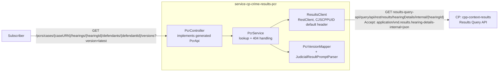

# PCR Phase 1 — Stateless Proxy Design

**Status:** Revised, 20 Jul 2026 — retargeted at the corrected API contract
(PR #5, `docs/simplify-pcr-versioning-model`, merged into
[`docs/2026-07-16-pcr-api-marketplace-design-v2.md`](2026-07-16-pcr-api-marketplace-design-v2.md),
v2). The original 17 Jul draft targeted a pre-redesign, HMPPS-shaped contract
(`ProsecutionCaseResultsApi`, `ProsecutionCaseResultView`/`DefendantResultView`,
`eventId` query param) that no longer exists — every component below is
rewritten against the current, CP-native `PcrApi`/`PcrVersion` contract.

**Supersedes, for phase 1 only:** the event-driven/data-store architecture in
v2. v2 remains the target end-state design for versioning, retention, and
Progression correlation — this document defines a deliberately smaller phase 1
that ships a working, demoable slice first, per direct product steer: *"no
data store, no versioning — just wire it up with CP and get the consumer
needed outcomes."* Read v2 first for the full business context (§1–§2); this
document only covers what phase 1 changes.

---

## 1. What phase 1 is, in one paragraph

A synchronous stateless-proxy `service-cp-*` (the same pattern already
codified in the shared HMCTS APIM standards, with its own pre-defined
integration test recipe). A subscriber calls **one** operation —
`getPcrVersion` (`GET .../versions?version=latest`) — the service calls CP's
Results Query API synchronously, maps the response to a `PcrVersion`, and
returns it. `version` is a required query parameter; any value other than
the literal `latest` returns `501` — see §7b/§13 update below. No event
consumption, no cache, no persistence, no version history, no
specific-version-by-id lookup, no correlation with Progression's PDF output,
no retention job.


**Update, 21 Jul 2026:** the API contract originally targeted here put the
specific-version lookup on its own path (`.../versions/{id}`) and latest on
another (`.../versions/latest`), each a separate operation. Both have since
been merged into one operation, `getPcrVersion`, keyed by a `version` query
parameter — `version=latest` for this document's `getLatestVersion` logic
unchanged, any other value for the (still phase-2) specific-id lookup. Code
samples below are updated to match; the phase boundary itself (§2) is
unchanged.

## 2. What's explicitly out of scope for phase 1

Carried over from v2, not built at all in phase 1:

- Event Grid `Hearing_Resulted` subscription / Service Bus consumer
- Redis-first / REST-fallback-with-retry (see §3 for why this is safe to skip, not just defer)
- Data store, version rows, version history
- **`getPcrVersionHistory`** (full version history) — needs real stored
  version rows to mean anything; there's no "history" without persistence.
  Not overridden — inherits `PcrApi`'s generated default (`501 Not
  Implemented`) until phase 2 adds the Data Store. **Specific-version-by-id
  lookup** — `getPcrVersion` is implemented, but only handles `version=latest`;
  any other `version` value is explicitly rejected with `501` (thrown by
  `PcrService`, not the generated default) until phase 2 adds real version
  storage to look up against.
- `PcrVersionCorrelationHandler` / any correlation with Progression's PDF output
- 30-day retention / TTL purge
- `ResultDefinition` reference-data enrichment beyond what CP's hearing-details payload already exposes directly (see §6) — the full `ResultDefinition` lookup only exists via the legacy queue-based messaging system, incompatible with a synchronous REST proxy

**Contract fields with no confirmed CP source for a synchronous lookup, left
`null` in phase 1** (all are `nullable: true` on the contract already — see
§10 for the full list and why each is deferred rather than guessed):
`PcrVersion.id`/`materialId` (no event-correlation pipeline exists yet),
`HearingDetails.courtHouseName`/`hearingOutcome`/`warrantType`/`overallConvictionDate`,
`Offence.title`/`wording`/`pleaValue`/`pleaDate`/`verdictCode`,
`JudicialResult.postHearingCustodyStatus`/`category`,
`CourtApplication.decision`/`decisionDate`/`response`/`responseDate`.

## 3. Architecture



No Redis, no Event Grid, no Service Bus, no data store. **Why skipping Redis
is safe, not just deferred**: the Redis-first pattern in v2 exists to solve a
race specific to the *event-driven* trigger — Redis is written synchronously
the instant `Hearing_Resulted` fires, before CP's REST viewstore catches up.
A pull-based query, requested by a subscriber sometime after the hearing (not
at the instant it results), doesn't hit that race — by request time CP's REST
viewstore has settled. Revisit only if real usage shows otherwise.

## 4. Component design

### 4.1 `PcrController`

```java
@RestController
@RequiredArgsConstructor
public class PcrController implements PcrApi {
    private final PcrService service;

    @Override
    public ResponseEntity<PcrVersion> getPcrVersion(
            String caseURN, UUID hearingId, UUID defendantId, String version) {
        return ResponseEntity.ok(service.getVersion(caseURN, hearingId, defendantId, version));
    }
}
```

No logic beyond delegation — matches the generated-interface rule (implement,
don't hand-roll `@RequestMapping`s). `getPcrVersionHistory` is **not
overridden** — `PcrApi`'s generated default method body returns `501 Not
Implemented` until phase 2 adds the Data Store. `getPcrVersion` **is**
overridden, but `PcrService.getVersion` only handles `version=latest` —
any other value is explicitly rejected with `501` (§10), so the interface is
implemented completely (per the layering rule) without pretending to support
version history or specific-id lookup that doesn't exist yet.

### 4.2 `PcrService`

```java
@Service
@RequiredArgsConstructor
public class PcrService {
    private static final String LATEST = "latest";

    private final ResultsClient resultsClient;
    private final PcrVersionMapper mapper;

    public PcrVersion getVersion(String caseURN, UUID hearingId, UUID defendantId, String version) {
        if (!LATEST.equals(version)) {
            throw new ResponseStatusException(HttpStatus.NOT_IMPLEMENTED,
                    "Version lookup by a specific id is not yet supported");
        }
        return getLatestVersion(caseURN, hearingId, defendantId);
    }

    private PcrVersion getLatestVersion(String caseURN, UUID hearingId, UUID defendantId) {
        HearingDetailsResponse hearing = resultsClient.getHearingDetails(hearingId);
        ProsecutionCaseResponse prosecutionCase = findCase(hearing, caseURN);
        DefendantResponse defendant = findDefendant(prosecutionCase, defendantId);
        return mapper.toPcrVersion(defendant, prosecutionCase, hearing, hearingId);
    }

    private ProsecutionCaseResponse findCase(HearingDetailsResponse hearing, String caseURN) {
        return hearing.hearing().prosecutionCases().stream()
                .filter(c -> caseURN.equals(c.prosecutionCaseIdentifier().caseURN()))
                .findFirst()
                .orElseThrow(() -> new ResponseStatusException(HttpStatus.NOT_FOUND,
                        "No PCR version found for the supplied case URN, hearing and defendant"));
    }

    private DefendantResponse findDefendant(ProsecutionCaseResponse prosecutionCase, UUID defendantId) {
        return prosecutionCase.defendants().stream()
                .filter(d -> defendantId.equals(d.id()))
                .findFirst()
                .orElseThrow(() -> new ResponseStatusException(HttpStatus.NOT_FOUND,
                        "No PCR version found for the supplied case URN, hearing and defendant"));
    }
}
```

No `eventId` parameter anywhere — the current contract's only query parameter
on `getPcrVersion` is the required `version` (§7b/§13 update), alongside the
three path parameters.

### 4.3 `ResultsClient`

```java
@Component
@RequiredArgsConstructor
public class ResultsClient {
    private static final String ACCEPT_HEARING_DETAILS_INTERNAL =
            "application/vnd.results.hearing-details-internal+json";

    private final RestClient restClient;
    private final AppProperties appProperties;

    public HearingDetailsResponse getHearingDetails(UUID hearingId) {
        String url = appProperties.getResultsQueryBasePath() + "/hearingDetails/internal/" + hearingId;
        return restClient.get()
                .uri(url)
                .accept(MediaType.parseMediaType(ACCEPT_HEARING_DETAILS_INTERNAL))
                .retrieve()
                .body(HearingDetailsResponse.class);
    }
}
```

Unchanged from the original draft — CP's own endpoint and response envelope
haven't moved, only this service's *outbound* contract has. `CJSCPPUID` is not
set per-call here — it's a default header on the shared `RestClient` bean
(see §4.7).

### 4.4 `HearingDetailsResponse` DTO family

Hand-modeled, Jackson-mapped, **only the fields this service consumes** — not
a 1:1 mirror of CP's full shared `hearing.json` schema. Every field path below
is confirmed directly against `cpp-context-results`'s RAML schema
(`results.hearing-details.json` → shared `hearing.json`) and cross-referenced
against real fixtures in the legacy Function App
(`cpp-context-azure-legalaidagency`) and `cpp-context-results`'s own test
resources — not assumed from the v2 design doc's prose. This is a materially
larger DTO family than the original 17 Jul draft, because the current
contract's `Defendant`/`HearingDetails`/`CourtApplication` shapes carry
defendant PII, custody location, and court applications that the pre-redesign
contract never exposed.

```java
record HearingDetailsResponse(HearingResponse hearing) {}

record HearingResponse(
        CourtCentreResponse courtCentre,
        List<HearingDayResponse> hearingDays,
        List<ProsecutionCaseResponse> prosecutionCases,
        List<CourtApplicationResponse> courtApplications) {}

record CourtCentreResponse(String id, String code, String name) {}

record HearingDayResponse(String sittingDay) {}

record ProsecutionCaseResponse(
        String id,
        ProsecutionCaseIdentifierResponse prosecutionCaseIdentifier,
        List<CaseMarkerResponse> caseMarkers,
        List<DefendantResponse> defendants) {}

record ProsecutionCaseIdentifierResponse(String caseURN) {}

record CaseMarkerResponse(String markerTypeCode) {}

record DefendantResponse(
        String id,
        String masterDefendantId,
        PersonDefendantResponse personDefendant,
        List<OffenceResponse> offences) {}

record PersonDefendantResponse(PersonDetailsResponse personDetails, CustodialEstablishmentResponse custodialEstablishment) {}

record PersonDetailsResponse(
        String title, String firstName, String middleName, String lastName,
        LocalDate dateOfBirth, AddressResponse address) {}

record AddressResponse(String address1, String address2, String address3, String address4, String address5, String postcode) {}

record CustodialEstablishmentResponse(String id, String name, String custody) {}

record OffenceResponse(
        String offenceCode,
        Integer listingNumber,
        LocalDate startDate,
        LocalDate endDate,
        LocalDate convictionDate,
        List<JudicialResultResponse> judicialResults) {}

record JudicialResultResponse(
        String cjsCode,
        String label,
        boolean isFinancialResult,
        boolean isConvictedResult,
        NextHearingResponse nextHearing,
        List<JudicialResultPromptResponse> judicialResultPrompts) {}

record NextHearingResponse(LocalDate date) {}

record JudicialResultPromptResponse(String promptReference, String value) {}

// Court applications are hearing-level, not nested per-defendant (confirmed —
// cpp-context-results's shared hearing.json has hearing.courtApplications[]
// as a sibling of prosecutionCases[], linked to defendants via respondents[]).
record CourtApplicationResponse(
        String id,
        String applicationReference,
        String type,
        List<RespondentResponse> respondents,
        List<CourtApplicationCaseResponse> courtApplicationCases,
        List<JudicialResultResponse> judicialResults) {}

record RespondentResponse(String masterDefendantId) {}

record CourtApplicationCaseResponse(List<OffenceResponse> offences) {}
```

Fields deliberately **not** modeled because no confirmed CP source exists for
the corresponding contract field (kept out rather than guessed at — see §10):
`decision`/`decisionDate`/`response`/`responseDate` on court applications
(`applicationStatus` is the closest analog found but is not confirmed to be
the same concept); `courtOrder.courtOrderOffences[]` (the second offence-link
source per v2 §6/§8a — deferred, phase 1 only folds in
`courtApplicationCases[].offences[]`, flagged as a known gap, not silently
dropped).

### 4.5 `PcrVersionMapper`

Plain `@Component` — **not MapStruct**. `service-shared.md` reserves
MapStruct for DB-backed entity↔DTO mapping; this mapping has no JPA entities
on either side (CP DTO → generated OpenAPI model), matching the existing
hand-written-mapper convention already used by sibling stateless-proxy repos
(`HearingMapper`, `DocumentMapper`).

```java
@Component
@RequiredArgsConstructor
public class PcrVersionMapper {

    private static final String DOMESTIC_VIOLENCE_MARKER = "DomesticViolence";

    private final JudicialResultPromptParser promptParser;

    public PcrVersion toPcrVersion(
            DefendantResponse defendant, ProsecutionCaseResponse prosecutionCase,
            HearingDetailsResponse hearingDetails, UUID hearingId) {
        HearingResponse hearing = hearingDetails.hearing();
        return PcrVersion.builder()
                .id(null) // no event-correlation pipeline in phase 1 — §7b/§13
                .hearingId(hearingId)
                .defendantId(UUID.fromString(defendant.id()))
                .prosecutionCase(toProsecutionCase(prosecutionCase))
                .caseMarkers(prosecutionCase.caseMarkers().stream()
                        .map(m -> CaseMarker.builder().code(m.markerTypeCode()).build())
                        .toList())
                .defendant(toDefendant(defendant))
                .custodyLocation(toCustodyLocation(defendant))
                .hearing(toHearingDetails(hearing))
                .offences(defendant.offences().stream()
                        .map(this::toOffence)
                        .toList())
                .courtApplications(toCourtApplications(hearing, defendant))
                .build();
    }

    private ProsecutionCase toProsecutionCase(ProsecutionCaseResponse prosecutionCase) {
        return ProsecutionCase.builder()
                .caseURN(prosecutionCase.prosecutionCaseIdentifier().caseURN())
                .build();
    }

    private Defendant toDefendant(DefendantResponse defendant) {
        PersonDetailsResponse personDetails = defendant.personDefendant().personDetails();
        return Defendant.builder()
                .id(UUID.fromString(defendant.id()))
                .masterDefendantId(defendant.masterDefendantId() == null ? null
                        : UUID.fromString(defendant.masterDefendantId()))
                .title(personDetails.title())
                .firstName(personDetails.firstName())
                .middleName(personDetails.middleName())
                .lastName(personDetails.lastName())
                .dateOfBirth(personDetails.dateOfBirth())
                .address(toAddress(personDetails.address()))
                .build();
    }

    private Address toAddress(AddressResponse address) {
        if (address == null) {
            return null;
        }
        return Address.builder()
                .address1(address.address1())
                .address2(address.address2())
                .address3(address.address3())
                .address4(address.address4())
                .address5(address.address5())
                .postCode(address.postcode())
                .build();
    }

    private String toCustodyLocation(DefendantResponse defendant) {
        CustodialEstablishmentResponse establishment = defendant.personDefendant().custodialEstablishment();
        return establishment == null ? null : establishment.name();
    }

    private HearingDetails toHearingDetails(HearingResponse hearing) {
        return HearingDetails.builder()
                .courtHouseCode(hearing.courtCentre() == null ? null : hearing.courtCentre().code())
                .hearingDate(hearing.hearingDays().isEmpty() ? null
                        : LocalDate.parse(hearing.hearingDays().get(0).sittingDay()))
                .nextHearing(findNextHearing(hearing))
                .build();
        // courtHouseName/hearingOutcome/warrantType/overallConvictionDate:
        // left unset (null) — no confirmed CP source, per PCR-HMPPS-FIELD-MAPPING.md
    }

    private NextHearing findNextHearing(HearingResponse hearing) {
        // Provisional: first non-null nextHearing found across any offence's
        // judicial results, for any defendant on the hearing. CP carries
        // nextHearing per (offence, judicialResult), not per-hearing or
        // per-defendant — which one should win when several diverge is an
        // open question (v2 §1's original field-mapping analysis). Stated
        // here explicitly as a provisional choice, not a silent assumption.
        return hearing.prosecutionCases().stream()
                .flatMap(c -> c.defendants().stream())
                .flatMap(d -> d.offences().stream())
                .flatMap(o -> o.judicialResults().stream())
                .map(JudicialResultResponse::nextHearing)
                .filter(Objects::nonNull)
                .findFirst()
                .map(n -> NextHearing.builder().date(n.date()).build())
                .orElse(null);
    }

    private Offence toOffence(OffenceResponse offence) {
        return Offence.builder()
                .code(offence.offenceCode())
                .listingNumber(offence.listingNumber())
                .startDate(offence.startDate())
                .endDate(offence.endDate())
                .convictionDate(offence.convictionDate())
                .results(offence.judicialResults().stream()
                        .map(this::toJudicialResult)
                        .toList())
                .build();
        // title/wording/pleaValue/pleaDate/verdictCode: left unset (null) —
        // no confirmed CP source for a synchronous lookup, per §10
    }

    private JudicialResult toJudicialResult(JudicialResultResponse result) {
        return JudicialResult.builder()
                .resultCode(result.cjsCode())
                .resultText(result.label())
                .financial(result.isFinancialResult() ? "Y" : "N")
                .convicted(result.isConvictedResult() ? "Y" : "N")
                .judicialResultPrompts(result.judicialResultPrompts().stream()
                        .map(p -> JudicialResultPrompt.builder()
                                .promptReference(p.promptReference())
                                .value(p.value())
                                .build())
                        .toList())
                .concurrent(promptParser.concurrent(result))
                .consecutiveToDate(promptParser.consecutiveToDate(result))
                .consecutiveToCourtName(promptParser.consecutiveToCourtName(result))
                .fineAmount(promptParser.fineAmount(result))
                .imprisonmentPeriod(promptParser.imprisonmentPeriod(result))
                .totalCustodialPeriod(promptParser.totalCustodialPeriod(result))
                .build();
        // postHearingCustodyStatus/category: need a real ResultDefinition
        // lookup (Reference Data) — no shadow field on CP's hearing-details
        // payload to substitute, unlike financial/convicted above. Left null.
    }

    private List<CourtApplication> toCourtApplications(HearingResponse hearing, DefendantResponse defendant) {
        return hearing.courtApplications().stream()
                .filter(app -> app.respondents().stream()
                        .anyMatch(r -> defendant.masterDefendantId() != null
                                && defendant.masterDefendantId().equals(r.masterDefendantId())))
                .map(this::toCourtApplication)
                .toList();
    }

    private CourtApplication toCourtApplication(CourtApplicationResponse application) {
        return CourtApplication.builder()
                .id(UUID.fromString(application.id()))
                .reference(application.applicationReference())
                .type(application.type())
                .results(application.judicialResults().stream()
                        .map(this::toJudicialResult)
                        .toList())
                .offences(application.courtApplicationCases().stream()
                        .flatMap(c -> c.offences().stream())
                        .map(this::toOffence)
                        .toList())
                .build();
        // decision/decisionDate/response/responseDate: no confirmed CP
        // source found — left unset, not guessed. courtOrder.courtOrderOffences[]
        // (the second offence-link source per v2 §6/§8a) not yet folded in —
        // known gap, tracked in §10, not silently dropped.
    }
}
```

Court-application-to-defendant linkage filters on `masterDefendantId`
(confirmed field on both `defendants[]` and `courtApplications[].respondents[]`)
rather than the per-case defendant UUID — the two identifiers are
confirmed distinct elsewhere in this codebase (`defendantId` is a per-case
snapshot id; `masterDefendantId` resolves identity across cases/appearances),
and `respondents[]` only carries the latter.

### 4.6 `JudicialResultPromptParser`

Isolates raw judicial-result-prompt extraction — the current `JudicialResult`
schema has these as flat fields directly on the result (no separate
`Sentence`/`Charge`/period-length type exists, unlike the pre-redesign
contract the original draft targeted). Prompt reference names below are
confirmed against real NCES hearing-resulted fixtures in
`cpp-context-azure-legalaidagency` — the same shared `hearing.json` schema
`cpp-context-results`'s Results Query API returns, cross-referenced rather
than assumed.

```java
@Component
public class JudicialResultPromptParser {
    private static final String CONCURRENT_PROMPT = "concurrent";
    private static final String CONSECUTIVE_TO_DATE_PROMPT = "consecutiveToSentenceImposedOn";
    private static final String CONSECUTIVE_TO_COURT_PROMPT = "whichWasImpBy";
    private static final String FINE_AMOUNT_PROMPT = "AOF";
    private static final String IMPRISONMENT_PERIOD_PROMPT = "imprisonmentPeriod";
    private static final String TOTAL_CUSTODIAL_PERIOD_PROMPT = "totalCustodialPeriod";

    public Boolean concurrent(JudicialResultResponse result) {
        return findPrompt(result, CONCURRENT_PROMPT).map(Boolean::parseBoolean).orElse(null);
    }

    public LocalDate consecutiveToDate(JudicialResultResponse result) {
        return findPrompt(result, CONSECUTIVE_TO_DATE_PROMPT).map(LocalDate::parse).orElse(null);
    }

    public String consecutiveToCourtName(JudicialResultResponse result) {
        return findPrompt(result, CONSECUTIVE_TO_COURT_PROMPT).orElse(null);
    }

    public Double fineAmount(JudicialResultResponse result) {
        // CP renders this as currency text (e.g. "£6787.00") — strip the
        // symbol before parsing; confirmed format from the NCES fixture, not
        // yet cross-checked against every possible locale/format variant.
        return findPrompt(result, FINE_AMOUNT_PROMPT)
                .map(v -> v.replaceAll("[^0-9.]", ""))
                .map(Double::parseDouble)
                .orElse(null);
    }

    public String imprisonmentPeriod(JudicialResultResponse result) {
        return findPrompt(result, IMPRISONMENT_PERIOD_PROMPT).orElse(null);
    }

    public String totalCustodialPeriod(JudicialResultResponse result) {
        return findPrompt(result, TOTAL_CUSTODIAL_PERIOD_PROMPT).orElse(null);
    }

    private Optional<String> findPrompt(JudicialResultResponse result, String promptReference) {
        return result.judicialResultPrompts().stream()
                .filter(p -> promptReference.equals(p.promptReference()))
                .map(JudicialResultPromptResponse::value)
                .findFirst();
    }
}
```

All six prompt reference strings above are evidenced from real fixtures (see
§10 for the exact source), not invented — but confirmed against NCES
hearing-resulted event fixtures specifically, not a byte-for-byte fixture of
`hearingDetails/internal`'s own RAML example. Both consume the same shared
`hearing.json` schema, so this is a strong cross-reference, not a guess — but
worth a real fixture from this endpoint specifically before this ships, not
just before this doc is written.

### 4.7 `AppConfig` / `AppProperties`

Unchanged from the original draft:

```java
@Configuration
public class AppConfig {
    @Bean
    RestClient resultsQueryRestClient(AppProperties appProperties) {
        return RestClient.builder()
                .baseUrl(appProperties.getCpBackendUrl())
                .defaultHeader("CJSCPPUID", appProperties.getCjscppuid())
                .build();
    }
}

@Component
@Getter
public class AppProperties {
    @Value("${CP_BACKEND_URL}")
    private String cpBackendUrl;

    @Value("${CJSCPPUID}")
    private String cjscppuid;

    @Value("${results-query.base-path:/results-query-api/query/api/rest/results}")
    private String resultsQueryBasePath;
}
```

### 4.8 `GlobalExceptionHandler`

Standard baseline set per `shared-code-rules.md` — no additions beyond it
(no `@Valid` inputs beyond path params in phase 1, so no bean-validation
handlers yet):

| Exception | Status | Log level |
|---|---|---|
| `ResponseStatusException` | passthrough | `WARN` (all 4xx in this service) |
| `HttpServerErrorException` (CP 5xx via `RestClient`) | passthrough | `ERROR` |
| `HttpClientErrorException` (CP 4xx via `RestClient`) | passthrough | `WARN` |
| `NoResourceFoundException`/`NoHandlerFoundException` | 404 | `WARN` |
| `Exception` (catch-all) | 500 | `ERROR` |

`ClockService`+`Tracer` injected, `buildErrorResponse` per the standard
pattern (`clockService.now()`, never raw `Instant.now()`).

## 5. Testing plan

Standard stateless-proxy integration suite (`shared-code-rules.md`):

| Class | Verifies |
|---|---|
| `IntegrationTestBase` | `@SpringBootTest @AutoConfigureMockMvc`, exposes `appProperties`/`mockMvc` |
| `SpringLoggingIntegrationTest` | JSON log line shape under a real Spring context |
| `TracingIntegrationTest` | `TracingFilter` propagates `traceId`/`spanId` — target `PcrController`, confirm `TracingFilter` exists first (port from a sibling repo if not) |
| `PcrControllerIntegrationTest` | Real controller→service→client→`RestClient` stack against in-process `WireMockServer` on `CP_BACKEND_URL`'s port — happy path (`getPcrVersion` with `version=latest`) + CP 404 → service 404; asserts `getPcrVersionHistory` returns `501` (proves the interface is genuinely fully implemented, not silently broken); asserts `getPcrVersion` returns `501` for any non-`latest` `version` value; asserts `400` when the required `version` query parameter is missing |

Unit tests:

| Class | Verifies |
|---|---|
| `PcrServiceTest` | Case-not-found / defendant-not-found → `ResponseStatusException(404)`; happy path delegates to mapper |
| `PcrVersionMapperTest` | Every mapped field asserted with contract-realistic fixtures (not placeholders); every intentionally-null field asserted null, one test per; court-application-to-defendant filtering by `masterDefendantId` |
| `JudicialResultPromptParserTest` | One test per prompt: `concurrent`, `consecutiveToDate`, `consecutiveToCourtName`, `fineAmount`, `imprisonmentPeriod`, `totalCustodialPeriod`, plus one "prompt absent → null" case |
| `ResultsClientTest` | Correct URL/`Accept` header built |

Test fixtures use fixed `UUID.fromString(...)` constants throughout, never
`UUID.randomUUID()`, per `shared-code-rules.md`.

## 6. Task breakdown (implementation order)

1. `AppConfig`/`AppProperties` — `RestClient` bean, `CJSCPPUID`, `CP_BACKEND_URL`, results-query base path; document new env vars in `.envrc.example`
2. `TracingFilter` — confirm exists in this repo; port from a sibling `service-cp-*` if missing
3. `GlobalExceptionHandler` — baseline set (§4.8)
4. `HearingDetailsResponse` DTO family (§4.4)
5. `ResultsClient` (§4.3)
6. `PcrService` (§4.2)
7. `JudicialResultPromptParser` (§4.6)
8. `PcrVersionMapper` (§4.5)
9. `PcrController` (§4.1)
10. Standard integration test suite (§5)
11. Unit tests — service, mapper, client, parser (§5)
12. Wire the `apiSpec` dependency coordinate in `build.gradle`, pointing it at `api-cp-crime-results-pcr`'s published artefact (currently `feat/cp-native-openapi-redesign`, not yet released — pin to the release tag once it's cut, not to a branch)

Each numbered item is independently buildable in this order — later items
depend only on earlier ones, not on siblings at the same depth (e.g. 6 and 7
can build in either order, both only need 4–5 done first).

## 7. Branch & PR scope

Implementation lands on `feature/pcr-phase1-stateless-proxy`, branched from
`main`. The API contract this phase targets is being finalized on
`api-cp-crime-results-pcr`'s `feat/cp-native-openapi-redesign` branch (PR #7)
— confirm that PR is merged and released before wiring the real `apiSpec`
dependency coordinate (task 12), not just before opening this service's own
PR. Single PR, scoped to exactly the 12 tasks in §6 — no datastore,
retention, or correlation code touched, not even stubbed.

## 8. Showcasing outcomes to the client

A short live demo beats a deck: docker-compose spins up the service +
WireMock stubbed with one realistic (anonymised) hearing fixture, `curl`/
Postman hits `getPcrVersion` (`version=latest`), and the resulting JSON sits side-by-side
with the actual historic PCR PDF for that same hearing — making "same
content, now pull-based" visible in under two minutes. Pair it with the
published Swagger UI (once `api-cp-crime-results-pcr`'s `publish-api-docs`
workflow ships) as the durable, browsable leave-behind, plus a 1-request
Postman collection with saved response examples. Narrate the deferred list
(version history, specific-version lookup, correlation, retention, second
court-application offence-link source) as a visible roadmap slide, not a
hidden gap — scoped, acknowledged gaps read as confidence, not as an
incomplete demo.

## 9. Remaining task designs (detailed)

Full detail for the tasks in §6 that weren't already given concrete code in
§4 — `TracingFilter`, `ClockService`, `GlobalExceptionHandler`, the
`build.gradle` wiring, and the complete test designs. Everything below is
confirmed by reading the actual sibling implementation (`service-cp-crime-
hearing`), not assumed from the shared standards prose alone.

### 9.1 `TracingFilter` — port verbatim

Neither `TracingFilter` nor `ClockService` nor any of the standard
integration tests exist yet in this repo (confirmed — no matches for any of
them under `src/`). Port `TracingFilter` unchanged from
`service-hmcts-crime-springboot-template` (the canonical copy; identical
across every sibling `service-cp-*` checked):

```java
package uk.gov.hmcts.cp.filters.tracing;

@Component
@Order(Ordered.HIGHEST_PRECEDENCE)
@Slf4j
public class TracingFilter extends OncePerRequestFilter {
    public static final String CORRELATION_ID_KEY = "X-Correlation-Id";

    @Override
    protected boolean shouldNotFilter(@Nonnull HttpServletRequest request) {
        return false;
    }

    @Override
    protected void doFilterInternal(@Nonnull HttpServletRequest request,
                                     @Nonnull HttpServletResponse response,
                                     @Nonnull FilterChain filterChain) throws ServletException, IOException {
        try {
            final String correlationId = getCorrelationId(request);
            MDC.put(CORRELATION_ID_KEY, correlationId);
            response.setHeader(CORRELATION_ID_KEY, correlationId);
            filterChain.doFilter(request, response);
        } finally {
            MDC.remove(CORRELATION_ID_KEY);
        }
    }

    private String getCorrelationId(HttpServletRequest request) {
        return request.getHeader(CORRELATION_ID_KEY) == null
                ? UUID.randomUUID().toString()
                : request.getHeader(CORRELATION_ID_KEY);
    }
}
```

### 9.2 `ClockService` — port verbatim

Required by `GlobalExceptionHandler` (§9.3) — a thin wrapper so tests can
inject a fixed `Clock` instead of `Instant.now()`:

```java
package uk.gov.hmcts.cp.services;

@Service
public class ClockService {
    private final Clock clock;

    public ClockService(final Clock clock) { this.clock = clock; }

    public Instant now() { return clock.instant(); }
}
```

A `@Bean Clock` (`Clock.systemUTC()`) needs adding to `AppConfig` — production
wiring; tests override it with `Clock.fixed(...)` per the `@Spy`
`ClockService` pattern in `shared-code-rules.md`.

### 9.3 `GlobalExceptionHandler` — full implementation

Matches the baseline table in §4.8 exactly (confirmed against
`service-cp-crime-hearing`'s actual class, not just the shared-standards
prose):

```java
@Slf4j
@AllArgsConstructor
@RestControllerAdvice
public class GlobalExceptionHandler {
    private final Tracer tracer;
    private final ClockService clockService;

    @ExceptionHandler(ResponseStatusException.class)
    public ResponseEntity<ErrorResponse> handleResponseStatusException(final ResponseStatusException e) {
        final String message = e.getReason() != null ? e.getReason() : e.getMessage();
        if (e.getStatusCode().is4xxClientError()) {
            log.warn("GlobalExceptionHandler handleResponseStatusException: {}", message);
        } else {
            log.error("GlobalExceptionHandler handleResponseStatusException", e);
        }
        return ResponseEntity.status(e.getStatusCode()).body(buildErrorResponse(message));
    }

    @ExceptionHandler(HttpServerErrorException.class)
    public ResponseEntity<ErrorResponse> handleServerException(final HttpServerErrorException e) {
        log.error("GlobalExceptionHandler handleServerException", e);
        return ResponseEntity.status(e.getStatusCode()).body(buildErrorResponse(e.getMessage()));
    }

    @ExceptionHandler(HttpClientErrorException.class)
    public ResponseEntity<ErrorResponse> handleClientException(final HttpClientErrorException e) {
        log.warn("GlobalExceptionHandler handleClientException: {}", e.getMessage());
        return ResponseEntity.status(e.getStatusCode()).body(buildErrorResponse(e.getMessage()));
    }

    @ExceptionHandler(NoResourceFoundException.class)
    public ResponseEntity<ErrorResponse> handleNoResourceFoundException(final NoResourceFoundException e) {
        log.warn("GlobalExceptionHandler handleNoResourceFoundException: {}", e.getMessage());
        return ResponseEntity.status(HttpStatus.NOT_FOUND).body(buildErrorResponse(e.getMessage()));
    }

    @ExceptionHandler(NoHandlerFoundException.class)
    public ResponseEntity<ErrorResponse> handleNoHandlerFoundException(final NoHandlerFoundException e) {
        log.warn("GlobalExceptionHandler handleNoHandlerFoundException: {}", e.getMessage());
        return ResponseEntity.status(HttpStatus.NOT_FOUND).body(buildErrorResponse(e.getMessage()));
    }

    @ExceptionHandler(Exception.class)
    public ResponseEntity<ErrorResponse> handleException(final Exception e) {
        log.error("GlobalExceptionHandler handleException", e);
        return ResponseEntity.status(HttpStatus.INTERNAL_SERVER_ERROR).body(buildErrorResponse(e.getMessage()));
    }

    private ErrorResponse buildErrorResponse(final String message) {
        return ErrorResponse.builder()
                .message(message)
                .timestamp(clockService.now())
                .traceId(Objects.requireNonNull(tracer.currentSpan()).context().traceId())
                .build();
    }
}
```

### 9.4 `build.gradle` wiring (task 12)

Confirmed against `service-cp-crime-hearing`'s actual dependency block.
`api-cp-crime-results-pcr`'s current CP-native contract is still on
`feat/cp-native-openapi-redesign` (PR #7), not yet released — the version
coordinate below is a placeholder pending that release, not a real tag like
the original 17 Jul draft assumed:

```gradle
dependencies {
  // Api spec — pin to the real release tag once feat/cp-native-openapi-redesign (PR #7) ships
  implementation('uk.gov.hmcts.cp:api-cp-crime-results-pcr:<pending-release>')
  implementation('io.swagger.core.v3:swagger-annotations:2.2.52')

  // Java core
  implementation 'net.logstash.logback:logstash-logback-encoder:9.0'
  // Sanitizes caseURN path input before backend calls and log lines (service-shared.md boundary-validation rule)
  implementation 'org.owasp.encoder:encoder:1.4.0'

  compileOnly 'org.projectlombok:lombok:1.18.46'
  annotationProcessor 'org.projectlombok:lombok:1.18.46'
  testCompileOnly 'org.projectlombok:lombok:1.18.46'
  testAnnotationProcessor 'org.projectlombok:lombok:1.18.46'

  implementation 'org.springframework.boot:spring-boot-starter-web'
  testImplementation "org.springframework.boot:spring-boot-starter-webmvc-test"
  testImplementation('org.springframework.boot:spring-boot-starter-test') {
    exclude group: 'junit', module: 'junit'
    exclude group: 'org.junit.vintage', module: 'junit-vintage-engine'
  }

  implementation 'org.springframework.boot:spring-boot-starter-actuator'
  implementation 'org.springframework.boot:spring-boot-starter-opentelemetry'
  implementation 'org.apache.tomcat.embed:tomcat-embed-core:11.0.24'

  // WireMock for PcrControllerIntegrationTest (§9.5)
  testImplementation 'org.wiremock:wiremock-standalone:3.13.2'
}
```

New env vars documented in `.envrc.example`: `CP_BACKEND_URL`, `CJSCPPUID`
(both already workspace-wide conventions, not new to this repo).

### 9.5 Integration test suite — concrete

`IntegrationTestBase`, `SpringLoggingIntegrationTest`, `TracingIntegrationTest`
port unchanged from `service-cp-crime-hearing` (same `IntegrationTestBase`
shape: `@SpringBootTest @AutoConfigureMockMvc`, exposes `appProperties`/
`mockMvc`; `TracingIntegrationTest` re-targeted at `PcrController` instead of
whatever endpoint the sibling used).

`PcrControllerIntegrationTest` — WireMock on port 8081 (matching
`CP_BACKEND_URL`'s default), one fixture per scenario, contract-realistic
values (fixed UUIDs, real-format `caseURN`), following the exact
`stubFor(WireMock.get(urlEqualTo(...)))` pattern already used in
`HearingControllerIntegrationTest`:

```java
private static final String CASE_URN = "ABCD1234567";
private static final UUID HEARING_ID = UUID.fromString("00000000-0000-0000-0000-000000000011");
private static final UUID DEFENDANT_ID = UUID.fromString("00000000-0000-0000-0000-000000000022");
private static final String MASTER_DEFENDANT_ID = "00000000-0000-0000-0000-000000000033";

@Test
void getPcrVersion_should_returnOk_withMappedFields_whenVersionIsLatest() throws Exception {
    stubHearingDetails(HEARING_ID, HTTP_OK, """
            {"hearing":{
              "courtCentre":{"id":"6b16f870-9dcb-4b62-88a1-b6a5b6e8e6b1","code":"LND001","name":"Central London Crown Court"},
              "hearingDays":[{"sittingDay":"2026-06-23"}],
              "prosecutionCases":[{
                "id":"99999999-9999-9999-9999-999999999999",
                "prosecutionCaseIdentifier":{"caseURN":"%s"},
                "caseMarkers":[{"markerTypeCode":"DomesticViolence"}],
                "defendants":[{
                  "id":"%s",
                  "masterDefendantId":"%s",
                  "personDefendant":{
                    "personDetails":{"title":"Mr","firstName":"John","lastName":"Doe","dateOfBirth":"1980-01-31",
                      "address":{"address1":"1 Example Street","postcode":"AB1 2CD"}},
                    "custodialEstablishment":{"id":"c1","name":"HMP Dovegate","custody":"Prison"}
                  },
                  "offences":[{
                    "offenceCode":"TH68001","listingNumber":1,"startDate":"2026-06-13","convictionDate":"2026-06-23",
                    "judicialResults":[{
                      "cjsCode":"1200","label":"Imprisonment","isFinancialResult":false,"isConvictedResult":true,
                      "judicialResultPrompts":[
                        {"promptReference":"concurrent","value":"true"},
                        {"promptReference":"imprisonmentPeriod","value":"6 Months 1 week"}
                      ]
                    }]
                  }]
                }]
              }],
              "courtApplications":[]
            }}
            """.formatted(CASE_URN, DEFENDANT_ID, MASTER_DEFENDANT_ID));

    mockMvc.perform(get("/pcrs/cases/{caseURN}/hearings/{hearingId}/defendants/{defendantId}/versions",
                    CASE_URN, HEARING_ID, DEFENDANT_ID)
                    .param("version", "latest")
                    .accept(MediaType.APPLICATION_JSON))
            .andExpect(status().isOk())
            .andExpect(jsonPath("$.id").doesNotExist())
            .andExpect(jsonPath("$.prosecutionCase.caseURN").value(CASE_URN))
            .andExpect(jsonPath("$.defendant.firstName").value("John"))
            .andExpect(jsonPath("$.custodyLocation").value("HMP Dovegate"))
            .andExpect(jsonPath("$.offences[0].code").value("TH68001"))
            .andExpect(jsonPath("$.offences[0].results[0].resultCode").value("1200"))
            .andExpect(jsonPath("$.offences[0].results[0].convicted").value("Y"))
            .andExpect(jsonPath("$.offences[0].results[0].concurrent").value(true))
            .andExpect(jsonPath("$.offences[0].results[0].imprisonmentPeriod").value("6 Months 1 week"));
}

@Test
void getPcrVersion_should_return404_whenCaseUrnNotFound() throws Exception { /* case URN absent from stubbed response */ }

@Test
void getPcrVersion_should_return404_whenDefendantIdNotFound() throws Exception { /* defendantId absent from stubbed defendants[] */ }

@Test
void getPcrVersion_should_return404_whenCpBackendReturns404() throws Exception { /* stubHearingDetailsNotFound(HEARING_ID) */ }

@Test
void getPcrVersion_should_return501_notImplemented_whenVersionIsSpecificId() throws Exception { /* ?version=<some-id> — PcrService explicitly rejects, not the generated default */ }

@Test
void getPcrVersion_should_return400_whenVersionQueryParamMissing() throws Exception { /* no ?version= at all — required query param */ }

@Test
void getPcrVersionHistory_should_return501_notImplemented() throws Exception { /* proves the interface method is genuinely un-overridden, not silently broken */ }
```

### 9.6 Unit tests — concrete method list

| Class | Test methods |
|---|---|
| `PcrServiceTest` | `getLatestVersion_should_throw404_whenCaseUrnNotFound`, `getLatestVersion_should_throw404_whenDefendantIdNotFound`, `getLatestVersion_should_delegateToMapper_whenDefendantFound` |
| `PcrVersionMapperTest` | `toPcrVersion_should_leaveIdNull`, `toPcrVersion_should_mapProsecutionCaseAndCaseMarkers`, `toDefendant_should_mapPersonDetailsAndAddress`, `toDefendant_should_mapMasterDefendantId`, `toCustodyLocation_should_mapCustodialEstablishmentName`, `toCustodyLocation_should_returnNull_whenNoEstablishment`, `toHearingDetails_should_leaveOpenFieldsNull`, `findNextHearing_should_returnFirstNonNull_acrossOffencesAndResults`, `toOffence_should_mapListingNumber`, `toJudicialResult_should_mapFinancialAndConvictedAsYN`, `toCourtApplications_should_filterByMasterDefendantId` |
| `JudicialResultPromptParserTest` | `concurrent_should_parseBoolean_whenPromptPresent`, `consecutiveToDate_should_parseDate_whenPromptPresent`, `consecutiveToCourtName_should_returnValue_whenPromptPresent`, `fineAmount_should_stripCurrencySymbolAndParse`, `imprisonmentPeriod_should_returnRawValue`, `totalCustodialPeriod_should_returnRawValue`, `concurrent_should_returnNull_whenPromptAbsent` |
| `ResultsClientTest` | `getHearingDetails_should_callCorrectUrlAndAcceptHeader` |

One test per branch, per `shared-code-rules.md` — no duplicate tests for the
same linear path.

## 10. Open items carried forward (not blockers for phase 1)

- **`id`/`materialId`**: nullable in phase 1's contract (`api-cp-crime-results-pcr`
  PR #7), always returned `null` — no event-correlation pipeline exists yet.
  Tightens once phase 2 delivers real correlation ids (v2 §7).
- **CP field paths confirmed via cross-reference, not the literal
  `hearingDetails/internal` RAML example** — evidenced from
  `cpp-context-results`'s shared `hearing.json` schema and NCES
  hearing-resulted fixtures in `cpp-context-azure-legalaidagency`, both of
  which consume the same underlying schema, but neither is a byte-for-byte
  fixture of this specific endpoint's response. Worth one real request
  against a live/nonlive environment before this ships:
  - `personDefendant.personDetails.*` / `.address.*` (defendant PII)
  - `personDefendant.custodialEstablishment.name` (custody location)
  - `hearing.courtApplications[]` + `respondents[].masterDefendantId` (court-application-to-defendant linkage)
  - `offences[].listingNumber`
  - `offences[].judicialResults[].nextHearing`
  - Prompt reference strings: `AOF` (fine amount), `imprisonmentPeriod`, `totalCustodialPeriod`, `consecutiveToSentenceImposedOn`, `whichWasImpBy`
- **Court application `decision`/`decisionDate`/`response`/`responseDate`**:
  no confirmed CP field found at all (closest analog, `applicationStatus`, is
  not confirmed to be the same concept) — left unmapped, not guessed at.
  Needs its own research pass, not assumed from `applicationStatus`.
- **`courtOrder.courtOrderOffences[]`**: the second offence-link source per
  v2 §6/§8a (results merged from four sources: case offences, application-level
  results, application-linked-offence results, court-order-offence results).
  Phase 1's `toCourtApplications` only folds in `courtApplicationCases[].offences[]`
  — the court-order source is a known gap, not silently dropped, tracked here
  for phase 1 completion or an explicit phase-2 pickup.
  - `nextHearing` per-offence-per-judicialResult ambiguity: phase 1's
  "first non-null found" choice (§4.5) is provisional, stated explicitly —
  revisit once product/HMPPS confirms which offence's `nextHearing` should
  win when several diverge.
- `HearingDetails.courtHouseName`/`hearingOutcome`/`warrantType`/`overallConvictionDate`,
  `Offence.title`/`wording`/`pleaValue`/`pleaDate`/`verdictCode`,
  `JudicialResult.postHearingCustodyStatus`/`category`: no confirmed CP source
  for a synchronous lookup — left `null`, consistent with
  `PCR-HMPPS-FIELD-MAPPING.md`'s existing findings.