# PCR Phase 2 — Data Store Design

**Status:** Draft, 21 Jul 2026. Deep-dive expansion of §8a in
[`2026-07-16-pcr-api-marketplace-design-v2.md`](2026-07-16-pcr-api-marketplace-design-v2.md)
("v2") — the same schema, written out as a full ER diagram with attributes
plus a table-by-table spec, instead of prose-only.

**Scope:** this is the persistence layer for phase 2 (real versioning, real
version history, real specific-version-by-id lookup) — none of it exists yet.
Phase 1, as shipped in
[`2026-07-17-pcr-stateless-proxy-design.md`](2026-07-17-pcr-stateless-proxy-design.md),
is a stateless proxy with no data store at all; `getPcrVersionHistory` and the
by-id branch of `getPcrVersion` both return `501` today because there is
nothing here yet to query. This document describes the schema those
operations will read from once phase 2 is built.

**Database engine:** PostgreSQL, via Flyway migrations (§7). Column types
below are still the *logical* model — the shape phase 2 implementation
will map onto — not final SQL; actual Flyway migration DDL is out of
scope here and gets written when phase 2 implementation starts.

---

## 1. Design principles

- **Normalized, not a JSON blob.** Matches how CP itself models this domain —
  `cpp-context-hearing`/`cpp-context-results` use fully normalized JPA
  entities (`ProsecutionCase`/`Defendant`/`Offence`/`JudicialResult`/
  `JudicialResultPrompt` are all separate real entity classes there, not JSON
  columns), and the confirmed access patterns (v2 §10) never need
  partial/granular querying inside a version's content — but normalizing
  still keeps this schema consistent with CP's own convention and avoids
  repeating case-level fields identically across every defendant on a
  hearing.
- **Immutable version rows.** Each `pcr_version` row is one defendant's PCR
  content as it stood at one source event — never updated in place. A new
  result for the same `(hearingId, defendantId)` is a new row, not a mutation
  of an old one (v2 §7).
- **Surrogate row identity, source-minted business identity.**
  `pcr_version_pk` (a UUID generated by this service at write time) is the
  table's primary key. `pcr_version.source_id` carries the v2 §7
  source-propagated id — minted once at `cpp-context-results`, never
  generated by this service, and hearing-scoped (every defendant on a
  multi-defendant hearing shares the same one) — but it is deliberately
  **not** the primary key. The source-id-propagation pipeline (v2 §7, §13
  item 3 — mint at Results, propagate through Redis/Function App/
  Progression/HRDS) is a cross-team, multi-repo effort with no committed
  delivery date; row identity can't depend on a value an external team
  hasn't shipped yet. Decoupling row identity (surrogate, always available)
  from business identity (external, may be delayed or permanently absent for
  older rows) is the standard fix — see §3's `pcr_version` section for the
  full column layout.
- **Polymorphic children, not source-specific branching.** `pcr_offence` and
  `pcr_judicial_result` each hang off *either* of two parents, matching v2
  §6's finding that CP's own eligibility filtering (`!publishedForNows`) has
  no source-specific branching across its four real result sources — the
  schema mirrors that rather than inventing a distinction CP itself doesn't
  make.

---

## 2. Entity-relationship diagram

```mermaid
erDiagram
    PCR_CASE_HEARING {
        uuid id PK
        string case_urn
        uuid hearing_id
        string court_house_code
        string court_house_name
        date hearing_date
        string hearing_outcome "no confirmed CP source — see §3"
        timestamp created_at
    }

    PCR_CASE_MARKER {
        uuid id PK
        uuid case_hearing_id FK
        string code
        string description
    }

    PCR_VERSION {
        uuid pcr_version_pk PK "surrogate, generated here — see §3"
        string source_id "nullable — v2 §7's source-propagated id; NOT the PK, see §3"
        uuid defendant_id
        uuid case_hearing_id FK
        string custody_location "unconfirmed whether ever printed — see v2 §6"
        uuid master_defendant_id
        string title "PII — API-suppression decision open, see §3"
        string first_name "PII — API-suppression decision open, see §3"
        string middle_name "PII — API-suppression decision open, see §3"
        string last_name "PII — API-suppression decision open, see §3"
        date date_of_birth "PII — API-suppression decision open, see §3"
        string address_1 "PII — API-suppression decision open, see §3"
        string address_2 "PII — API-suppression decision open, see §3"
        string address_3 "PII — API-suppression decision open, see §3"
        string address_4 "PII — API-suppression decision open, see §3"
        string address_5 "PII — API-suppression decision open, see §3"
        string post_code "PII — API-suppression decision open, see §3"
        date next_hearing_date "embedded, nullable — see §3, CP's own nextHearing name"
        string next_hearing_time
        string next_hearing_court_house_code
        string next_hearing_court_house_name
        uuid next_hearing_id
        timestamp created_at
        timestamp expires_at
    }

    PCR_OFFENCE {
        uuid id PK "CP's own offence id"
        uuid version_pk FK "nullable — set only when parent is a version; FK to pcr_version.pcr_version_pk"
        uuid court_application_id FK "nullable — set only when parent is an application"
        string code
        string title
        string wording
        date start_date
        date end_date
        integer listing_number
        date conviction_date
        string plea_value
        date plea_date
        string verdict_code
    }

    PCR_COURT_APPLICATION {
        uuid id PK "CP's own application id"
        uuid version_pk FK "FK to pcr_version.pcr_version_pk"
        string reference
        string type
        string decision
        date decision_date
        string response
        date response_date
    }

    PCR_JUDICIAL_RESULT {
        uuid id PK
        uuid offence_id FK "nullable — exactly one of offence_id/court_application_id set"
        uuid court_application_id FK "nullable — exactly one of offence_id/court_application_id set"
        string result_code
        string result_text
        string post_hearing_custody_status
        boolean financial
        string category
        boolean convicted
        boolean concurrent
        date consecutive_to_date
        string consecutive_to_court_name
        decimal fine_amount
        string imprisonment_period
        string total_custodial_period
    }

    PCR_JUDICIAL_RESULT_PROMPT {
        uuid id PK
        uuid judicial_result_id FK
        string label
        string value
        string prompt_reference
        string type
    }

    PCR_CASE_HEARING ||--o{ PCR_CASE_MARKER          : "has (case-level)"
    PCR_CASE_HEARING ||--o{ PCR_VERSION              : "one per defendant"
    PCR_VERSION      ||--o{ PCR_OFFENCE              : "case-level (direct)"
    PCR_VERSION      ||--o{ PCR_COURT_APPLICATION    : "has"
    PCR_COURT_APPLICATION ||--o{ PCR_OFFENCE         : "linked/cloned"
    PCR_OFFENCE      ||--o{ PCR_JUDICIAL_RESULT      : "has"
    PCR_COURT_APPLICATION ||--o{ PCR_JUDICIAL_RESULT : "application-level"
    PCR_JUDICIAL_RESULT ||--o{ PCR_JUDICIAL_RESULT_PROMPT : "has"
```



`PCR_OFFENCE` and `PCR_JUDICIAL_RESULT` each show two parent-FK edges in the
diagram above because they are polymorphic (§1) — in the real schema exactly
one of each pair is set per row, enforced by a `CHECK` constraint (§3), not
by the diagram having two independent parents at once.

---

## 3. Tables

### `pcr_case_hearing`

The shared "case at a hearing" parent — exists so `case_urn`/`hearing_id`
and the hearing's own facts aren't repeated identically across every
defendant on the same hearing (a hearing with 3 defendants would otherwise
triplicate all of this).

- **Key:** `id` (surrogate PK), unique on `(case_urn, hearing_id)`.
- **Owns:** the hearing-level facts from `HearingDetails` (minus
  `nextHearing` — see `pcr_version` below) — `court_house_code`,
  `court_house_name`, `hearing_date`, `hearing_outcome`.
- **Lifecycle:** not tied to any single defendant's retention clock — see §4.
- **`hearing_outcome` has no confirmed CP source** (the field-mapping
  analysis showed `—`). The column exists only to match the current API
  contract — if that contract field is ever dropped, drop the column with
  it, don't leave it as permanent dead weight.
- **No `overall_conviction_date` column** — the hearing-level aggregate
  derives from `offences[].convictionDate`, and CP need not send it
  separately; `conviction_date` lives only on `pcr_offence`.

### `pcr_case_marker`

Case-level markers (e.g. `DomesticViolence`), child of `pcr_case_hearing`
because CP holds markers on the prosecution case, not per defendant.

- **Key:** `id` (surrogate PK). `case_hearing_id` (FK, required).
- **Columns:** `code`, `description`.

### `pcr_version`

The actual "immutable version row" — one per defendant's PCR version at a
case+hearing.

- **Key:** `pcr_version_pk`, a surrogate UUID generated by this service at
  write time.
- **`source_id`:** the v2 §7 source-propagated id — nullable, not part of
  the PK. Populated once the cross-team propagation pipeline delivers it;
  rows written before then simply have `source_id = NULL`, same as
  `PcrVersion.id` is `null` today in phase 1. A partial unique constraint,
  `UNIQUE (source_id, defendant_id) WHERE source_id IS NOT NULL`, still
  guarantees no two rows claim the same real id once one exists, without
  blocking rows that don't have one. `version=latest` queries never need
  `source_id` at all (ordered by `case_hearing_id`+`defendant_id`+recency);
  only the still-`501` specific-version-by-id lookup would filter on
  `(source_id, defendant_id)`.
- **`defendant_id`:** a plain column, not part of the PK — the surrogate key
  alone is sufficient row identity.
- **FK:** `case_hearing_id` → `pcr_case_hearing.id`.
- **`expires_at`:** the retention anchor for this row (§4) — purge is a TTL
  sweep read off this column directly, not an event-driven delete.
- **Defendant identity fields:** `master_defendant_id`, `title`,
  `first_name`, `middle_name`, `last_name`, `date_of_birth`, `address_1`
  through `address_5`, `post_code` — embedded directly on this table rather
  than a separate `pcr_defendant` table, because they are genuinely 1:1 with
  a version and have no independent lifecycle of their own.
- **Open decision, not yet made: whether to suppress these PII fields from
  the API response entirely.** HMPPS's actual consumption path looks these
  same defendant details up against NOMIS independently — the API surfacing
  `title`/`first_name`/`middle_name`/`last_name`/`date_of_birth`/
  `address_1..5`/`post_code` may be redundant with that lookup, not
  additive. They're carried here today because they're printed on the
  physical PCR PDF and this service mirrors that content faithfully (v2 §6)
  — but "printed on the PDF" and "needed in this API" aren't automatically
  the same requirement. Needs a product/security call: keep as-is (accept
  the duplication with HMPPS's NOMIS lookup), or suppress some/all of these
  fields from the API response — a data-minimisation question (OFFICIAL-
  SENSITIVE PII, UK GDPR/DPA 2018) independent of whether the *storage*
  schema keeps them. If suppressed at the API layer, these columns would
  likely still exist here (this service's data store mirrors CP's source
  content), with the cut made in the Query API/response mapping instead.
- **`next_hearing_*` fields:** named after CP's own `nextHearing`, not a
  consumer-facing "next appearance" term. Embedded, nullable, 1:1 — kept
  per-defendant on `pcr_version` rather than promoted to `pcr_case_hearing`,
  because which offence's `nextHearing` should win when several diverge is
  still unconfirmed and may genuinely vary per defendant (field-mapping
  analysis §7).
- **`custody_location`:** included, but the API's own documentation is
  explicit that whether it's ever printed on the physical register could not
  be independently confirmed (the template is owned by an external
  `systemdocgenerator` service, not available for inspection).

### `pcr_offence`

Polymorphic child — parented by **either** `pcr_version` (a defendant's own
case-level offences, direct) **or** `pcr_court_application` (offences linked
via `courtApplicationCases[].offences[]` or `courtOrder.courtOrderOffences[]`,
folded together per product decision since consumers don't need to
distinguish how an offence came to be linked).

- **Key:** `id` — CP's own offence UUID, not a surrogate.
- **Parent FKs (exactly one set, enforced by `CHECK`):** `version_pk`
  (nullable) for the direct case, or `court_application_id` (nullable) for
  the linked/cloned case. Single-column, not composite with `defendant_id` —
  the surrogate `pcr_version_pk` is already globally unique per row, so no
  disambiguating column is needed on the child side.
- **Columns:** `code`, `title`, `wording`, `start_date`, `end_date`,
  `listing_number`, `conviction_date`, `plea_value`, `plea_date`,
  `verdict_code`.
- **Deliberately no column for `terrorRelated`/`foreignPowerRelated`** —
  dropped from the API contract as derived duplicates of
  `judicialResultPrompts[]`; the raw signal lives only in
  `pcr_judicial_result_prompt`.
- **Why polymorphic, not a third array:** confirmed via the legacy Function
  App's `DefendantContextBaseService.getDefendantContextBaseList()` that PCR
  eligibility (`!publishedForNows`) is checked uniformly across case
  offences, application-level results, and both linked-offence sources —
  there's no source-specific branching in the real code, so the schema
  doesn't need one either.

### `pcr_court_application`

Bail applications, variations, etc. — child of `pcr_version` (many per
version).

- **Key:** `id` — CP's own application UUID.
- **FK:** `version_pk` (required) — single-column, same reasoning as
  `pcr_offence` above.
- **Columns:** `reference`, `type`, `decision`, `decision_date`, `response`,
  `response_date`.

### `pcr_judicial_result`

Polymorphic child, mirroring the OpenAPI contract's own reuse of
`JudicialResult` for both offence results and application-level results.

- **Key:** `id` (surrogate PK — CP does not expose a stable natural id at
  this level).
- **Parent FKs (exactly one set, enforced by `CHECK`):** `offence_id`
  (nullable) or `court_application_id` (nullable).
- **Columns:** `result_code`, `result_text`, `post_hearing_custody_status`,
  `financial`, `category`, `convicted`, plus the flattened sentence fields
  `concurrent`, `consecutive_to_date`, `consecutive_to_court_name`,
  `fine_amount`, `imprisonment_period`, `total_custodial_period`.
- **Coverage note:** because `pcr_offence` is itself polymorphic, this one
  table already covers all four of CP's real result sources — a result on a
  `pcr_offence` row parented by `pcr_court_application` is exactly a
  "linked-offence result," with no separate schema needed for it.

### `pcr_judicial_result_prompt`

Raw prompt data, exposed as-is per v2 §6 so consumers can build their own
logic on structured signals (e.g. terrorism/foreign-power flags) rather than
depend only on this service's derived fields.

- **Key:** `id` (surrogate PK).
- **FK:** `judicial_result_id` (required).
- **Columns:** `label`, `value`, `prompt_reference`, `type`.

---

## 4. Retention and cascade

- **Window:** 30 days, fixed (v2 §11) — no per-consumer or per-case override.
- **`pcr_version` is the retention anchor.** Each row carries its own
  `expires_at`; purge is a TTL sweep, not an event-driven delete.
- **Cascade on `pcr_version` deletion:** all four child tables —
  `pcr_offence`, `pcr_court_application`, `pcr_judicial_result`,
  `pcr_judicial_result_prompt` — cascade, including both `pcr_offence`
  parentage paths (direct and via `pcr_court_application`).
- **`pcr_case_hearing` is swept separately, not cascaded.** Its lifetime
  isn't tied to any single defendant's TTL — siblings on the same hearing
  may have been generated (and so expire) at slightly different times. A
  secondary sweep deletes a `pcr_case_hearing` row only once it has zero
  remaining `pcr_version` children — this is the sole deletion mechanism
  for this table.
- **`pcr_case_marker` cascades with its `pcr_case_hearing` parent** — it has
  no TTL of its own, so it follows the same secondary-sweep timing.

---

## 5. Open items — not resolved here

- **Id shape not locked (v2 §7, §13 item 5):** ULID (recommended) vs
  UUID+`sharedResultTime`. This changes `pcr_version.source_id`'s column
  type and whether a separate ordering column is needed alongside it — it
  does not affect the PK, since `pcr_version_pk` (§3) is the surrogate key
  and `source_id` is a plain nullable column.
- **Dead legacy fields (v2 §6, §13 item 6):** whether to carry
  `officerInCase`, `parentGuardianName`/`Address1`, and the always-empty
  `parentGuardianAddress2-5`/`PostCode` through as permanently-empty columns,
  or drop them from this service's model entirely. No column for these
  exists in §2/§3 above pending that decision.

---

## 6. Relationship to the current (phase 1) API contract

`api-cp-crime-results-pcr` exposes one Query API operation,
`GET .../versions?version={value}` (`version=latest` or a specific id), per
[`api-cp-crime-results-pcr` PR #10](https://github.com/hmcts/api-cp-crime-results-pcr/pull/10).
That's a query-layer/contract concern, not a data-model one — nothing in
this document changes as a result. Whichever query method phase 2
implements against `pcr_version` (fetch latest by
`(case_hearing_id, defendant_id)` + recency, or fetch a specific version by
`(source_id, defendant_id)` once that's implemented) reads against the same
schema either way.

---

## 7. Database configuration

PostgreSQL, Spring Data JPA, Flyway-managed migrations —
`baseline-on-migrate: true` so this applies cleanly against an existing
(pre-phase-2) database rather than assuming a schema created from
scratch.

```yaml
environment:
  name: ${ENVIRONMENT_NAME:UNKNOWN}
spring:
  application:
    name: service-cp-crime-results-pcr
  jpa:
    open-in-view: false
  datasource:
    url: ${DATASOURCE_URL:jdbc:postgresql://localhost:5432/pcrdb}
    username: ${DATASOURCE_USERNAME:postgres}
    password: ${DATASOURCE_PASSWORD:postgres}
    hikari:
      maximum-pool-size: ${HIKARI_MAX_POOL_SIZE:8}
  flyway:
    enabled: true
    locations: classpath:db/migration
    baseline-on-migrate: true
```

`open-in-view: false` — no lazy-loading outside a transaction boundary;
each repository/service call needs its data fully fetched within its own
transaction, not deferred to whatever layer happens to render the
response. `HIKARI_MAX_POOL_SIZE` defaults conservatively (8) — phase 1 has
no database connections at all today, so there's no existing pool-sizing
precedent in this service to match; revisit once real phase-2 load is
known.

Migration files themselves (`db/migration/V1__*.sql` etc., the actual
`CREATE TABLE` statements for §3's tables) are still out of scope per this
document's opening scope note — this section fixes the engine and
migration tooling, not the DDL.