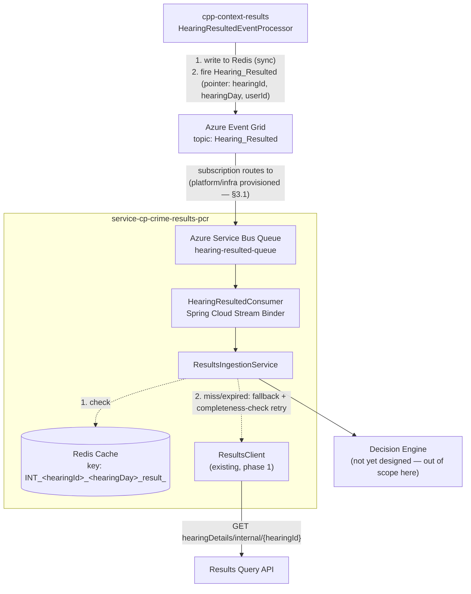
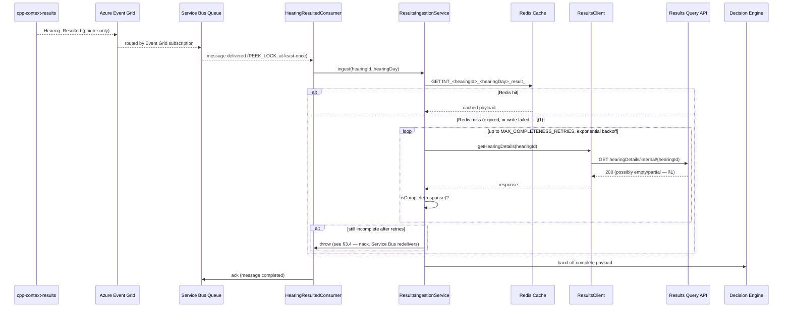

# PCR Hearing Event Ingestion Design

**Status:** Draft, 22 Jul 2026. Deep-dive expansion of v2 §3a/§3b/§4/§8's Event
Grid trigger and Results Query Client sections — same target architecture,
written out with concrete Spring/Azure wiring instead of prose-only.
Companion to
[`2026-07-21-pcr-data-store-design.md`](2026-07-21-pcr-data-store-design.md)
("the data-store doc") — together the two documents cover everything in v2's
target architecture except the Decision Engine, Transformer, and Correlation
pieces (v2 §5/§6), which aren't deep-dived yet.

**Scope:** the ingestion pipeline only — Event Grid subscription → Service
Bus queue → Spring Cloud Stream consumer → Results Query Client (Redis-first,
REST-fallback with a completeness check) → a raw hearing/results payload in
hand. Stops there. Does **not** cover the Decision Engine's per-defendant
fan-out or `publishedForNows` eligibility filtering, the Transformer, or
writing into `pcr_version` — the data-store doc covers the target shape of
that write, not how a payload gets there.

**Not yet built:** none of this exists in phase 1 — a stateless, synchronous
proxy with no Event Grid, no Redis, no Service Bus (see
[`2026-07-17-pcr-stateless-proxy-design.md`](2026-07-17-pcr-stateless-proxy-design.md)
§2). This document describes what a later phase adds *in front of* phase 1's
existing `ResultsClient` — that class's synchronous REST call is reused
here as the REST-fallback leg, not replaced or duplicated.

---

## 1. Why this design doesn't repeat v2's original assumption

v2 §4b recorded, but did not verify, tech arch's assumption that a
REST-fallback race against the asynchronous Results viewstore either fails
cleanly or is a non-issue once Redis's 24-hour TTL has expired — flagged as
an open item (§13 item 2) needing confirmation from the Results team or a
read of the actual code, not something to build retry logic around
unchecked.

A direct read of the legacy Function App
(`cpp-context-azure-legalaidagency`) and `cpp-context-results` contradicts
the "24h TTL means it's settled by fallback time" version of that
assumption:

- **Redis misses aren't only caused by TTL expiry.** `HearingResultedEventProcessor.java`
  and `RedisCacheService.java` wrap the cache write in a try/catch that
  swallows exceptions and only logs. If the write itself fails (a Redis
  outage, a connection blip), the very next `GET` returns `null`
  **immediately** — the REST fallback triggers with zero elapsed time, not
  after 24 hours.
- **The REST-fallback endpoint never returns a clean error for "not ready
  yet."** `results.get-hearing-details-internal` (`ResultsQueryView.java`)
  returns HTTP `200` with an empty JSON object if nothing exists yet, and
  `200` with whatever partial state currently exists if the aggregate is
  only partially projected. Never a `404`.
- **No completeness checking exists anywhere in the path this service
  replicates** — not in the Function App's fallback code, not in its
  retry wrapper (which only retries on transport failures — 5xx/timeout —
  with zero awareness of data completeness), not in the query-side
  viewstore endpoint, not in any test fixture for either repo.

This is a genuinely open, structural gap in the system being replicated —
not a new risk this service introduces, and not something 24 hours of
elapsed time reliably papers over. §3.3 below designs around it explicitly.

---

## 2. Architecture



Sequence for one hearing:



---

## 3. Component design

### 3.1 Event Grid → Service Bus (infra dependency, not app code)

Same cross-team dependency as v2 §13 item 1 — platform/infra provisions the
Event Grid subscription that routes `Hearing_Resulted` into a Service Bus
queue. Nothing in this service can provision that subscription itself; it
only consumes from the queue once the route exists. The concrete ask for
that team: an Event Grid subscription on the `Hearing_Resulted` topic,
routing into a new Service Bus queue (`hearing-resulted-queue` below is a
placeholder name, not a confirmed one).

App-side consumer config (Spring Cloud Azure Stream Binder for Service Bus —
confirmed as the correct pattern against Microsoft's own guidance in v2
§4b, no other reference pattern exists for a Spring Boot service receiving
Event Grid pushes without standing up its own webhook):

```yaml
# application.yml
spring:
  cloud:
    azure:
      servicebus:
        connection-string: ${SERVICEBUS_CONNECTION_STRING}
    function:
      definition: hearingResulted
    stream:
      bindings:
        hearingResulted-in-0:
          destination: hearing-resulted-queue
          group: pcr-service
      servicebus:
        bindings:
          hearingResulted-in-0:
            consumer:
              # PEEK_LOCK: message only completes after the handler returns
              # normally. An exception leaves it unacked — Service Bus
              # redelivers per the queue's own max-delivery-count and
              # backoff (platform/infra config, not this service's).
              checkpoint-mode: MANUAL
```

```java
@Configuration
@RequiredArgsConstructor
public class HearingResultedConsumerConfig {

    private final ResultsIngestionService ingestionService;

    @Bean
    public Consumer<HearingResultedPointer> hearingResulted() {
        return pointer -> {
            log.info("Received Hearing_Resulted pointer for hearingId:{} hearingDay:{}",
                    pointer.hearingId(), pointer.hearingDay());
            ingestionService.ingest(pointer.hearingId(), pointer.hearingDay());
        };
    }
}

// Matches the confirmed eventGridEvent.data shape (v2 §4a) — pointer only,
// no PCR content on the event itself.
record HearingResultedPointer(UUID hearingId, String hearingDay, String userId) {}
```

### 3.2 Redis cache client

Key format confirmed from both the write side
(`HearingResultedEventProcessor.java`) and the read side
(`HearingResultedCacheQuery/index.js`'s `getCacheKey`) — reused verbatim,
not reinvented:

```java
@Component
@RequiredArgsConstructor
@Slf4j
public class HearingResultedCacheClient {

    private final StringRedisTemplate redisTemplate;

    public Optional<String> get(final UUID hearingId, final String hearingDay) {
        final String key = cacheKey(hearingId, hearingDay);
        final String value = redisTemplate.opsForValue().get(key);
        if (value == null) {
            log.info("Redis miss for hearingId:{} — falling back to REST", hearingId);
        }
        return Optional.ofNullable(value);
    }

    private String cacheKey(final UUID hearingId, final String hearingDay) {
        return "INT_" + hearingId + "_" + hearingDay + "_result_";
    }
}
```

Read-only from this service's side — it never writes to this cache
(`cpp-context-results` owns the write, §2). No TTL management needed here
either, for the same reason.

### 3.3 `ResultsIngestionService` — Redis-first, REST-fallback, completeness check

The completeness check is the part v2's assumption skipped and §1 above
found no equivalent of anywhere in the legacy path. Minimal signal used
here: a hearing that has genuinely been resulted must have at least one
prosecution case in the response — an empty or missing `prosecutionCases`
is exactly the symptom §1 found the legacy REST-fallback path can return
with a `200` and no error.

```java
@Service
@RequiredArgsConstructor
@Slf4j
public class ResultsIngestionService {

    private static final int MAX_COMPLETENESS_RETRIES = 3;
    private static final Duration INITIAL_BACKOFF = Duration.ofSeconds(2);

    private final HearingResultedCacheClient cacheClient;
    private final ResultsClient resultsClient; // existing, phase 1
    private final ObjectMapper objectMapper;

    public HearingDetailsResponse ingest(final UUID hearingId, final String hearingDay) {
        return cacheClient.get(hearingId, hearingDay)
                .map(this::deserializeCachedPayload)
                .orElseGet(() -> fetchViaRestWithCompletenessCheck(hearingId));
    }

    private HearingDetailsResponse deserializeCachedPayload(final String cachedJson) {
        // Redis stores the same internal payload shape ResultsClient
        // parses from REST — one deserialization target either way.
        try {
            return objectMapper.readValue(cachedJson, HearingDetailsResponse.class);
        } catch (JsonProcessingException e) {
            throw new ResponseStatusException(HttpStatus.INTERNAL_SERVER_ERROR,
                    "Malformed cached payload", e);
        }
    }

    private HearingDetailsResponse fetchViaRestWithCompletenessCheck(final UUID hearingId) {
        for (int attempt = 1; attempt <= MAX_COMPLETENESS_RETRIES; attempt++) {
            final HearingDetailsResponse response = resultsClient.getHearingDetails(hearingId);
            if (isComplete(response)) {
                return response;
            }
            log.warn("Incomplete hearing details for hearingId:{} on attempt {}/{} — viewstore may not have caught up yet (§1)",
                    hearingId, attempt, MAX_COMPLETENESS_RETRIES);
            sleepUninterruptibly(backoffFor(attempt));
        }
        // §3.4: this is not a final failure — it's a signal to the message
        // layer that this delivery attempt should retry later, not that the
        // hearing will never be available.
        throw new ResponseStatusException(HttpStatus.SERVICE_UNAVAILABLE,
                "Hearing details not yet complete for hearingId " + hearingId + " after " + MAX_COMPLETENESS_RETRIES + " attempts");
    }

    private boolean isComplete(final HearingDetailsResponse response) {
        return response != null
                && response.getHearing() != null
                && response.getHearing().getProsecutionCases() != null
                && !response.getHearing().getProsecutionCases().isEmpty();
    }

    private Duration backoffFor(final int attempt) {
        return INITIAL_BACKOFF.multipliedBy((long) Math.pow(2, attempt - 1)); // 2s, 4s, 8s
    }
}
```

Deliberately **not** the same shape as the legacy `AxiosRetryWrapper` —
that class retries on transport failure only (5xx/timeout) and has no
concept of "got a response, but it's not actually populated yet." This
loop is the completeness-specific retry §1 found missing everywhere else;
transport-level retry (on the `RestClient` call itself) is a separate,
already-standard concern and isn't duplicated here.

### 3.4 Retry escalation — bounded in-process, then message-level

Two different kinds of retry, deliberately not conflated:

- **In-process, bounded (§3.3):** 3 attempts, exponential backoff (2s/4s/8s
  — a starting point, tunable via config, not locked). Smooths over the
  common near-miss case without holding the message lock for an
  unbounded time.
- **Message-level, via Service Bus (once in-process retries exhaust):**
  the thrown exception leaves the message unacked (`checkpoint-mode:
  MANUAL`, §3.1); Service Bus redelivers per the queue's own max-delivery-
  count and backoff policy — platform/infra configuration, not this
  service's code, same ownership boundary as the Event Grid subscription
  itself (§3.1).
- **Dead-letter queue needs monitoring.** If a hearing's details never
  become complete within the queue's max delivery count, the message
  dead-letters. Nobody is watching that today — same "needs a person
  actually watching for it, not just logging it" pattern already true of
  drift detection (data-store doc §5, resolved item; this is a new,
  separate thing to watch).

---

## 4. Idempotency — handed off, not solved here

Service Bus is at-least-once delivery. A redelivered message means
`ResultsIngestionService.ingest(...)` runs again for the same hearing,
producing the same (or a refreshed) payload a second time. Whatever
consumes that payload downstream (the not-yet-designed Decision Engine,
ultimately writing to `pcr_version`) needs to tolerate that — e.g.
deduping by `(source_id, defendant_id)` once `source_id` is populated
(data-store doc §3), or by some other means for the interim rows written
before it is. This document doesn't design that dedup mechanism — it's a
downstream concern this ingestion pipeline creates, not one it can resolve
on its own, and is flagged here so it isn't silently assumed away when the
Decision Engine/persistence integration is eventually designed.

---

## 5. Testing approach

Following this repo's existing WireMock-based integration pattern
(`shared-code-rules.md`), extended for the two new dependencies:

| Dependency | Test approach |
|---|---|
| Service Bus consumer | Spring Cloud Stream's test binder (`spring-cloud-stream-test-binder`) — publish a `HearingResultedPointer` directly to the input binding, assert `ResultsIngestionService.ingest(...)` is invoked with the right arguments. No real Service Bus needed. |
| Redis | Embedded/Testcontainers Redis for integration tests exercising the hit/miss branches — real `StringRedisTemplate` behaviour, not a mocked one, since the exact key format (§3.2) is worth testing against a real client. |
| REST fallback + completeness | Existing `WireMockServer` pattern (`PcrControllerIntegrationTest`'s approach) — stub `hearingDetails/internal/{hearingId}` to return an empty/partial body on the first N calls and a complete one after, asserting the retry loop terminates correctly and eventually returns the complete payload; a separate test asserts the `503` after exhausting `MAX_COMPLETENESS_RETRIES`. |

Unit tests: `ResultsIngestionService`'s `isComplete` branches (null response,
null `hearing`, null/empty `prosecutionCases`, genuinely complete),
`HearingResultedCacheClient`'s key-format construction, backoff calculation.

---

## 6. Open items — carried forward from v2, not resolved here

- **Event Grid subscription provisioning (v2 §13 item 1):** cross-team,
  platform/infra dependency — this service consumes from a queue that must
  already exist.
- **Confirm the queue's own max-delivery-count/backoff policy** with
  platform/infra once provisioned (§3.4) — not decided here, since it's
  the same ownership boundary as the subscription itself.
- **Completeness-check thresholds (3 attempts, 2s/4s/8s) are a starting
  point, not measured.** Worth revisiting once real production timing data
  exists for how long the viewstore actually takes to catch up after a
  Redis miss.
- **Idempotency (§4)** is flagged, not designed — belongs with whichever
  document eventually covers the Decision Engine/persistence integration.
