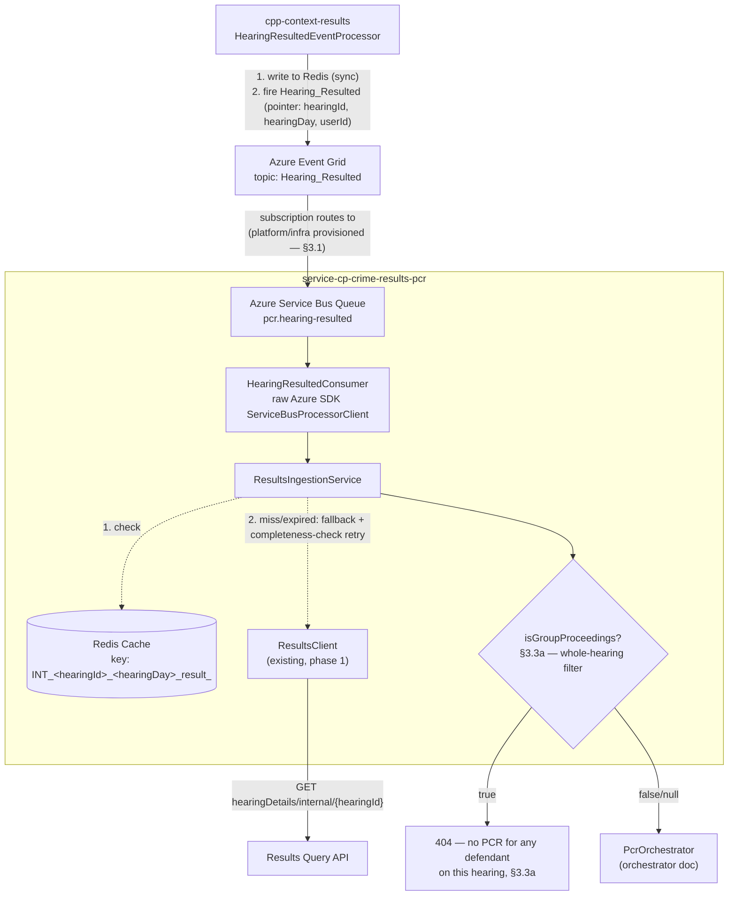
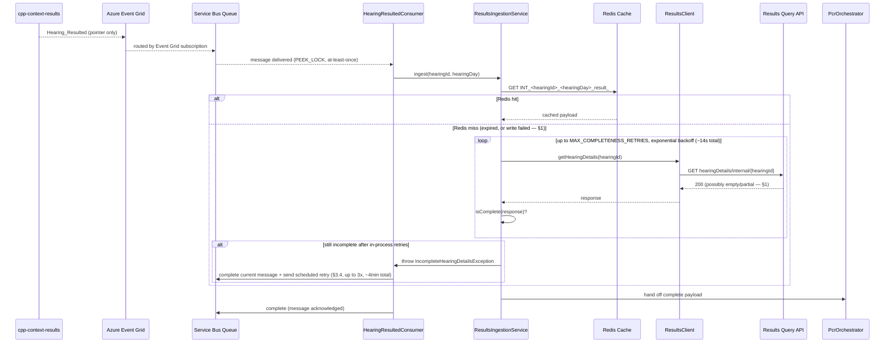

# PCR Hearing Event Ingestion Design

**Status:** Draft, 22 Jul 2026. Deep-dive expansion of v2 §3a/§3b/§4/§8's Event
Grid trigger and Results Query Client sections — the same target architecture,
written out with concrete Spring/Azure wiring instead of prose-only.
Companion to
[`2026-07-21-pcr-data-store-design.md`](2026-07-21-pcr-data-store-design.md)
("the data-store doc") and
[`2026-07-22-pcr-orchestrator-design.md`](2026-07-22-pcr-orchestrator-design.md)
("the orchestrator doc") — together the three cover the full pipeline from
Event Grid trigger through to a written `pcr_version` row.

**Scope:** the ingestion pipeline only — Event Grid subscription → Service
Bus queue → a raw Azure SDK Service Bus consumer → Results Query Client
(Redis-first, REST-fallback with a completeness check) → a raw
hearing/results payload in hand. Stops there. Does **not** cover the
Decision Engine's per-defendant fan-out or `publishedForNows` eligibility
filtering, the Transformer, or writing into `pcr_version` — the data-store
doc covers the target shape of that write, not how a payload gets there.

**Not yet built:** none of this exists in phase 1 — a stateless, synchronous
proxy with no Event Grid, no Redis, no Service Bus (see
[`2026-07-17-pcr-stateless-proxy-design.md`](2026-07-17-pcr-stateless-proxy-design.md)
§2). This document describes what a later phase adds *in front of* phase 1's
existing `ResultsClient` — that class's synchronous REST call is reused
here as the REST-fallback leg, not replaced or duplicated.

---

## 1. The completeness problem

A direct read of the legacy Function App
(`cpp-context-azure-legalaidagency`) and `cpp-context-results` establishes
why a REST-fallback race against the asynchronous Results viewstore can't
be assumed away, and why 24 hours of Redis TTL doesn't reliably settle it:

- **Redis misses aren't only caused by TTL expiry.** `HearingResultedEventProcessor.java`
  and `RedisCacheService.java` wrap the cache write in a try/catch that
  swallows exceptions and only logs. If the write itself fails (a Redis
  outage, a connection blip), the very next `GET` returns `null`
  **immediately** — the REST fallback triggers with zero elapsed time, not
  after 24 hours.
- **The REST-fallback endpoint never returns a clean error for "not ready
  yet."** `results.get-hearing-details-internal` (`ResultsQueryView.java`)
  returns HTTP `200` with an empty JSON object if nothing exists yet, and
  `200` with whatever partial state currently exists if the aggregate is
  only partially projected. Never a `404`.
- **No completeness checking exists anywhere in the path this service
  replicates** — not in the Function App's fallback code, not in its
  retry wrapper (which only retries on transport failures — 5xx/timeout —
  with zero awareness of data completeness), not in the query-side
  viewstore endpoint, not in any test fixture for either repo.

This is a genuinely open, structural gap in the system being replicated —
not a new risk this service introduces, and not something 24 hours of
elapsed time reliably papers over. §3.3 below designs around it explicitly.

---

## 2. Architecture



Sequence for one hearing:



---

## 3. Component design

### 3.1 Event Grid → Service Bus

Azure Service Bus is **one shared namespace per environment**
(`sbdevamp01`, `sbsitamp01`, `sbprdamp01`, `sbprpamp01` —
`cp-vp-aks-deploy/vp-config/*_values.yml`), not one namespace per service.
Every onboarded service gets `AZURE_SERVICE_BUS_URI` and `Service Bus Data
Owner` RBAC on that shared namespace automatically, via the standard
deploy pipeline (`vp-deploy.yml`'s "Shared lookups (same for all
services)" step) — no per-service provisioning request. This service
self-creates its own queue at startup via the Service Bus Administration
SDK once onboarded to `cp-vp-aks-deploy` the normal way — the same pattern
`service-cp-crime-hearing-results-document-subscription` ("HRDS," a live
sibling `service-cp-*`) already uses for its own queues against that same
shared namespace (client construction below).

**The one genuine cross-team ask**, per v2 §13 item 1: the **Event Grid
subscription** routing `Hearing_Resulted` into whichever queue this
service creates. This service has no way to create that subscription
itself — Event Grid subscriptions are managed on the publisher/topic side
(`cpp-context-results`'s topic, confirmed below), not something a consumer
can self-serve.

**This service needs its own queue**

**Topic:** `cpp-context-results`'s own WildFly config (the publisher
side) names the real `Hearing_Resulted` topic: host
`eg-ste-ccp0121-hearingres.uksouth-1.eventgrid.azure.net` (nonlive/"ste"
environment, `uksouth-1`), endpoint `https://eg-ste-ccp0121-hearingres.uksouth-1.eventgrid.azure.net/api/events`.
The access key is never written here — it's a live secret and belongs in
whatever this org's services already use for secret management (Key
Vault, or an env var injected at deploy time), referenced only by name,
e.g. `${EVENTGRID_TOPIC_KEY}`. This service is a Grid *subscriber* via the
Service Bus queue, not a direct Event Grid client — it doesn't need this
key itself; recorded here only to confirm which topic platform/infra
needs to route.

**Client construction matches how this org actually talks to Service
Bus** — the raw Azure SDK (`ServiceBusAdministrationClient`,
`ServiceBusClientBuilder`, `ServiceBusProcessorClient`), the same way
HRDS is built, not `spring-cloud-azure-stream-binder-servicebus`. This is
a client-construction concern (how do you authenticate and connect in
this environment), not a retry-policy one (§3.4 designs that fresh). It
also confirms the right auth model: in Azure (not the local emulator),
connections are **passwordless**, via managed identity
(`DefaultAzureCredentialBuilder` against the namespace host) — consistent
with the RBAC model confirmed above. There is no connection-string-with-
embedded-key anywhere in Azure.

```yaml
# application.yml
service-bus:
  # Emulator vs Azure detected from the connection string (https = Azure,
  # sb:// = emulator) — same detection HRDS already uses.
  admin-connection: ${AZURE_SERVICE_BUS_ADMIN_URI:Endpoint=sb://localhost:5300;SharedAccessKeyName=RootManageSharedAccessKey;SharedAccessKey=SAS_KEY_VALUE;UseDevelopmentEmulator=true;}
  connection: ${AZURE_SERVICE_BUS_URI:Endpoint=sb://localhost;SharedAccessKeyName=RootManageSharedAccessKey;SharedAccessKey=SAS_KEY_VALUE;UseDevelopmentEmulator=true;}
  queue-name: ${PCR_HEARING_RESULTED_QUEUE:pcr.hearing-resulted}
```

```java
@Component
@RequiredArgsConstructor
public class HearingResultedServiceBusClientFactory {

    private final ServiceBusProperties properties; // connection, admin-connection, queue-name

    public ServiceBusProcessorClient processorClient(final Consumer<ServiceBusReceivedMessageContext> onMessage,
                                                       final Consumer<ServiceBusErrorContext> onError) {
        return clientBuilder().processor()
                .queueName(properties.getQueueName())
                .processMessage(onMessage::accept)
                .processError(onError::accept)
                .buildProcessorClient();
    }

    public ServiceBusSenderClient senderClient() {
        return clientBuilder().sender().queueName(properties.getQueueName()).buildClient();
    }

    private ServiceBusClientBuilder clientBuilder() {
        if (properties.isEmulator()) {
            return new ServiceBusClientBuilder().connectionString(properties.getConnection());
        }
        return new ServiceBusClientBuilder()
                .fullyQualifiedNamespace(URI.create(properties.getConnection()).getHost())
                .credential(new DefaultAzureCredentialBuilder().build());
    }
}
```

```java
@Component
@RequiredArgsConstructor
@Slf4j
public class HearingResultedConsumer {

    private final HearingResultedServiceBusClientFactory clientFactory;
    private final ResultsIngestionService ingestionService; // §3.3/§3.4

    private ServiceBusProcessorClient processorClient;

    @PostConstruct
    void start() {
        processorClient = clientFactory.processorClient(this::onMessage, this::onError);
        processorClient.start();
    }

    private void onMessage(final ServiceBusReceivedMessageContext context) {
        // §3.1a — the message body is the Event Grid envelope, not a flat
        // pointer payload. Unwrap before use.
        final HearingResultedPointer pointer = unwrap(context.getMessage());
        try {
            ingestionService.ingest(pointer.hearingId(), pointer.hearingDay());
            context.complete();
        } catch (IncompleteHearingDetailsException e) {
            // §3.4 — a deliberate, scheduled retry, not native abandon/redelivery.
            ingestionService.scheduleRetry(context, pointer);
        } catch (Exception e) {
            log.error("Unrecoverable failure ingesting hearingId:{}", pointer.hearingId(), e);
            context.deadLetter(); // genuinely wrong, not a transient completeness wait
        }
    }

    private void onError(final ServiceBusErrorContext errorContext) {
        log.error("Unexpected Service Bus processor error", errorContext.getException());
    }
}

// Matches the confirmed eventGridEvent.data shape (v2 §4a) — pointer only,
// no PCR content on the event itself.
record HearingResultedPointer(UUID hearingId, String hearingDay, String userId) {}
```

### 3.1a Event Grid envelope — unwrap before use

The Service Bus message body is not the flat pointer payload directly —
it's the Event Grid envelope, with the pointer fields nested under
`.data`. Confirmed from both sides of the real event:

- **Publisher** (`EventGridPublisher.java`, `cpp-context-results`): built
  via `.buildEventGridEventPublisherClient()` — the `EventGridEvent`/
  **EventGridSchema** client, not `CloudEvent`/CloudEventSchemaV1_0.
  `sendEventToGrid(...)` (`HearingResultedEventProcessor.java`) always
  publishes via the with-`hearingDay` payload
  (`HearingResultedForDayEventData{hearingId, userId, hearingDay}`) for
  the `Hearing_Resulted` event type specifically — `hearingDay` is always
  present, not optional.
- **Consumer** (legacy, `PrisonCourtRegisterEventGridTrigger/index.js`):
  reads `eventGridEvent.data.hearingId`/`.data.hearingDay`/`.data.userId`
  alongside top-level `eventGridEvent.subject`/`.eventTime` — the pointer
  fields are nested under `.data`, with `subject`/`eventTime`/`eventType`
  at the envelope's top level.

**The same topic carries a sibling event type, `SJP_Hearing_Resulted`**
(Single Justice Procedure hearings) — the Event Grid subscription's
event-type filter must match `Hearing_Resulted` exactly, not loosely, or
SJP events would land in this queue too.

That legacy trigger receives events via Azure Functions' native
`EventGridTrigger` binding, which auto-deserializes the envelope for the
caller — a convenience specific to that binding, not something a Service
Bus queue destination provides for free. This service's
`ServiceBusProcessorClient` receives the raw envelope JSON as the message
body and has to unwrap it itself:

```java
private HearingResultedPointer unwrap(final ServiceBusReceivedMessage message) {
    final EventGridEnvelope envelope = jsonMapper.fromJson(
            message.getBody().toString(), EventGridEnvelope.class);
    return new HearingResultedPointer(
            envelope.data().hearingId(), envelope.data().hearingDay(), envelope.data().userId());
}

record EventGridEnvelope(String eventType, String subject, String eventTime, EventGridData data) {}
record EventGridData(UUID hearingId, String hearingDay, String userId) {}
```

**Not independently confirmed:** whether a Service-Bus-queue
*destination* delivers one envelope object per message or an array of
envelopes per message — a subscription-level delivery detail, not a
publisher-side one, so the publisher-client evidence above doesn't settle
it. Capture a real message once the subscription exists (§6) and confirm
`unwrap()` against it before relying on the single-object shape above.

### 3.2 Redis cache client

Key format confirmed from both the write side
(`HearingResultedEventProcessor.java`) and the read side
(`HearingResultedCacheQuery/index.js`'s `getCacheKey`) — reused verbatim,
not reinvented:

```java
@Component
@RequiredArgsConstructor
@Slf4j
public class HearingResultedCacheClient {

    private final StringRedisTemplate redisTemplate;

    public Optional<String> get(final UUID hearingId, final String hearingDay) {
        final String key = cacheKey(hearingId, hearingDay);
        final String value = redisTemplate.opsForValue().get(key);
        if (value == null) {
            log.info("Redis miss for hearingId:{} — falling back to REST", hearingId);
        }
        return Optional.ofNullable(value);
    }

    private String cacheKey(final UUID hearingId, final String hearingDay) {
        return "INT_" + hearingId + "_" + hearingDay + "_result_";
    }
}
```

Read-only from this service's side — it never writes to this cache
(`cpp-context-results` owns the write, §2). No TTL management needed here
either, for the same reason.

### 3.3 `ResultsIngestionService` — Redis-first, REST-fallback, completeness check

Minimal completeness signal used here: a hearing that has genuinely been
resulted must have at least one prosecution case in the response — an
empty or missing `prosecutionCases` is exactly the symptom §1 identified
the legacy REST-fallback path can return with a `200` and no error.

```java
@Service
@RequiredArgsConstructor
@Slf4j
public class ResultsIngestionService {

    private static final int MAX_COMPLETENESS_RETRIES = 3;
    private static final Duration INITIAL_BACKOFF = Duration.ofSeconds(2);

    private final HearingResultedCacheClient cacheClient;
    private final ResultsClient resultsClient; // existing, phase 1
    private final ObjectMapper objectMapper;

    public HearingDetailsResponse ingest(final UUID hearingId, final String hearingDay) {
        return cacheClient.get(hearingId, hearingDay)
                .map(this::deserializeCachedPayload)
                .orElseGet(() -> fetchViaRestWithCompletenessCheck(hearingId));
    }

    private HearingDetailsResponse deserializeCachedPayload(final String cachedJson) {
        // Redis stores the same internal payload shape ResultsClient
        // parses from REST — one deserialization target either way.
        try {
            return objectMapper.readValue(cachedJson, HearingDetailsResponse.class);
        } catch (JsonProcessingException e) {
            throw new ResponseStatusException(HttpStatus.INTERNAL_SERVER_ERROR,
                    "Malformed cached payload", e);
        }
    }

    private HearingDetailsResponse fetchViaRestWithCompletenessCheck(final UUID hearingId) {
        for (int attempt = 1; attempt <= MAX_COMPLETENESS_RETRIES; attempt++) {
            final HearingDetailsResponse response = resultsClient.getHearingDetails(hearingId);
            if (isComplete(response)) {
                return response;
            }
            log.warn("Incomplete hearing details for hearingId:{} on attempt {}/{} — viewstore may not have caught up yet (§1)",
                    hearingId, attempt, MAX_COMPLETENESS_RETRIES);
            sleepUninterruptibly(backoffFor(attempt));
        }
        // §3.4 — the consumer, not this class, decides what "try again
        // later" means at the message level.
        throw new IncompleteHearingDetailsException(hearingId, MAX_COMPLETENESS_RETRIES);
    }

    private boolean isComplete(final HearingDetailsResponse response) {
        return response != null
                && response.getHearing() != null
                && response.getHearing().getProsecutionCases() != null
                && !response.getHearing().getProsecutionCases().isEmpty();
    }

    private Duration backoffFor(final int attempt) {
        return INITIAL_BACKOFF.multipliedBy((long) Math.pow(2, attempt - 1)); // 2s, 4s, 8s
    }
}
```

Deliberately **not** the same shape as the legacy `AxiosRetryWrapper` —
that class retries on transport failure only (5xx/timeout) and has no
concept of "got a response, but it's not actually populated yet." This
loop is the completeness-specific retry that §1 found missing everywhere
else in the system being replicated; transport-level retry (on the
`RestClient` call itself) is a separate, already-standard concern and
isn't duplicated here.

### 3.3a Whole-hearing filters — the boundary this document owns

Exactly two whole-hearing filters exist in the legacy system, both
evaluated immediately after the hearing payload is retrieved and before
any per-defendant work starts — confirmed by reading the full legacy
orchestrator (`PrisonCourtRegisterOrchestrator/index.js`, no other guard
anywhere) and the start of `SetPrisonCourtRegister.build()`, which goes
straight into per-defendant fan-out with no guard of its own. This is the
correct home for both checks — `PcrOrchestrator` (the orchestrator design
doc) begins *after* per-defendant fan-out has already happened, so it
structurally cannot apply a whole-hearing filter; it would have to apply
the same check once per defendant, redundantly.

1. **`isGroupProceedings`** — `PrisonCourtRegisterOrchestrator/index.js:20-22`:
   `if (isGroupProceedings == null || isGroupProceedings == false)` gates
   everything downstream (loose `==`, not `===` — legacy's own semantics,
   worth replicating exactly: only a literal `true` skips, `null`/`false`/
   anything else proceeds). Not yet modeled anywhere — `HearingDetailsResponse.HearingDetail`
   (phase 1) has no `isGroupProceedings` field today; see §6.
2. **The hearing payload must resolve to something non-null** — already
   handled by this service's own completeness-check retry (§3.3), but the
   legacy source of "null" is wider than just a Redis miss: `getHearing`
   (`HearingResultedCacheQuery/index.js`, ~lines 168–183) also returns
   `null` outright, skipping the REST fallback *entirely*, if `cjscppuid`
   or `hearingId` is missing on the request — not a case this service
   should hit in practice, since `CJSCPPUID` is service-level config here
   (`AppPropertiesBackend`), not a per-request value that can go missing —
   but worth recording as reviewed, not overlooked.

**Where this sits in `ingest`:** the `isGroupProceedings` check belongs
right after the payload is retrieved (Redis or REST) and before handing
off downstream — the exact position the legacy orchestrator places it:

```java
public HearingDetailsResponse ingest(final UUID hearingId, final String hearingDay) {
    final HearingDetailsResponse response = cacheClient.get(hearingId, hearingDay)
            .map(this::deserializeCachedPayload)
            .orElseGet(() -> fetchViaRestWithCompletenessCheck(hearingId));
    if (isGroupProceedings(response)) {
        // Matches legacy exactly: a group-proceedings hearing produces no
        // PCR content for any defendant on it, not an error — same "no
        // content exists" outcome as the orchestrator doc's subscription
        // no-match case (404), just at the whole-hearing level instead of
        // per-defendant.
        throw new ResponseStatusException(HttpStatus.NOT_FOUND,
                "No PCR version found for the supplied identifiers");
    }
    return response;
}

private boolean isGroupProceedings(final HearingDetailsResponse response) {
    return Boolean.TRUE.equals(response.getHearing().isGroupProceedings()); // new field — §6
}
```

### 3.4 Retry escalation — sized for eventual consistency, not external availability

This service's retry problem is a distinct shape from either sibling's:
HRDS's retry service (`ServiceBusRetryService`, `retry-durations` config)
is tuned for *external subscriber-callback availability* — a
subscriber's endpoint being down is reasonably expected to last hours, so
HRDS schedules up to 108 tries across a schedule stretching to 4 hours.
The legacy Function App's `AxiosRetryWrapper` is tuned for *transport*
failures inside one synchronous activity call — 3 fixed 1-second retries,
no concept of "got a response but it's not populated yet," and no
message queue at all to retry against later. This service's problem is an
*eventual-consistency* wait (the Results viewstore catching up after a
Redis miss) that normally resolves in seconds, consumed via an
*at-least-once queue*, which gives it native primitives — scheduled
redelivery, dead-lettering — neither sibling's architecture had available.
Neither sibling's specific numbers fit: HRDS's hours-long schedule would
leave a hearing looking "stuck" for far longer than the actual problem
ever takes to resolve; the Function App's fixed short retries block a
thread with no fallback for anything slower.

**Two tiers, both short, sized for "this should resolve in seconds — if
it hasn't after low single-digit minutes, something is actually wrong":**

1. **In-process, bounded (§3.3):** 3 attempts, exponential backoff
   (2s/4s/8s, ~14s total). Handles the common case — most viewstore lag
   resolves within this window — without ever touching the queue again.
2. **Message-level, scheduled redelivery (once tier 1 exhausts):** rather
   than relying on Service Bus's *native* abandon-and-redeliver (which has
   no built-in backoff — an abandoned message becomes visible again
   almost immediately, which would just hammer the Results API in a tight
   loop), this service explicitly completes the current message and sends
   a **new** message to the same queue with an explicit
   `ServiceBusMessage` scheduled enqueue time — a deliberate, spaced-out
   redelivery, not the broker's default behaviour. Retry count travels as
   a message application property (`retryCount`), not a custom JSON
   envelope — this service doesn't need HRDS's `targetUrl`/correlation
   wrapper shape, so it doesn't carry one.

```java
public class IncompleteHearingDetailsException extends RuntimeException {
    IncompleteHearingDetailsException(final UUID hearingId, final int attemptsExhausted) {
        super("Hearing details not yet complete for hearingId " + hearingId + " after " + attemptsExhausted + " in-process attempts");
    }
}
```

```java
@Service
@RequiredArgsConstructor
@Slf4j
public class ResultsIngestionService {

    private static final int MAX_SCHEDULED_RETRIES = 3;
    private static final List<Duration> SCHEDULED_RETRY_DELAYS =
            List.of(Duration.ofSeconds(30), Duration.ofMinutes(1), Duration.ofMinutes(2)); // ~4 minutes total, tunable

    private final HearingResultedServiceBusClientFactory clientFactory;
    private final JsonMapper jsonMapper;
    // ... cacheClient, resultsClient, objectMapper as in §3.3

    public void scheduleRetry(final ServiceBusReceivedMessageContext context, final HearingResultedPointer pointer) {
        final int retryCount = retryCountOf(context.getMessage()) + 1;
        context.complete(); // take ownership of the retry — don't leave this to native abandon/redelivery
        if (retryCount > MAX_SCHEDULED_RETRIES) {
            log.error("Giving up on hearingId:{} after {} scheduled retries — dead-lettering explicitly", pointer.hearingId(), retryCount);
            sendDeadLettered(pointer, retryCount);
            return;
        }
        final Duration delay = SCHEDULED_RETRY_DELAYS.get(retryCount - 1);
        final ServiceBusMessage retryMessage = new ServiceBusMessage(jsonMapper.toJson(pointer));
        retryMessage.getApplicationProperties().put("retryCount", retryCount);
        retryMessage.setScheduledEnqueueTime(OffsetDateTime.now().plus(delay));
        log.warn("Scheduling retry {}/{} for hearingId:{} in {}", retryCount, MAX_SCHEDULED_RETRIES, pointer.hearingId(), delay);
        try (ServiceBusSenderClient sender = clientFactory.senderClient()) {
            sender.sendMessage(retryMessage);
        }
    }

    private int retryCountOf(final ServiceBusReceivedMessage message) {
        final Object value = message.getApplicationProperties().get("retryCount");
        return value == null ? 0 : (int) value;
    }
}
```

`sendDeadLettered` isn't shown — after `MAX_SCHEDULED_RETRIES`, this
service sends the message to the queue's dead-letter sub-queue explicitly
(via the same sender, or a receiver-side `deadLetter()` call before the
`complete()` above, whichever the real Azure SDK client shape makes
cleaner — an implementation detail, not a design decision). The design
decision is the ceiling itself: **~4 minutes total** across both tiers, a
full order of magnitude shorter than HRDS's schedule, because this
service's failure mode is qualitatively different from HRDS's.

**Dead-letter queue needs monitoring** — nobody is watching it today.
Same "needs a person actually watching for it, not just logging it"
pattern already true of drift detection (data-store doc §5, resolved
item; this is a new, separate thing to watch).

---

## 4. Idempotency — handed off, not solved here

Service Bus is at-least-once delivery. A redelivered message means
`ResultsIngestionService.ingest(...)` runs again for the same hearing,
producing the same (or a refreshed) payload a second time. Whatever
consumes that payload downstream (`PcrOrchestrator`, ultimately writing to
`pcr_version`) needs to tolerate that — e.g. deduping by
`(source_id, defendant_id)` once `source_id` is populated (data-store doc
§3), or by some other means for the interim rows written before it is.
This document doesn't design that dedup mechanism — it's a downstream
concern this ingestion pipeline creates, not one it can resolve on its
own.

---

## 5. Testing approach

Following this repo's existing WireMock-based integration pattern
(`shared-code-rules.md`), extended for the two new dependencies:

| Dependency | Test approach |
|---|---|
| Service Bus consumer | `HearingResultedConsumer.onMessage` called directly with a mocked `ServiceBusReceivedMessageContext` — no real Service Bus needed for the unit-level branches (`complete()`, `scheduleRetry()`, `deadLetter()` called correctly for each outcome). |
| Service Bus queue/scheduled-retry integration | Emulator (`UseDevelopmentEmulator=true`, same as HRDS's local setup) for integration tests that need a real queue — asserting the scheduled message's `retryCount` application property and enqueue time, not just mocking the sender. |
| Redis | Embedded/Testcontainers Redis for integration tests exercising the hit/miss branches — real `StringRedisTemplate` behaviour, not a mocked one, since the exact key format (§3.2) is worth testing against a real client. |
| REST fallback + completeness | Existing `WireMockServer` pattern (`PcrControllerIntegrationTest`'s approach) — stub `hearingDetails/internal/{hearingId}` to return an empty/partial body on the first N calls and a complete one after, asserting the in-process retry loop terminates correctly and eventually returns the complete payload; a separate test asserts `IncompleteHearingDetailsException` after exhausting `MAX_COMPLETENESS_RETRIES`. |

Unit tests: `ResultsIngestionService`'s `isComplete` branches (null response,
null `hearing`, null/empty `prosecutionCases`, genuinely complete),
`HearingResultedCacheClient`'s key-format construction, backoff calculation.

---

## 6. Open items — not resolved here

- **Single-envelope vs. array delivery to the Service Bus queue (§3.1a) —
  not independently confirmed.** The envelope schema itself is confirmed
  (EventGridSchema, `.data`-nested pointer fields, `hearingDay` always
  present) from both the publisher (`EventGridPublisher.java`) and legacy
  consumer (`PrisonCourtRegisterEventGridTrigger/index.js`) sides. What's
  still unconfirmed is a subscription-level delivery detail neither side
  settles: whether a Service-Bus-queue *destination* delivers one envelope
  object per message or an array of envelopes per message. Capture a real
  message once the subscription (Jira ticket, §3.1) exists and confirm
  `unwrap()` against it.
- **Event Grid subscription provisioning (v2 §13 item 1) — the Service Bus
  queue itself doesn't need a platform/infra request** (§3.1) — this
  service can self-provision it in the already-shared per-environment
  namespace once onboarded to `cp-vp-aks-deploy`, same as HRDS does. Only
  the Event Grid subscription routing `Hearing_Resulted` into that queue
  remains a genuine cross-team ask, since this service can't create that
  subscription itself.
- **The queue's native max-delivery-count is a backstop, not the retry
  mechanism (§3.4)** — this service owns its own retry schedule explicitly
  (scheduled redelivery, ~4 minutes total, then an explicit dead-letter).
  The native setting still matters as a safety net for genuinely
  unexpected crashes that skip the `try`/`catch` in
  `HearingResultedConsumer.onMessage` entirely — worth setting to
  something sane (e.g. low single digits) when the queue is
  self-provisioned, not left at whatever Service Bus defaults to.
- **HRDS's own docs (README/CLAUDE.md) describe "topics" — its actual code
  uses plain queues exclusively**, no topics anywhere — a doc/code drift
  in a different repo, not this one's to fix, but worth flagging to that
  team since it could mislead the next person who reads it instead of the
  code.
- **Completeness-check thresholds (3 attempts, 2s/4s/8s) are a starting
  point, not measured.** Worth revisiting once real production timing data
  exists for how long the viewstore actually takes to catch up after a
  Redis miss.
- **Idempotency (§4)** is flagged, not designed — belongs with whichever
  document eventually covers the Decision Engine/persistence integration.
- **`isGroupProceedings` has no field yet (§3.3a).** `HearingDetailsResponse.HearingDetail`
  (phase 1) doesn't model it. Confirm it's actually present on a real
  `hearingDetails/internal` response before adding it — same rigor
  standard as every other unconfirmed field in this doc series.
- **Phase 1's already-shipped code doesn't check this at all.** Separate
  from the design gap above: `PcrService`/`PcrController` (live today) has
  no `isGroupProceedings` check anywhere — a synchronous `version=latest`
  request against a group-proceedings hearing currently returns PCR
  content the legacy system would never have generated. This is a real
  functional gap in shipped code, not just a documentation gap for a
  future phase — worth prioritizing as its own fix, independent of when
  the rest of this ingestion pipeline gets built.
