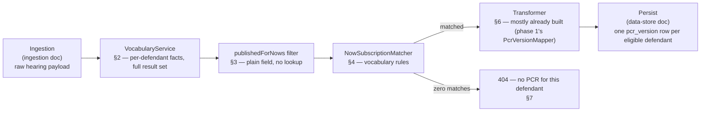

# PCROrchestrator (Decision Engine, Enrichment, and Transformer) Design

**Status:** Draft, 22 Jul 2026, cross-checked file-by-file against the
`cpp-context-azure-legalaidagency` source on 23 Jul 2026. Deep-dive of v2
§5a/§6/§8's Decision Engine, Enrichment, and Transformer components,
grounded in a direct read-through of the legacy
`PrisonCourtRegisterOrchestrator`'s five Durable Functions activities and
the `SubscriptionsService`/`VocabularyService` modules it calls —
`file:line` citations throughout point into that repo. Companion to
[`2026-07-22-pcr-hearing-event-ingestion-design.md`](2026-07-22-pcr-hearing-event-ingestion-design.md)
("the ingestion doc") and
[`2026-07-21-pcr-data-store-design.md`](2026-07-21-pcr-data-store-design.md)
("the data-store doc") — together the three cover the full pipeline from
Event Grid trigger through to a written `pcr_version` row.

**Why subscription matching is in scope at all:** a defendant with zero
matched subscriptions gets no register in the legacy system — subscription
matching isn't recipient routing, it's the generation gate itself.
Independent of the `publishedForNows` content filter, a defendant can be
filtered out entirely (e.g. most non-custody defendants fail every
subscription's custody-status rule). This service's job is to expose "the
same underlying content currently distributed as a PDF" (v2 §1); if the
legacy system never produced that PDF for a given defendant, serving PCR
content for them anyway isn't mirroring the source system — it's inventing
content that never existed. This document replicates the gate, not just
the content shaping.

**Scope:** everything between "raw hearing/results payload in hand" (the
ingestion doc's boundary) and "content ready to persist into `pcr_version`"
(the data-store doc's target):
- Per-defendant vocabulary computation (§2)
- The `publishedForNows` content filter (§3)
- The subscription-match generation gate (§4)
- Enrichment (§5) and the Transformer (§6)

**Explicitly not in scope** — the other half of the legacy orchestrator,
which is about *delivery*, not content or eligibility:
- Recipient/email/template resolution (legacy activity 4's `recipientFromCase`/
  `recipientFromResults`/`recipientFromSubscription` paths) — this service
  reads and serves content; it doesn't route or send registers anywhere.
- Submission to Progression (legacy activity 5) — same reason.
- The group-proceedings whole-hearing skip (`isGroupProceedings`) — belongs
  with the ingestion doc's boundary (it's a whole-hearing filter, evaluated
  before per-defendant fan-out even starts). It runs in the orchestrator
  itself, immediately after activity 1 returns and before activity 2 is
  invoked (`PrisonCourtRegisterOrchestrator/index.js:20-22`), not inside
  activity 1 (`HearingResultedCacheQuery`).

---

## 1. Pipeline position

`PcrOrchestrator` performs the decision-relevant subset of the legacy
orchestrator's five activities — activities 2 and 3 only:

1. **Compute vocabulary** (`VocabularyService.compute`, §2) — per-defendant
   fact computation from the full, unfiltered result set.
2. **Exclude `publishedForNows` results**
   (`PcrOrchestrator.excludePublishedForNows`, §3) — the content filter,
   replicating legacy activity 2's `filterJudicialResultsApplicableForRegisters`
   step.
3. **Determine whether a PCR is required**
   (`PcrOrchestrator.isPrisonCourtRegisterRequired`, §4) — the
   subscription-match gate (vocabulary rules via `NowSubscriptionMatcher`,
   backed by `ReferenceDataClient`), replicating legacy activity 3
   (`PrisonCourtRegisterSubscriptions`).

Not included, even though the legacy orchestrator's activities 2 and 3 also
touch them: building the register fragment's non-decision content, and
anything from activities 4–5 (recipients, payload assembly, Progression
submission) — see "Explicitly not in scope" above.

**Naming — `PcrOrchestrator`, not the legacy name.** The legacy top-level
coordinator, `PrisonCourtRegisterOrchestrator`, is an Azure Durable
Functions orchestrator function with checkpointing/replay semantics,
coordinating all five activities including delivery. A plain Spring
`@Component` coordinating only the decision-relevant subset (activities
2–3) isn't the same thing, so this class follows this service's own
naming convention instead — `PcrController`, `PcrService`,
`PcrVersionMapper` are all `Pcr`-prefixed — while still naming the class
for what it does: coordinate `VocabularyService`, the `publishedForNows`
filter, and `NowSubscriptionMatcher`/`ReferenceDataClient` in sequence.



This diagram is *this service's* equivalent of the legacy pipeline, not a
literal mirror of its control flow. The real orchestrator never gates
activities 3/4/5 on subscription-match outcomes at all — it calls them
unconditionally; "zero matches → no register" is enforced *inside* legacy
activity 4 (`OutboundPrisonCourtRegister`, which discards fragments with no
`matchedSubscriptions` before building payloads) — a detail that only
matters to delivery-routing machinery this service doesn't replicate. The
determination itself (`matchedSubscriptions.length > 0`, legacy activity 4)
is exactly equivalent to this design's `PcrOrchestrator.isPrisonCourtRegisterRequired`
(§4) — same check, just relocated earlier in the pipeline since this
service has no reason to build the rest of activity 4's recipient/payload
machinery first.

A second, separate orchestrator-level gate does exist: activities 3–5 are
skipped entirely when `if (prisonCourtRegisters.length)` is false
(`PrisonCourtRegisterOrchestrator/index.js:32`) — i.e. activity 2
(`SetPrisonCourtRegister`) produced zero fragments for the whole hearing
(no eligible defendant/case/application at all), not "this defendant failed
subscription matching." For this service that's simply "no defendants to
iterate" and needs no separate modelling, but activities 3–5 are not
unconditionally reached just because activity 1 succeeded. A second,
narrower discard also exists per-fragment inside activity 4
(`if (!hearingJson.prosecutionCases && !hearingJson.courtApplications) return null;`,
`OutboundPrisonCourtRegister/index.js:30-33`) — likely unreachable in
practice since a fragment can't exist without cases/applications, noted for
completeness only.

---

## 2. `VocabularyService` — per-defendant fact computation

The vocabulary is computed from the defendant's **full** result set,
before any filtering — it's used by the subscription matcher (§4), so it
must reflect everything the defendant actually has, not what's left after
`publishedForNows` stripping.

The real `VocabularyService` is constructed with
`(hearingObj, defendantContextBase, majorCreditorMap, complianceEnforcementList)`
(`VocabularyService.js:137`) and its `getVocabularyInfo()` returns the
following fields that matter for PCR (`VocabularyService.js:9-29`):
`custodyLocationIsPolice`, `custodyLocationIsPrison` (from which `inCustody`
is derived), `atleastOneCustodialResult`, `allNonCustodialResults`,
`atleastOneNonCustodialResult`, `appearedInPerson`, `appearedByVideoLink`,
`anyAppearance`, `isCpsProsecuted`, `youthDefendant`, `adultDefendant`,
`welshCourtHearing`, `englishCourtHearing`, `prosecutorMajorCreditor`
(array), `nonProsecutorMajorCreditor` (array). §4's
`checkIfCustodialResultMatch` reads `allNonCustodialResults`/
`atleastOneNonCustodialResult` directly, so both are needed alongside the
single custodial-result boolean, not instead of it.

- **Custody location is a hearing-wide `masterDefendantId` scan, not a read
  of the defendant's own object.** `getCustodyLocationInfo()`
  (`VocabularyService.js:194-243`) scans every defendant across every
  `prosecutionCase` sharing the same `masterDefendantId`, plus every
  `courtApplication.subject.masterDefendant` matching it — the same pattern
  as `cpsProsecuted` below. A defendant appearing in more than one
  case/application on one hearing can have `custodyLocationIsPolice` and
  `custodyLocationIsPrison` both `true`, so these are modelled as two
  independent booleans rather than one mutually-exclusive enum.
- **`inCustody` is derived, and doesn't cover every custody value.**
  `LocationTypeEnum.js:1-5` defines three custody values —
  `'Police Station'`, `'Prison'`, `'DETENTIONCENTRE'` — but the
  custody-location `switch` only has `case`s for the first two
  (`VocabularyService.js:207-214,227-234`); `'DETENTIONCENTRE'` is
  unhandled, so `inCustody = custodyLocationIsPrison || custodyLocationIsPolice`
  (line 167) is `false` for a defendant held in a detention centre even
  though `custodialEstablishment` is present. This service models
  `inCustody` as the OR of the two booleans, faithfully including the
  detention-centre gap rather than "fixing" it with a broader
  `establishment != null` check — confirm with whoever owns the legacy
  logic before changing this.
- **`attendanceType` is not a plain per-defendant field.**
  `getAttendanceInfo()` (`VocabularyService.js:245-274`) loops
  `hearing.defendantAttendance[]`, keeps only entries whose `defendantId` is
  in the defendant's merged `defendantIds` list, and only counts a day if
  `attendanceDay.day` matches one of the defendant's own
  `judicialResult.orderedDate`s — only then does it set
  `appearedInPerson`/`appearedByVideoLink` from the literal strings
  `'IN_PERSON'`/`'BY_VIDEO'`. Both are independently settable (a defendant
  can appear in person on one day and by video on another within the same
  hearing); `anyAppearance` is a third, derived field.
- **`courtLanguage` is real and hearing-level, and is the same rule as §4's
  vocabulary-level `checkIfCourtHouseMatch`** — one dimension, not two:
  `welshCourtHearing = !!hearing.courtCentre.welshCourtCentre`
  (`VocabularyService.js:164`), `englishCourtHearing = !welshCourtHearing`.
- **`prosecutorMajorCreditor`/`nonProsecutorMajorCreditor` are always empty
  for PCR.** `majorCreditorMap`/`complianceEnforcementList` are never
  passed to `VocabularyService` in the PCR pipeline
  (`SetPrisonCourtRegister/index.js:29` only passes the first two
  constructor args), so both arrays are always `[]` — modelled as
  always-empty, not as a lookup this service needs to build (§4).

```java
public record Vocabulary(
        boolean custodyLocationIsPolice,
        boolean custodyLocationIsPrison,      // both may be true together — see above
        boolean inCustody,                    // = custodyLocationIsPolice || custodyLocationIsPrison
        boolean atleastOneCustodialResult,
        boolean allNonCustodialResults,
        boolean atleastOneNonCustodialResult,
        boolean appearedInPerson,
        boolean appearedByVideoLink,
        boolean anyAppearance,
        boolean cpsProsecuted,
        boolean youthDefendant,
        boolean adultDefendant,
        boolean welshCourtHearing,
        boolean englishCourtHearing,
        List<String> prosecutorMajorCreditor,     // always [] for PCR — see above
        List<String> nonProsecutorMajorCreditor) {}  // always [] for PCR — see above
```

```java
@Component
public class VocabularyService {

    private static final String CUSTODIAL_RESULT_PROMPT = "prisonOrganisationName";

    // Real VocabularyService also merges across every prosecutionCase/courtApplication
    // sharing the same masterDefendantId (§2 above) — this signature assumes that merge
    // has already happened upstream (see §7's structural note on masterDefendantId
    // merging vs this service's per-(hearingId, defendantId) model).
    public Vocabulary compute(final DefendantResponse defendant, final HearingResponse hearing) {
        final boolean custodyLocationIsPolice = custodyLocationIsPolice(defendant, hearing);
        final boolean custodyLocationIsPrison = custodyLocationIsPrison(defendant, hearing);
        return new Vocabulary(
                custodyLocationIsPolice,
                custodyLocationIsPrison,
                custodyLocationIsPolice || custodyLocationIsPrison,
                hasCustodialResult(defendant),
                allNonCustodialResults(defendant),           // negation of per-result custodial check
                atleastOneNonCustodialResult(defendant),
                appearedInPerson(defendant, hearing),
                appearedByVideoLink(defendant, hearing),
                appearedInPerson(defendant, hearing) || appearedByVideoLink(defendant, hearing),
                cpsProsecuted(hearing),
                defendant.isYouth(),                          // see §7 — ageGroup source resolved
                !defendant.isYouth(),
                hearing.courtCentre().welshCourtCentre(),     // see §7 — merged with courtLanguage open item
                !hearing.courtCentre().welshCourtCentre(),
                List.of(),                                    // prosecutorMajorCreditor — always empty for PCR
                List.of());                                   // nonProsecutorMajorCreditor — always empty for PCR
    }

    private boolean cpsProsecuted(final HearingResponse hearing) {
        // Scans ALL prosecutionCases on the hearing for prosecutor.isCps ==
        // true — not scoped to the defendant's own case. Replicated as-is;
        // see §7 for why this is flagged rather than silently narrowed.
        return hearing.prosecutionCases().stream()
                .anyMatch(c -> c.prosecutor() != null && c.prosecutor().isCps());
    }

    // custodyLocationIsPolice/custodyLocationIsPrison: each scans every prosecutionCase's
    // defendants AND every courtApplication.subject.masterDefendant sharing this
    // defendant's masterDefendantId, matching establishment.custody() against
    // "Police Station"/"Prison" respectively (DETENTIONCENTRE unhandled, see above) —
    // omitted here for brevity, same hearing-wide scan shape as cpsProsecuted.

    // appearedInPerson/appearedByVideoLink: scan hearing.defendantAttendance() filtered to
    // this defendant's merged defendantIds and cross-referenced against this defendant's
    // own judicialResult orderedDates — omitted here for brevity, see prose above.

    private boolean hasCustodialResult(final DefendantResponse defendant) {
        return defendant.offences().stream()
                .flatMap(o -> o.judicialResults().stream())
                .flatMap(r -> r.judicialResultPrompts().stream())
                .anyMatch(p -> CUSTODIAL_RESULT_PROMPT.equals(p.promptReference()));
    }

    // allNonCustodialResults/atleastOneNonCustodialResult: derived from the same
    // per-result CUSTODIAL_RESULT_PROMPT scan as hasCustodialResult, over all vs. any
    // of the defendant's results — needed by §4's checkIfCustodialResultMatch.
}
```

`hasCustodialResult` is directly portable — `JudicialResultPromptParser`
already scans `judicialResultPrompts[]` by `promptReference` for six other
prompts (phase 1). This is the same pattern, one more prompt reference.

None of `Vocabulary`'s fields belong in `PcrVersion` (the API schema) or
`pcr_version` (the data store) — cross-checked against both, correctly:
`Vocabulary` exists only to decide *whether* a PCR is generated (§4), not
to describe its content. Don't add a `pcr_version` column or an API field
for any of `custodyLocationIsPolice`/`inCustody`/`appearedInPerson`/
`welshCourtHearing`/etc. — `custodyLocation` (content, sourced separately,
§5) and `custody_location` (the data-store column) are a different,
correctly-separate concept from `Vocabulary.custodyLocationIsPolice`/
`custodyLocationIsPrison` (eligibility only).

---

## 3. The `publishedForNows` content filter — a plain field, not a lookup

`publishedForNows` is read as a plain boolean property already present on
the judicial result object — `r.judicialResult.publishedForNows` — no
async call, no lookup, a synchronous filter over data the Function App
already has in hand from activity 1's fetch. There is no
`ResultDefinition`/`cjsResultCode`-keyed Reference Data endpoint anywhere
in the legacy pipeline (an exhaustive check of the Function App's
Reference Data client confirms this — see §5).

**What this means for this service:** `publishedForNows` must already be
present on the payload CP's Results Query API returns — pre-enriched
upstream of the Function App, and presumably upstream of this service's
own `hearingDetails/internal` call too, since both consume the same
Results Query API family. It is **not yet modeled** on
`HearingDetailsResponse.JudicialResult` (phase 1). Confirm it's actually
present on a real `hearingDetails/internal` response (§7), then add it as
a plain field. The filter itself is `PcrOrchestrator.excludePublishedForNows`
(§4) — deliberately named to avoid reusing "eligible"/"eligibility," which
already means something different in this document (§4's subscription-
match gate).

---

## 4. `NowSubscriptionMatcher` — the generation gate

Sourced from Reference Data's NOW-subscription config, filtered to
`isPrisonCourtRegisterSubscription == true`, matched against a defendant's
`Vocabulary` (§2), replicated with full rule fidelity against live
Reference Data — a narrower approximation risks this API disagreeing with
the legacy system about whether a PCR exists at all.

**The dispatcher has four independent branches, one per subscription
kind** (`SubscriptionsService.getSubscriptions`):

```js
if (matchCourtHouse(subscription, ouCode) && matchVocabularyRules(...)) { push; return; }
if (matchProsecutor(subscription, ouCode) && matchVocabularyRules(...)) { push; return; }
if ((subscription.isNowSubscription || subscription.isEDTSubscription) && matchSubscriptionRules(...)) { push; ... }
if (subscription.isPrisonCourtRegisterSubscription && matchVocabularyRules(...)) { push; }
```

The court-house/prosecutor gate (branches 1–2) and the NOW include/exclude
list check inside `matchSubscriptionRules` (branch 3) belong to *different
subscription kinds* — regular NOW/EDT subscriptions — not PCR ones. **PCR
subscriptions (branch 4) are matched by `matchVocabularyRules` alone,
nothing else.** No court-house/prosecutor/NOW-list gate applies to this
service's use case at all.

**`matchVocabularyRules` covers more ground than the vocabulary dimensions
in v2's original description.** Reading it in full
(`SubscriptionsService.js:125-205`): it runs `checkIfAttendanceTypeMatch`,
`checkIfMajorCreditorTypeMatch`, a *vocabulary-level* `checkIfCourtHouseMatch`
(distinct from the unrelated top-level `matchCourtHouse` above),
`checkIfDefendantMatch` (age group), `checkIfCustodyMatch`,
`checkIfCustodialResultMatch`, then the prompt/result include/exclude
lists (prompts first, then results), with a CPS-prosecuted short-circuit
ahead of all of them.

**Vocabulary-level `checkIfCourtHouseMatch` is the English/Welsh language
check, not a separate dimension** (`SubscriptionsService.js:313-326`,
reading `welshCourtHearing`/`englishCourtHearing` off §2's `Vocabulary`) —
modelled below as `courtLanguageMatches`, the same rule as
`checkIfCourtHouseMatch`.

**`checkIfMajorCreditorTypeMatch` resolves to a fixed outcome for PCR.**
Because §2 established `prosecutorMajorCreditor`/`nonProsecutorMajorCreditor`
are always `[]` for PCR, the real function's name-match helpers
(`SubscriptionsService.js:258-278`) can never succeed against those arrays:
if a subscription requires prosecutor/non-prosecutor major-creditor
matching without also setting `anyMajorCreditor`, it can never match any
PCR defendant — a permanent, config-level dead end, not something this
service computes creditor names for. `majorCreditorTypeMatches` below
models exactly that: pass unless the subscription sets
`requiresProsecutorMajorCreditor`/`requiresNonProsecutorMajorCreditor`
without `anyMajorCreditor`, in which case always fail.

**Every check below requires an explicit "any"/"ignore" flag to pass when
unconfigured — a bare `null` does not mean "any."** Reading
`checkIfAttendanceTypeMatch` (`SubscriptionsService.js:240-256`),
`checkIfCustodyMatch` (`:343-365`), and `checkIfCustodialResultMatch`
(`:367-380`): each requires its own explicit flag on the subscription side
(`anyAppearance`, `ignoreCustody`, `ignoreResults`) to bypass its
comparison; with no flag set and no specific requirement set, the function
falls through to its final `return`, which evaluates to `false` (the
subscription fails). Only `checkIfMajorCreditorTypeMatch` has a genuine
unconditional-pass early return when unconfigured (`anyMajorCreditor`
above). `NowSubscription`'s fields below are modelled as an explicit
(any-flag, specific-requirement) pair per dimension for this reason, not a
single nullable enum where "null" silently means "any."

**Default/fail-open behaviour is at the subscription-configuration level,
separate from the per-check flags above:** if
`!subscription.applySubscriptionRules`, or if
`subscription.subscriptionVocabulary` itself is unset, none of the checks
run and the function returns `true` — a subscription with no rules
configured matches by default. This is the one place "defaults to pass" is
correct; the per-check any-flags above are a different, narrower mechanism.

One further asymmetry worth knowing: `if (subscriptionObject.vocabulary === undefined) return false`
(`SubscriptionsService.js:117-121`) fails closed if the *defendant's own*
vocabulary is missing — practically unreachable here since vocabulary is
always computed unconditionally before this gate runs (§2), but noted for
completeness against the subscription-side fail-open above.

```java
public record NowSubscription(
        boolean isPrisonCourtRegisterSubscription,
        boolean applySubscriptionRules,             // false, or no subscriptionVocabulary at all -> matches by default (only true default-pass case)
        boolean anyAppearance,                       // explicit "any" flag — false + no requirement below -> FAILS, not passes
        AttendanceType requiredAttendanceType,       // IN_PERSON, VIDEO_LINK — only consulted if anyAppearance is false
        boolean anyCourtLanguage,                    // explicit "any" flag for the language/court-house rule above
        CourtLanguage requiredCourtLanguage,         // ENGLISH, WELSH — same rule as checkIfCourtHouseMatch, see prose above
        AgeGroup requiredAgeGroup,                   // nullable
        boolean ignoreCustody,                       // explicit "any" flag — false + no requirement below -> FAILS
        CustodyRequirement custodyRequirement,       // NONE, IN_CUSTODY, PRISON_ONLY, POLICE_ONLY
        boolean ignoreResults,                       // explicit "any" flag — false + no requirement below -> FAILS
        CustodialOutcomeRequirement custodialOutcomeRequirement, // ANY, CUSTODIAL_ONLY, NON_CUSTODIAL_ONLY
        boolean requiresCpsProsecuted,
        boolean anyMajorCreditor,                    // only dimension that genuinely defaults to pass when false
        boolean requiresProsecutorMajorCreditor,     // always fails for PCR unless anyMajorCreditor is also true — see prose above
        boolean requiresNonProsecutorMajorCreditor,  // same
        List<String> includedResultTypes,            // empty = no restriction
        List<String> excludedResultTypes,
        List<String> includedPrompts,
        List<String> excludedPrompts) {}
```

```java
@Component
public class NowSubscriptionMatcher {

    public boolean matches(final NowSubscription subscription, final Vocabulary vocabulary,
                            final List<JudicialResultResponse> eligibleResults) {
        if (!subscription.applySubscriptionRules()) {
            return true; // no rules configured -> matches by default
        }
        return matchesVocabularyRules(subscription, vocabulary, eligibleResults);
    }

    private boolean matchesVocabularyRules(final NowSubscription subscription, final Vocabulary vocabulary,
                                             final List<JudicialResultResponse> eligibleResults) {
        // CPS short-circuit — bypasses every other rule in this method once
        // both the subscription requires CPS and the vocabulary is
        // CPS-prosecuted.
        if (subscription.requiresCpsProsecuted() && vocabulary.cpsProsecuted()) {
            return true;
        }
        return attendanceMatches(subscription, vocabulary)
                && majorCreditorTypeMatches(subscription, vocabulary)
                && courtLanguageMatches(subscription, vocabulary) // = checkIfCourtHouseMatch, see prose above
                && ageGroupMatches(subscription, vocabulary)
                && custodyMatches(subscription, vocabulary)
                && custodialOutcomeMatches(subscription, vocabulary)
                && promptListsMatch(subscription, eligibleResults)   // real order: prompts before results
                && resultTypeListsMatch(subscription, eligibleResults);
    }

    private boolean custodyMatches(final NowSubscription subscription, final Vocabulary vocabulary) {
        if (subscription.ignoreCustody()) {
            return true;
        }
        // No ignoreCustody AND no specific requirement below -> falls through to FAILS,
        // matching the real checkIfCustodyMatch — not a null-means-any default.
        return switch (subscription.custodyRequirement()) {
            case NONE -> true;
            case IN_CUSTODY -> vocabulary.inCustody();
            case PRISON_ONLY -> vocabulary.custodyLocationIsPrison();
            case POLICE_ONLY -> vocabulary.custodyLocationIsPolice();
        };
    }

    private boolean majorCreditorTypeMatches(final NowSubscription subscription, final Vocabulary vocabulary) {
        if (subscription.anyMajorCreditor()) {
            return true; // the one dimension that genuinely defaults to pass
        }
        // vocabulary.prosecutorMajorCreditor()/nonProsecutorMajorCreditor() are always
        // empty for PCR (§2) -> any specific requirement below can never be satisfied.
        return !subscription.requiresProsecutorMajorCreditor()
                && !subscription.requiresNonProsecutorMajorCreditor();
    }

    // attendanceMatches / courtLanguageMatches / ageGroupMatches / custodialOutcomeMatches:
    // each requires its own explicit any-flag (anyAppearance/anyCourtLanguage/ignoreResults)
    // to bypass — no flag set and no requirement set FAILS, mirroring custodyMatches above.
    // Omitted here for brevity, same shape.

    private boolean resultTypeListsMatch(final NowSubscription subscription, final List<JudicialResultResponse> results) {
        final List<String> resultCodes = results.stream().map(JudicialResultResponse::cjsCode).toList();
        final boolean includeOk = subscription.includedResultTypes().isEmpty()
                || resultCodes.stream().anyMatch(subscription.includedResultTypes()::contains);
        final boolean excludeOk = subscription.excludedResultTypes().isEmpty()
                || resultCodes.stream().noneMatch(subscription.excludedResultTypes()::contains);
        return includeOk && excludeOk;
    }

    // promptListsMatch: same include/exclude shape as resultTypeListsMatch,
    // over judicialResultPrompts[].promptReference instead of cjsCode.
}
```

```java
@Component
@RequiredArgsConstructor
public class PcrOrchestrator {

    private final NowSubscriptionMatcher nowSubscriptionMatcher;
    private final ReferenceDataClient referenceDataClient;

    public boolean isPrisonCourtRegisterRequired(final Vocabulary vocabulary, final List<JudicialResultResponse> eligibleResults) {
        // See §7 — the real endpoint (getSubscriptionsMetadata) is date-scoped (?on=<date>);
        // this signature doesn't yet account for that, resolve before implementing.
        final List<NowSubscription> subscriptions = referenceDataClient.getPrisonCourtRegisterSubscriptions();
        return subscriptions.stream()
                .anyMatch(s -> nowSubscriptionMatcher.matches(s, vocabulary, eligibleResults));
    }

    public List<JudicialResultResponse> excludePublishedForNows(final List<JudicialResultResponse> results) {
        // §3 — mirrors RegisterFragmentService.filterJudicialResultsApplicableForRegisters
        return results.stream()
                .filter(r -> !r.publishedForNows()) // new field on JudicialResultResponse, once confirmed — §7
                .toList();
    }
}
```

`ReferenceDataClient` is the only new external client this document
needs — nothing in phase 1 or the ingestion doc calls Reference Data for
subscription config today.

---

## 5. Enrichment — one real Reference Data client, plus a DTO gap

Phase 1's `PcrVersionMapper` leaves `postHearingCustodyStatus`/`category`
`null`. Checked against the legacy source, this splits into a genuine
reference-data lookup and a set of plain-field DTO gaps:

**`custodyLocation`'s printed name is a real Reference Data enrichment
lookup, not a plain field — its email is not this API's concern.**
`CustodyLocationMapper.js:12-28` resolves `custodialEstablishment.id`
against `ReferenceDataService.getPrisonsCustodySuites()` to produce both
`custodyLocation.name` (content) and `custodyAddress.email` (used only by
`RecipientMapper` for delivery routing — legacy activity 4, out of this
document's scope, §1). This service needs
`ReferenceDataClient.getPrisonsCustodySuites()` for the `name` only, to
enrich the `PcrVersion.custodyLocation` string beyond the raw id already on
the Results payload — the same client the subscription-matching gate (§4)
would also depend on if this service ever needs Reference Data config, so
both can share one `ReferenceDataClient`. `CustodyLocationMapper.getDefendant()`
(lines 30-40) uses the same hearing-wide, `masterDefendantId`-scanning
pattern as `VocabularyService`'s custody-location lookup (§2) — a third
independent occurrence of that pattern in this codebase.

**`postHearingCustodyStatus` is a plain field, sourced with a "first case
wins" precedence.** Read via
`filteredCustodyStatuses[0].postHearingCustodyStatus`
(`DefendantMapper.js:51`) from `defendant.defendantCaseJudicialResults`
(case-level results only), filtered to exclude the literal string
`"Not Applicable"`, taking the first remaining entry
(`DefendantMapper.js:11,46-55`) — and `defendant` here is the first raw
case-level defendant record matching this person's merged `defendantIds`,
by `prosecutionCases` array order (`DefendantMapper.js:22-23,92-102`;
`DefendantContextBaseService.js:63-133` does the merging). For a defendant
appearing in more than one prosecution case on the same hearing, the
legacy system sources this field only from whichever case comes first in
the array — it is not aggregated or reconciled across cases. This depends
on the same `masterDefendantId` merge behaviour §7 discusses, which this
service doesn't currently replicate.

**`financial`/`category`/`convicted` are real fields, sourced upstream of
this service's own boundary — not something this service looks up itself
via a new client.** An exhaustive read of the Function App's only Reference Data
client (`ReferenceDataService.js` — NOW metadata, NOW subscriptions
metadata used in §4, organisation unit, major creditors, enforcement area,
prisons-custody-suites) found no `ResultDefinition`/`cjsResultCode`-keyed
endpoint, and none of these three fields are referenced anywhere in the
Function App's own code. `PCR-HMPPS-FIELD-MAPPING.md` (the field-mapping
doc in the `api-cp-crime-results-pcr` spec repo) independently states they
come from `ResultDefinition` reference data keyed on `cjsResultCode` — both
are correct at different layers: that join happens upstream (in
`cpp-context-results`, before the Results Query API response this service
and the Function App both consume), so by the time either sees the
payload, `financial`/`category`/`convicted`/`postHearingCustodyStatus` are
already plain fields on the judicial result object, not something to
look up via a new client here.

**`financial`/`convicted` are already implemented — the remaining DTO gap
is narrower than it looks.** `HearingDetailsResponse.JudicialResult`
already has `isFinancialResult`/`isConvictedResult`, and
`PcrVersionMapper.toJudicialResult` already maps them to the API's
`financial`/`convicted` enum fields. What's still missing is
`postHearingCustodyStatus`, `category`, and `publishedForNows` — none of
these three exist on `HearingDetailsResponse.JudicialResult` today, even
though the Results Query API response family already carries them
(§3/§7) — they're silently dropped by `@JsonIgnoreProperties(ignoreUnknown
= true)`. Confirm each is actually present on a real `hearingDetails/internal`
response (§7), then add them as plain fields:

```java
// Add to HearingDetailsResponse.JudicialResult (phase 1's existing DTO),
// once confirmed present on a real response — no new client needed:
private boolean publishedForNows;
private String postHearingCustodyStatus;
private String category;
```

---

## 6. Transformer — mostly already built

v2 §8 named a "Transformer" as a new component. It's largely **not** new
— phase 1's `PcrVersionMapper` already does the `HearingDetailsResponse` →
`PcrVersion` field mapping (defendant identity, custody location, hearing
details, offences, judicial results, court applications). What's actually
new here, on top of the existing mapper:

1. **Feed it filtered, not raw, offences/results** — `PcrVersionMapper`
   currently maps every offence and result unconditionally (correct for
   phase 1, which has no eligibility concept at all). Once §3's filter
   exists, the mapper needs to run against the filtered result list, not
   `defendant.offences()` directly.
2. **Read `postHearingCustodyStatus`/`publishedForNows`/`financial`/
   `category`/`convicted` directly**, once §5's fixture check confirms
   they're present on the real payload — replace the `null` defaults. Call
   `ReferenceDataClient.getPrisonsCustodySuites()` to enrich
   `custodyLocation`'s name/email (§5) — the one genuine new client call
   this component needs.
3. **Only run per eligible defendant** — the mapper today runs
   unconditionally for whichever defendant a synchronous phase-1 request
   asks for. Once §4's gate exists, it only runs for defendants that passed
   it — ineligible defendants never reach the mapper at all.

`DefendantMapper.getResultMapper()`
(`OutboundPrisonCourtRegister/PrisonCourtRegisterRequest/Mapper/Defendant/DefendantMapper.js:83-86`)
filters to `r.level === LEVEL_TYPE.DEFENDANT` only, confirming the legacy
system routes its four result "levels" (CASE, OFFENCE, APPLICATION,
DEFENDANT) to different parts of the outbound content rather than
flattening them uniformly — consistent with the existing mapper's separate
offence/court-application handling.

**A register-specific content-routing rule the mapper needs to replicate.**
`DefendantContextBaseService`'s `setJudicialResultsAtEachCourtApplicationCasesLevel`
reclassifies application-linked, case-offence-level judicial results from
`LEVEL_TYPE.APPLICATION` to `LEVEL_TYPE.OFFENCE` specifically when
`isRegister` is `true` (confirmed by `DefendantContextBaseService.test.js`,
comparing register vs non-register runs over the same fixture) — i.e.
PCR generation routes these results into `offence.results[]`, not
`application.results[]`, purely because it's a register, not because the
underlying data differs. `PcrVersionMapper` needs to apply the same
register-specific routing, not the general-purpose routing a non-register
consumer of the same payload would use.

**Content fields found in the legacy mapper tree, cross-checked against
this API's own schema and data-store columns (`api-cp-crime-results-pcr`'s
`openapi-spec.yml`, and the phase-2 Flyway migrations) — most already have
a home:**
- **`arrestSummonsNumber` (ASN) and `prosecutorName` — confirmed not
  needed, resolved.** Both exist in the legacy source
  (`personDefendant.arrestSummonsNumber`, first match by `masterDefendantId`,
  `ProsecutionCaseOrApplicationMapper.js:51-60,76-81`;
  `prosecutionCase.prosecutionCaseIdentifier.prosecutionAuthorityName` for
  a case, or only the first linked case's name for a court application —
  an undocumented precedence rule, `ProsecutionCaseOrApplicationMapper.js:30,172-178`)
  but not needed by this API's consumers. Not modeled anywhere — no field
  in `Offence`/`ProsecutionCase`/`Defendant`, no column in
  `pcr_offence`/`pcr_case_hearing` — and deliberately staying that way, same
  resolution pattern as the other confirmed-not-needed fields in
  `PCR-HMPPS-FIELD-MAPPING.md` §2c/§6.
- **`applicationType` is already fully modeled — not a gap.**
  `CourtApplication.type` exists in the schema, `pcr_court_application.type`
  exists in the data store, and `PcrVersionMapper.toCourtApplication`
  already maps it. `CourtApplication.reference` is likewise already modeled
  end-to-end from `courtApplication.applicationReference`
  (`ProsecutionCaseOrApplicationMapper.js:88`) — no action needed for
  either. The one open nuance: `ProsecutionCase.caseURN` is declared
  non-nullable in the schema, but the legacy mapper falls back to
  `prosecutionAuthorityReference` when `caseURN` is absent
  (`ProsecutionCaseOrApplicationMapper.js:31-32`) — worth a quick
  confirmation that `caseURN` is genuinely always present on this
  service's own payload rather than assuming the schema's non-nullability
  is safe.
- **`courtHouseName` already has a source, but `PcrVersionMapper` doesn't
  wire it.** `HearingDetailsResponse.CourtCentre.name` already exists on
  the upstream DTO — `toHearingDetails` maps `courtHouseCode` from
  `courtCentre.getCode()` but leaves `courtHouseName` `null` with a comment
  citing "no confirmed CP source," which is out of date: the source is
  already there, just not read. This is a real, easy-to-fix gap, not an
  open design question.
- **Youth-court venue name override has no source or field yet, and only
  matters once `courtHouseName` above is wired.** If a defendant's id is in
  the hearing-level `youthCourtDefendantIds[]` array, the legacy printed
  venue name is `youthCourt.name` instead of `courtCentre.name`
  (`HearingVenueMapper.js:22-30`, confirmed by a dedicated legacy test) —
  a *second*, independent youth signal alongside `defendant.isYouth` (§2's
  `ageGroup` source), never cross-checked against it anywhere in the
  legacy codebase. Neither `youthCourtDefendantIds` nor a youth court
  name/code exists on `HearingDetailsResponse` today — needs its own DTO
  addition alongside the `courtHouseName` fix above, not assumed to fall
  out of it automatically.
- Offence `wording` is a literal `wording + '####' + offenceLegislation`
  concatenation in the legacy output (`OffenceMapper.js:24`) — moot until
  `wording` itself is wired, since neither `wording` nor a legislation
  field exists on `HearingDetailsResponse.Offence` today (only `offenceCode`/
  `listingNumber`/`startDate`/`endDate`/`convictionDate` are modeled,
  matching `PcrVersionMapper.toOffence`'s existing `null` defaults for
  `title`/`wording`/`pleaValue`/`pleaDate`/`verdictCode`). Recorded here so
  the `####` convention and the missing legislation field aren't discovered
  again from scratch whenever this DTO gap is finally closed.
- `applicationDecision`/`applicationDecisionDate` are declared on the
  legacy output model but never populated by any mapper
  (`ProsecutionCaseOrApplicationMapper.js` never sets them) — nothing to
  port for these two; source them fresh from the Results/Hearing payload
  if HMPPS needs them. Likewise `ethnicity` is declared but never set by
  `DefendantMapper.build()` — no ethnicity data flows through this
  pipeline at all, legacy or otherwise.
- **Hearing-level attendance/appearance detail has no field anywhere in
  this contract, and given the bug below, may not be worth adding.** The
  legacy `hearing.defendantPresent`/`hearing.defendantAppearanceDetails`
  content has no equivalent on `HearingDetails` in this API or in
  `pcr_version`/`pcr_case_hearing`. Low priority to add given the confirmed
  bug immediately below makes the legacy source data unreliable anyway.

**A confirmed legacy bug, needing an explicit replicate-or-diverge
decision.** `HearingMapper.js:13,22` reads
`this.hearingJson.defendantAttendance.find(d => d.defendantId = defendantId)`
— an assignment (`=`) inside the predicate, not a comparison (`===`). Since
the assignment's value is truthy, `.find()` always returns the array's
first element regardless of which defendant is being mapped, and as a side
effect overwrites that first element's `defendantId`. In practice, the
outbound `hearing.defendantPresent`/`hearing.defendantAppearanceDetails`
fields on every defendant's content are not actually scoped to that
defendant at all — they always reflect `defendantAttendance[0]`, mutated
on each call. Given the goal of this branch behaving exactly like Common
Platform, this needs an explicit decision from whoever owns the outcome:
replicate the bug for byte-for-byte parity, or knowingly diverge and
correct it — it should not be silently "fixed" as an incidental side effect
of porting this logic, nor silently missed.

---

## 7. Open items

### Structural gap — legacy merges by `masterDefendantId` across cases; this service doesn't

This is the single most significant structural finding in this document and
needs an explicit decision, not silent divergence.
`DefendantContextBaseService.getDefendantContextBaseList()`
(`DefendantContextBaseService.js:63-133`) groups and **merges** results by
`masterDefendantId` across **multiple** `prosecutionCases`, court
applications (gated on `subject.masterDefendant !== undefined`, lines
141,179-187), and hearing-level `defendantJudicialResults` — spanning four
distinct result "levels" (CASE, OFFENCE, APPLICATION, DEFENDANT). A single
legacy PCR fragment can represent one physical person's presence across
**multiple** prosecution-case `defendantId`s and court applications within
one hearing, not a single `defendantId`. Every vocabulary field that scans
"the whole hearing by `masterDefendantId`" (custody location, §2; CPS
scope, below) and `postHearingCustodyStatus`'s "first case wins" sourcing
(§5) are direct consequences of this merge.

This is in real tension with this repo's own `CLAUDE.md` architecture rule,
**"One PCR record per `(hearingId, defendantId)`, never merged across
defendants."** That's a deliberate, already-settled design decision for
this service, not something to walk back here — but it means: if this
service computes vocabulary/eligibility per raw `defendantId`/per-case
rather than per merged `masterDefendantId`, its eligibility and content
outcome **will diverge from the legacy system** for any defendant who
appears in more than one prosecution case (or a linked court application)
within the same hearing. This needs an explicit reconciliation decision —
e.g. computing vocabulary against the `masterDefendantId`-merged view even
though the persisted `pcr_version` row stays keyed per `(hearingId,
defendantId)` — before §2's `VocabularyService.compute` can be implemented
as sketched. Flagging for the tech lead/whoever owns this decision, not
resolving it unilaterally here.

### No-match behaviour: `404`

When `PcrOrchestrator.isPrisonCourtRegisterRequired` returns `false`, this
service treats it exactly like "no PCR version found for the supplied
identifiers" — the same `404` `PcrService` already returns for a
case/defendant that doesn't exist (phase 1). No new error shape, no
partial/flagged response — the defendant genuinely has no PCR, matching
the legacy system exactly. Concretely, the eligibility check sits
alongside the existing case/defendant lookups in
`PcrService.getLatestVersion`: fail the same way, for the same reason —
"nothing here to return."

### Genuinely still open

- **`publishedForNows`/`postHearingCustodyStatus`/`financial`/`category`/
  `convicted` need a real fixture check** (§3/§5) — confirm all five are
  actually present on a live `hearingDetails/internal` response before
  adding them as fields. Their upstream source (`ResultDefinition`
  reference data joined at `cpp-context-results`, §5) is established; what's
  unconfirmed is only whether that join has already happened by the time
  this service's own payload arrives.
- **CPS scan scope (§2):** the legacy vocabulary computation checks
  `prosecutor.isCps` across *every* `prosecutionCase` on the hearing, not
  scoped to the defendant's own case. Can't confirm *intent*, but the same
  hearing-wide, `masterDefendantId`-scoped scan shape recurs independently
  in custody-location lookups (§2) and `CustodyLocationMapper` (§5) — three
  occurrences is reasonable evidence this is house style rather than a
  one-off bug, though not proof. Worth confirming with whoever owns the
  legacy logic before silently "fixing" it.
- **`ReferenceDataClient`'s Reference Data integration shape** — a new
  dependency, needed for both the subscription-match gate (§4) and
  `custodyLocation` enrichment (§5). The real subscription endpoint
  (`getSubscriptionsMetadata`) is a simple `GET` with an `Accept` vendor
  media type and `CJSCPPUID`, retried via a wrapper, but is date-scoped
  (`?on=<date>`) — resolved via
  `PrisonCourtRegisterSubscriptions/index.js:52-57` (`getOrderedDate`),
  which takes the first `prisonCourtRegister` fragment in array order with
  any dated result, then that fragment's first result's `orderedDate` —
  not sorted, not the latest, not computed per-defendant. A single,
  somewhat arbitrarily-chosen date is used to fetch subscription config
  for every defendant on the hearing. This date-versioning behaviour isn't
  modeled by `ReferenceDataClient.getPrisonCourtRegisterSubscriptions()`
  above and needs a decision before implementation: reproduce the same
  first-fragment-wins date selection, or something more principled.
  Whether Reference Data even exposes either endpoint to a consumer outside
  the Function App is still unconfirmed and needs its own investigation.

### Other findings, outside this document's scope but worth recording

- **The orchestrator has no visible retry policy or idempotency check
  beyond whatever Durable Functions provides implicitly.**
  `PrisonCourtRegisterOrchestrator/index.js:73-78` wraps everything in one
  `try/catch`; on any exception it logs and returns
  `{Success: false, Error: err}` rather than throwing or scheduling a
  retry, and there's no dedupe on `hearingId`/event replay visible in this
  file or in activity 1 (`HearingResultedCacheQuery`, which has its own
  retry only around the Redis/REST calls, not the pipeline as a whole).
  This service shouldn't assume the legacy system has a safety net here
  beyond what's actually in these files — cross-reference against the
  ingestion doc's own retry/idempotency design rather than assuming legacy
  parity implies one exists.
- **The Redis cache key format matches this service's own read — confirmed,
  no action needed.** `HearingResultedCacheQuery` builds its key as
  `payloadPrefix + hearingId + "_" + hearingDate + "_result_"` (with a
  hearing date) or `payloadPrefix + hearingId + "_result_"` (without) —
  exactly the template `HearingResultedCacheClient.cacheKey()` already uses
  (`"INT_" + hearingId + "_" + hearingDay + "_result_"`). Noted here only
  because it surfaced during this pass; the canonical key format itself
  belongs to the ingestion doc.
- **PII warning, not to be ported.** `ProcessOutboundPrisonCourtRegister/index.js:25-26`
  logs the full outbound payload (`JSON.stringify(prisonCourtRegisterRequest)`,
  including defendant name/DOB/address) at error level on a Progression-
  submission failure. This is legacy activity 5, explicitly out of this
  document's scope (see "Explicitly not in scope" above) — but flagging
  loudly given this repo's PII-logging rules (`shared-code-rules.md`): if
  any future work ever touches that boundary, this specific behaviour must
  not be replicated.