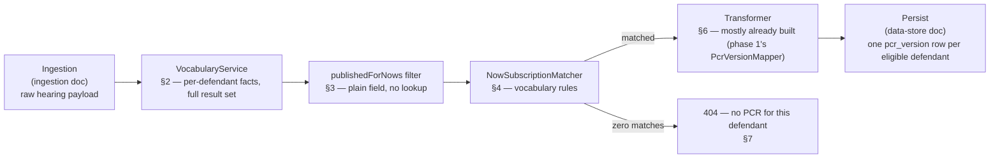

# PCROrchestrator (Decision Engine, Enrichment, and Transformer) Design

**Status:** Draft, 22 Jul 2026. Deep-dive of v2 §5a/§6/§8's Decision Engine,
Enrichment, and Transformer components, grounded in a direct read-through of
the legacy `PrisonCourtRegisterOrchestrator`'s five Durable Functions
activities and the `SubscriptionsService`/`VocabularyService` modules it
calls. Companion to
[`2026-07-22-pcr-hearing-event-ingestion-design.md`](2026-07-22-pcr-hearing-event-ingestion-design.md)
("the ingestion doc") and
[`2026-07-21-pcr-data-store-design.md`](2026-07-21-pcr-data-store-design.md)
("the data-store doc") — together the three cover the full pipeline from
Event Grid trigger through to a written `pcr_version` row.

**Why subscription matching is in scope at all:** a defendant with zero
matched subscriptions gets no register in the legacy system — subscription
matching isn't recipient routing, it's the generation gate itself.
Independent of the `publishedForNows` content filter, a defendant can be
filtered out entirely (e.g. most non-custody defendants fail every
subscription's custody-status rule). This service's job is to expose "the
same underlying content currently distributed as a PDF" (v2 §1); if the
legacy system never produced that PDF for a given defendant, serving PCR
content for them anyway isn't mirroring the source system — it's inventing
content that never existed. This document replicates the gate, not just
the content shaping.

**Scope:** everything between "raw hearing/results payload in hand" (the
ingestion doc's boundary) and "content ready to persist into `pcr_version`"
(the data-store doc's target):
- Per-defendant vocabulary computation (§2)
- The `publishedForNows` content filter (§3)
- The subscription-match generation gate (§4)
- Enrichment (§5) and the Transformer (§6)

**Explicitly not in scope** — the other half of the legacy orchestrator,
which is about *delivery*, not content or eligibility:
- Recipient/email/template resolution (legacy activity 4's `recipientFromCase`/
  `recipientFromResults`/`recipientFromSubscription` paths) — this service
  reads and serves content; it doesn't route or send registers anywhere.
- Submission to Progression (legacy activity 5) — same reason.
- The group-proceedings whole-hearing skip (legacy activity 1's
  `isGroupProceedings` check) — belongs with the ingestion doc's boundary
  (it's a whole-hearing filter, evaluated before per-defendant fan-out even
  starts).

---

## 1. Pipeline position

`PcrOrchestrator` performs the decision-relevant subset of the legacy
orchestrator's five activities — activities 2 and 3 only:

1. **Compute vocabulary** (`VocabularyService.compute`, §2) — per-defendant
   fact computation from the full, unfiltered result set.
2. **Exclude `publishedForNows` results**
   (`PcrOrchestrator.excludePublishedForNows`, §3) — the content filter,
   replicating legacy activity 2's `filterJudicialResultsApplicableForRegisters`
   step.
3. **Determine whether a PCR is required**
   (`PcrOrchestrator.isPrisonCourtRegisterRequired`, §4) — the
   subscription-match gate (vocabulary rules via `NowSubscriptionMatcher`,
   backed by `ReferenceDataClient`), replicating legacy activity 3
   (`PrisonCourtRegisterSubscriptions`).

Not included, even though the legacy orchestrator's activities 2 and 3 also
touch them: building the register fragment's non-decision content, and
anything from activities 4–5 (recipients, payload assembly, Progression
submission) — see "Explicitly not in scope" above.

**Naming — `PcrOrchestrator`, not the legacy name.** The legacy top-level
coordinator, `PrisonCourtRegisterOrchestrator`, is an Azure Durable
Functions orchestrator function with checkpointing/replay semantics,
coordinating all five activities including delivery. A plain Spring
`@Component` coordinating only the decision-relevant subset (activities
2–3) isn't the same thing, so this class follows this service's own
naming convention instead — `PcrController`, `PcrService`,
`PcrVersionMapper` are all `Pcr`-prefixed — while still naming the class
for what it does: coordinate `VocabularyService`, the `publishedForNows`
filter, and `NowSubscriptionMatcher`/`ReferenceDataClient` in sequence.



This diagram is *this service's* equivalent of the legacy pipeline, not a
literal mirror of its control flow. The real orchestrator never gates
activities 3/4/5 on subscription-match outcomes at all — it calls them
unconditionally; "zero matches → no register" is enforced *inside* legacy
activity 4 (`OutboundPrisonCourtRegister`, which discards fragments with no
`matchedSubscriptions` before building payloads) — a detail that only
matters to delivery-routing machinery this service doesn't replicate. The
determination itself (`matchedSubscriptions.length > 0`, legacy activity 4)
is exactly equivalent to this design's `PcrOrchestrator.isPrisonCourtRegisterRequired`
(§4) — same check, just relocated earlier in the pipeline since this
service has no reason to build the rest of activity 4's recipient/payload
machinery first.

---

## 2. `VocabularyService` — per-defendant fact computation

The vocabulary is computed from the defendant's **full** result set,
before any filtering — it's used by the subscription matcher (§4), so it
must reflect everything the defendant actually has, not what's left after
`publishedForNows` stripping.

```java
public record Vocabulary(
        boolean inCustody,
        CustodyLocationType custodyLocationType, // PRISON, POLICE, NONE
        boolean hadCustodialResult,
        AgeGroup ageGroup,                        // YOUTH, ADULT
        CourtLanguage courtLanguage,               // ENGLISH, WELSH
        AttendanceType attendanceType,              // IN_PERSON, VIDEO_LINK
        boolean cpsProsecuted) {}
```

```java
@Component
public class VocabularyService {

    private static final String CUSTODIAL_RESULT_PROMPT = "prisonOrganisationName";

    public Vocabulary compute(final DefendantResponse defendant, final HearingResponse hearing) {
        final CustodialEstablishmentResponse establishment = defendant.personDefendant().custodialEstablishment();
        return new Vocabulary(
                establishment != null,
                custodyLocationType(establishment),
                hasCustodialResult(defendant),
                ageGroup(defendant),           // see open items §7 — field not yet modeled
                courtLanguage(hearing),        // see open items §7 — field not yet modeled
                attendanceType(defendant),     // see open items §7 — field not yet modeled
                cpsProsecuted(hearing));
    }

    private boolean cpsProsecuted(final HearingResponse hearing) {
        // Scans ALL prosecutionCases on the hearing for prosecutor.isCps ==
        // true — not scoped to the defendant's own case. Replicated as-is;
        // see §7 for why this is flagged rather than silently narrowed.
        return hearing.prosecutionCases().stream()
                .anyMatch(c -> c.prosecutor() != null && c.prosecutor().isCps());
    }

    private CustodyLocationType custodyLocationType(final CustodialEstablishmentResponse establishment) {
        if (establishment == null) {
            return CustodyLocationType.NONE;
        }
        // "custody" field confirmed present on CustodialEstablishmentResponse
        // (already modeled, phase 1) — exact value vocabulary (e.g. "Prison"
        // vs "Police") not yet confirmed against a real fixture; see §7.
        return CustodyLocationType.from(establishment.custody());
    }

    private boolean hasCustodialResult(final DefendantResponse defendant) {
        return defendant.offences().stream()
                .flatMap(o -> o.judicialResults().stream())
                .flatMap(r -> r.judicialResultPrompts().stream())
                .anyMatch(p -> CUSTODIAL_RESULT_PROMPT.equals(p.promptReference()));
    }
}
```

`hasCustodialResult` is directly portable — `JudicialResultPromptParser`
already scans `judicialResultPrompts[]` by `promptReference` for six other
prompts (phase 1). This is the same pattern, one more prompt reference.

---

## 3. The `publishedForNows` content filter — a plain field, not a lookup

`publishedForNows` is read as a plain boolean property already present on
the judicial result object — `r.judicialResult.publishedForNows` — no
async call, no lookup, a synchronous filter over data the Function App
already has in hand from activity 1's fetch. There is no
`ResultDefinition`/`cjsResultCode`-keyed Reference Data endpoint anywhere
in the legacy pipeline (an exhaustive check of the Function App's
Reference Data client confirms this — see §5).

**What this means for this service:** `publishedForNows` must already be
present on the payload CP's Results Query API returns — pre-enriched
upstream of the Function App, and presumably upstream of this service's
own `hearingDetails/internal` call too, since both consume the same
Results Query API family. It is **not yet modeled** on
`HearingDetailsResponse.JudicialResult` (phase 1). Confirm it's actually
present on a real `hearingDetails/internal` response (§7), then add it as
a plain field. The filter itself is `PcrOrchestrator.excludePublishedForNows`
(§4) — deliberately named to avoid reusing "eligible"/"eligibility," which
already means something different in this document (§4's subscription-
match gate).

---

## 4. `NowSubscriptionMatcher` — the generation gate

Sourced from Reference Data's NOW-subscription config, filtered to
`isPrisonCourtRegisterSubscription == true`, matched against a defendant's
`Vocabulary` (§2), replicated with full rule fidelity against live
Reference Data — a narrower approximation risks this API disagreeing with
the legacy system about whether a PCR exists at all.

**The dispatcher has four independent branches, one per subscription
kind** (`SubscriptionsService.getSubscriptions`):

```js
if (matchCourtHouse(subscription, ouCode) && matchVocabularyRules(...)) { push; return; }
if (matchProsecutor(subscription, ouCode) && matchVocabularyRules(...)) { push; return; }
if ((subscription.isNowSubscription || subscription.isEDTSubscription) && matchSubscriptionRules(...)) { push; ... }
if (subscription.isPrisonCourtRegisterSubscription && matchVocabularyRules(...)) { push; }
```

The court-house/prosecutor gate (branches 1–2) and the NOW include/exclude
list check inside `matchSubscriptionRules` (branch 3) belong to *different
subscription kinds* — regular NOW/EDT subscriptions — not PCR ones. **PCR
subscriptions (branch 4) are matched by `matchVocabularyRules` alone,
nothing else.** No court-house/prosecutor/NOW-list gate applies to this
service's use case at all.

**`matchVocabularyRules` itself covers more ground than the vocabulary
dimensions in v2's original description.** Reading it in full: it runs
`checkIfAttendanceTypeMatch`, `checkIfMajorCreditorTypeMatch`, a
*vocabulary-level* `checkIfCourtHouseMatch` (distinct from the unrelated
top-level `matchCourtHouse` above), `checkIfDefendantMatch` (age group),
`checkIfCustodyMatch`, `checkIfCustodialResultMatch`, then the
prompt/result include/exclude lists, with a CPS-prosecuted short-circuit
ahead of all of them. Two of these — major-creditor-type and the
vocabulary-level court-house check — have no corresponding field on
`Vocabulary`/`NowSubscription` below yet (§7). No distinct English/Welsh
**language** check appears anywhere in the actual sequence, which means
`languageMatches`/`CourtLanguage` below may not correspond to a real rule
at all (§7).

**Default/fail-open behaviour:** if `!subscription.applySubscriptionRules`,
or if `subscription.subscriptionVocabulary` itself is unset, none of the
checks run and the function returns `true` — a subscription with no rules
configured matches by default, not by failing safe.

```java
public record NowSubscription(
        boolean isPrisonCourtRegisterSubscription,
        boolean applySubscriptionRules,                 // false, or no subscriptionVocabulary at all -> matches by default
        AttendanceType requiredAttendanceType,       // nullable — unset means "any"
        CourtLanguage requiredCourtLanguage,          // nullable — real rule unconfirmed, see §7
        AgeGroup requiredAgeGroup,                    // nullable
        CustodyRequirement custodyRequirement,        // NONE, IN_CUSTODY, PRISON_ONLY, POLICE_ONLY
        boolean ignoreCustody,
        CustodialOutcomeRequirement custodialOutcomeRequirement, // ANY, CUSTODIAL_ONLY, NON_CUSTODIAL_ONLY
        boolean requiresCpsProsecuted,
        List<String> includedResultTypes,             // empty = no restriction
        List<String> excludedResultTypes,
        List<String> includedPrompts,
        List<String> excludedPrompts) {}
        // majorCreditorType / vocabulary-level courtHouse requirements: real
        // dimensions found, not modeled here yet — see §7.
```

```java
@Component
public class NowSubscriptionMatcher {

    public boolean matches(final NowSubscription subscription, final Vocabulary vocabulary,
                            final List<JudicialResultResponse> eligibleResults) {
        if (!subscription.applySubscriptionRules()) {
            return true; // no rules configured -> matches by default
        }
        return matchesVocabularyRules(subscription, vocabulary, eligibleResults);
    }

    private boolean matchesVocabularyRules(final NowSubscription subscription, final Vocabulary vocabulary,
                                             final List<JudicialResultResponse> eligibleResults) {
        // CPS short-circuit — bypasses every other rule in this method once
        // both the subscription requires CPS and the vocabulary is
        // CPS-prosecuted.
        if (subscription.requiresCpsProsecuted() && vocabulary.cpsProsecuted()) {
            return true;
        }
        return attendanceMatches(subscription, vocabulary)
                && languageMatches(subscription, vocabulary) // unconfirmed real rule — §7
                && ageGroupMatches(subscription, vocabulary)
                && custodyMatches(subscription, vocabulary)
                && custodialOutcomeMatches(subscription, vocabulary)
                && resultTypeListsMatch(subscription, eligibleResults)
                && promptListsMatch(subscription, eligibleResults);
                // majorCreditorType / vocabulary-level courtHouse checks: missing — §7
    }

    private boolean custodyMatches(final NowSubscription subscription, final Vocabulary vocabulary) {
        if (subscription.ignoreCustody()) {
            return true;
        }
        return switch (subscription.custodyRequirement()) {
            case NONE -> true;
            case IN_CUSTODY -> vocabulary.inCustody();
            case PRISON_ONLY -> vocabulary.custodyLocationType() == CustodyLocationType.PRISON;
            case POLICE_ONLY -> vocabulary.custodyLocationType() == CustodyLocationType.POLICE;
        };
    }

    // attendanceMatches / languageMatches / ageGroupMatches / custodialOutcomeMatches:
    // each a null-means-"any" comparison against the corresponding Vocabulary
    // field — omitted here for brevity, same shape as custodyMatches above.

    private boolean resultTypeListsMatch(final NowSubscription subscription, final List<JudicialResultResponse> results) {
        final List<String> resultCodes = results.stream().map(JudicialResultResponse::cjsCode).toList();
        final boolean includeOk = subscription.includedResultTypes().isEmpty()
                || resultCodes.stream().anyMatch(subscription.includedResultTypes()::contains);
        final boolean excludeOk = subscription.excludedResultTypes().isEmpty()
                || resultCodes.stream().noneMatch(subscription.excludedResultTypes()::contains);
        return includeOk && excludeOk;
    }

    // promptListsMatch: same include/exclude shape as resultTypeListsMatch,
    // over judicialResultPrompts[].promptReference instead of cjsCode.
}
```

```java
@Component
@RequiredArgsConstructor
public class PcrOrchestrator {

    private final NowSubscriptionMatcher nowSubscriptionMatcher;
    private final ReferenceDataClient referenceDataClient;

    public boolean isPrisonCourtRegisterRequired(final Vocabulary vocabulary, final List<JudicialResultResponse> eligibleResults) {
        final List<NowSubscription> subscriptions = referenceDataClient.getPrisonCourtRegisterSubscriptions();
        return subscriptions.stream()
                .anyMatch(s -> nowSubscriptionMatcher.matches(s, vocabulary, eligibleResults));
    }

    public List<JudicialResultResponse> excludePublishedForNows(final List<JudicialResultResponse> results) {
        // §3 — mirrors RegisterFragmentService.filterJudicialResultsApplicableForRegisters
        return results.stream()
                .filter(r -> !r.publishedForNows()) // new field on JudicialResultResponse, once confirmed — §7
                .toList();
    }
}
```

`ReferenceDataClient` is the only new external client this document
needs — nothing in phase 1 or the ingestion doc calls Reference Data for
subscription config today.

---

## 5. Enrichment — a DTO gap, not a new client

Phase 1's `PcrVersionMapper` leaves `postHearingCustodyStatus`/`category`
`null`. Checked against the legacy source:

- `postHearingCustodyStatus` is read directly off the payload elsewhere in
  the Function App family (e.g. `DefendantMapper.js`:
  `filteredCustodyStatuses[0].postHearingCustodyStatus`) — a plain field,
  not a lookup result.
- An exhaustive read of the Function App's only Reference Data client
  (`ReferenceDataService.js`, all live endpoints: NOW metadata, NOW
  subscriptions metadata — used in §4, organisation unit, major creditors,
  enforcement area, prisons-custody-suites) found **no**
  `ResultDefinition`/`cjsResultCode`-keyed endpoint at all.
- `financial`/`category`/`convicted` produced **zero** hits anywhere in
  the Function App's PCR-relevant code. Unlike `postHearingCustodyStatus`/
  `publishedForNows`, there's no evidence either way that the legacy PCR
  pipeline uses these fields — not confirmed present, not confirmed
  absent.

**There is no enrichment *client* to build here.** The real gap is that
`HearingDetailsResponse.JudicialResult` (phase 1) simply doesn't model
`postHearingCustodyStatus`/`publishedForNows` as fields yet, even though
CP's Results Query API response family plausibly already carries them —
they'd be silently dropped today by `@JsonIgnoreProperties(ignoreUnknown =
true)` if present. This needs a real fixture check (§7), not a
lookup-client design, before anything is implemented.

```java
// If confirmed present on a real hearingDetails/internal response:
// add directly to HearingDetailsResponse.JudicialResult (phase 1's
// existing DTO), no new client:
private boolean publishedForNows;
private String postHearingCustodyStatus;
// financial/category/convicted: add only if a real fixture confirms
// the legacy PCR pipeline actually reads them — no evidence yet either way.
```

---

## 6. Transformer — mostly already built

v2 §8 named a "Transformer" as a new component. It's largely **not** new
— phase 1's `PcrVersionMapper` already does the `HearingDetailsResponse` →
`PcrVersion` field mapping (defendant identity, custody location, hearing
details, offences, judicial results, court applications). What's actually
new here, on top of the existing mapper:

1. **Feed it filtered, not raw, offences/results** — `PcrVersionMapper`
   currently maps every offence and result unconditionally (correct for
   phase 1, which has no eligibility concept at all). Once §3's filter
   exists, the mapper needs to run against the filtered result list, not
   `defendant.offences()` directly.
2. **Read `postHearingCustodyStatus` (and `publishedForNows`) directly**,
   once §5's fixture check confirms they're present on the real payload —
   replace the `null` default for `postHearingCustodyStatus`. No enrichment
   client to wire in — a DTO field addition (§5).
3. **Only run per eligible defendant** — the mapper today runs
   unconditionally for whichever defendant a synchronous phase-1 request
   asks for. Once §4's gate exists, it only runs for defendants that passed
   it — ineligible defendants never reach the mapper at all.

No other change to the existing mapper's field-mapping logic is implied by
this document.

---

## 7. Open items — not resolved here

- **No-match behaviour: `404`.** When
  `PcrOrchestrator.isPrisonCourtRegisterRequired` returns `false`, this
  service treats it exactly like "no PCR version found for the supplied
  identifiers" — the same `404` `PcrService` already returns for a
  case/defendant that doesn't exist (phase 1). No new error shape, no
  partial/flagged response — the defendant genuinely has no PCR, matching
  the legacy system exactly. Concretely, the eligibility check sits
  alongside the existing case/defendant lookups in
  `PcrService.getLatestVersion`: fail the same way, for the same reason —
  "nothing here to return."
- **Several `Vocabulary`/`NowSubscription` fields have no confirmed CP
  source path yet** — `ageGroup` (youth/adult), `attendanceType`
  (in-person/video), and the exact value vocabulary for
  `CustodialEstablishment.custody` (e.g. whether it's literally
  `"Prison"`/`"Police"` or some other coded value). None of these exist in
  phase 1's `HearingDetailsResponse` today. Confirm each against a real
  hearing-details fixture before implementing, don't guess a shape.
  `cpsProsecuted`'s source is confirmed (§2), just not yet modeled on our
  DTO.
- **`courtLanguage`/`languageMatches` may not correspond to a real rule at
  all (§4).** The actual sequence of comparisons in `matchVocabularyRules`
  (attendance, major-creditor-type, court-house, defendant/age, custody,
  custodial-result, then prompt/result lists) has no distinct English/
  Welsh check anywhere in it. This may need removing entirely rather than
  just sourcing, pending confirmation.
- **Two real rule dimensions found, not modeled (§4):**
  `checkIfMajorCreditorTypeMatch` and a *vocabulary-level*
  `checkIfCourtHouseMatch` (distinct from the unrelated top-level
  `matchCourtHouse` used by a different subscription kind) both run inside
  `matchVocabularyRules` for PCR subscriptions. Neither has a corresponding
  field on `Vocabulary`/`NowSubscription` in this document yet. Needs
  reading `checkIfMajorCreditorTypeMatch`/`checkIfCourtHouseMatch`'s actual
  implementations before modeling.
- **`publishedForNows`/`postHearingCustodyStatus` need a real fixture
  check** (§3/§5) — confirm both are actually present on a live
  `hearingDetails/internal` response before adding them as fields.
  `financial`/`category`/`convicted` have no evidence either way in the
  legacy PCR pipeline specifically — don't add them speculatively.
- **CPS scan scope (§2):** the legacy vocabulary computation checks
  `prosecutor.isCps` across *every* `prosecutionCase` on the hearing, not
  scoped to the defendant's own case — replicated as-is here, but worth
  confirming with whoever owns the legacy logic whether that's intentional
  (a hearing-wide CPS flag) or an existing bug being faithfully carried
  forward. Not something to silently "fix" without asking.
- **`isGroupProceedings`** — the legacy activity-1 whole-hearing skip.
  Belongs to the ingestion doc's boundary (it's evaluated before
  per-defendant fan-out), not this one.
- **`ReferenceDataClient`'s Reference Data integration shape** — a new
  dependency with no confirmed endpoint contract yet (per-code lookup vs
  batch, caching needs, whether Reference Data even exposes NOW-subscription
  config to a consumer outside the legacy Function App). Needs its own
  investigation before implementation, not assumed from this document's
  illustrative code.