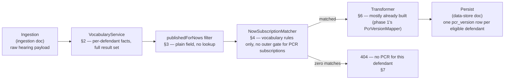

# PCROrchestrator (Decision Engine, Enrichment, and Transformer) Design

**Status:** Draft, 22 Jul 2026. Deep-dive of v2 §5a/§6/§8's Decision Engine,
Enrichment, and Transformer components, grounded in a direct read-through of
the legacy `PrisonCourtRegisterOrchestrator`'s five Durable Functions
activities. Companion to
[`2026-07-22-pcr-hearing-event-ingestion-design.md`](2026-07-22-pcr-hearing-event-ingestion-design.md)
("the ingestion doc") and
[`2026-07-21-pcr-data-store-design.md`](2026-07-21-pcr-data-store-design.md)
("the data-store doc") — together the three now cover the full pipeline from
Event Grid trigger through to a written `pcr_version` row.

**Correction to v2 §5b:** v2 §5b said `VocabularyService`/
`PrisonCourtRegisterSubscriptions` were "subscriber *matching* — deciding
which prisons should be notified — not PCR *content*... confirmed not
needed here." That call is wrong. Reading the actual orchestrator: **a
defendant with zero matched subscriptions gets no register at all** —
subscription matching isn't recipient routing, it's the generation gate
itself. Independent of the `publishedForNows` content filter, a defendant
can be filtered out entirely (e.g. most non-custody defendants fail every
subscription's custody-status rule). If this service's job is to expose
"the same underlying content currently distributed as a PDF" (v2 §1), and
the legacy system never produced that PDF for a given defendant, serving
PCR content for them anyway isn't mirroring the source system — it's
inventing content that never existed. This document replicates the gate,
not just the content shaping.

**Scope:** everything between "raw hearing/results payload in hand" (the
ingestion doc's boundary) and "content ready to persist into `pcr_version`"
(the data-store doc's target):
- Per-defendant vocabulary computation (§2)
- The `publishedForNows` content filter and its enrichment dependency (§3)
- The subscription-match eligibility gate (§4)
- Enrichment (§5) and the Transformer (§6)

**Explicitly not in scope** — the other half of the legacy orchestrator,
which is about *delivery*, not content or eligibility:
- Recipient/email/template resolution (legacy activity 4's `recipientFromCase`/
  `recipientFromResults`/`recipientFromSubscription` paths) — this service
  reads and serves content; it doesn't route or send registers anywhere.
- Submission to Progression (legacy activity 5) — same reason.
- The group-proceedings whole-hearing skip (legacy activity 1's
  `isGroupProceedings` check) — belongs with the ingestion doc's boundary
  (it's a whole-hearing filter, evaluated before per-defendant fan-out even
  starts), flagged here as a gap in that doc rather than solved in this one.

**Verified against the actual legacy source, 22 Jul 2026** (not just the
narrative description this document was originally drafted from) — most of
§2–§4 held up; §5 did not and has been rewritten. Specifics inline below,
but the headline correction: **there is no live Reference Data
`ResultDefinition` lookup anywhere in the legacy pipeline.**
`publishedForNows` and `postHearingCustodyStatus` are read as plain fields
already present on the judicial result object the Function App receives
from activity 1 — pre-enriched upstream, not looked up by the Function App
itself. The `ResultDefinitionClient` originally proposed in §5 doesn't
exist in the system being replicated and has been replaced with a much
smaller, unconfirmed-but-different question: does phase 1's own
`hearingDetails/internal` payload already carry these same fields, just
not yet modeled on `HearingDetailsResponse`? See the rewritten §3/§5 and
§7's open items.

---

## 1. Pipeline position

**Activities `PcrOrchestrator` performs** — the decision-relevant subset
of the legacy orchestrator's five activities (activities 2 and 3 only; not
named "activities" here since this isn't a Durable Functions orchestrator —
see the naming note below):

1. **Compute vocabulary** (`VocabularyService.compute`, §2) — per-defendant
   fact computation from the full, unfiltered result set.
2. **Exclude `publishedForNows` results**
   (`PcrOrchestrator.excludePublishedForNows`, §3) — the
   content filter, replicating legacy activity 2's
   `filterJudicialResultsApplicableForRegisters` step.
3. **Determine whether a PCR is required**
   (`PcrOrchestrator.isPrisonCourtRegisterRequired`, §4) —
   the subscription-match gate (vocabulary rules via
   `NowSubscriptionMatcher`, backed by `ReferenceDataClient`), replicating
   legacy activity 3 (`PrisonCourtRegisterSubscriptions`).

Not included, even though the legacy orchestrator's activities 2 and 3 also
touch them: building the register fragment's non-decision content, and
anything from activities 4–5 (recipients, payload assembly, Progression
submission) — see "Explicitly not in scope" above.

**Naming note — `PcrOrchestrator`, not a verbatim legacy-name reuse.**
Elsewhere in this document series, reusing the legacy's exact name has
been the right call (`Vocabulary`, `AttendanceType`, `NowSubscription`) —
those map 1:1 onto a legacy concept with no scope mismatch. This class is
different: the legacy top-level coordinator is
`PrisonCourtRegisterOrchestrator`, an Azure Durable Functions orchestrator
function (with checkpointing/replay semantics) coordinating all five
activities, including delivery. A plain Spring `@Component` coordinating
only the decision-relevant subset (activities 2–3) isn't the same thing,
so verbatim reuse of that exact name would overclaim both the technical
pattern and the scope. `PcrOrchestrator` instead follows this *service's*
own naming convention — `PcrController`, `PcrService`, `PcrVersionMapper`
are all `Pcr`-prefixed — while still naming the class for what it actually
does: coordinate `VocabularyService`, the `publishedForNows` filter, and
`NowSubscriptionMatcher`/`ReferenceDataClient` in sequence. Distinct enough
from `PrisonCourtRegisterOrchestrator` not to imply parity with it; still
honest about being an orchestrating component.



Note: this diagram is *this service's* simplified equivalent of the legacy
pipeline, not a literal mirror of its control flow. The real orchestrator
never gates activities 3/4/5 on subscription-match outcomes at all — it
calls them unconditionally; "zero matches → no register" is enforced
*inside* legacy activity 4 (`OutboundPrisonCourtRegister`, which discards
fragments with no `matchedSubscriptions` before building payloads) — a
detail that only matters to delivery-routing machinery this service
doesn't replicate (see "Explicitly not in scope" above). The determination
itself (`matchedSubscriptions.length
> 0`, legacy activity 4) is exactly equivalent to this design's
`PcrOrchestrator.isPrisonCourtRegisterRequired` (§4) — same check, just relocated
earlier in the pipeline since this service has no reason to build the rest
of activity 4's recipient/payload machinery first.

---

## 2. `VocabularyService` — per-defendant fact computation

Confirmed from the orchestrator: the vocabulary is computed from the
defendant's **full** result set, before any filtering — it's used by the
subscription matcher (§4), so it must reflect everything the defendant
actually has, not what's left after `publishedForNows` stripping.

```java
public record Vocabulary(
        boolean inCustody,
        CustodyLocationType custodyLocationType, // PRISON, POLICE, NONE
        boolean hadCustodialResult,
        AgeGroup ageGroup,                        // YOUTH, ADULT
        CourtLanguage courtLanguage,               // ENGLISH, WELSH
        AttendanceType attendanceType,              // IN_PERSON, VIDEO_LINK
        boolean cpsProsecuted) {}
```

```java
@Component
public class VocabularyService {

    private static final String CUSTODIAL_RESULT_PROMPT = "prisonOrganisationName";

    public Vocabulary compute(final DefendantResponse defendant, final HearingResponse hearing) {
        final CustodialEstablishmentResponse establishment = defendant.personDefendant().custodialEstablishment();
        return new Vocabulary(
                establishment != null,
                custodyLocationType(establishment),
                hasCustodialResult(defendant),
                ageGroup(defendant),           // see open items §7 — field not yet modeled
                courtLanguage(hearing),        // see open items §7 — field not yet modeled
                attendanceType(defendant),     // see open items §7 — field not yet modeled
                cpsProsecuted(hearing));       // confirmed source below — field not yet modeled on our DTO
    }

    private boolean cpsProsecuted(final HearingResponse hearing) {
        // Confirmed from VocabularyService.js: scans ALL prosecutionCases on
        // the hearing for prosecutor.isCps == true — not scoped to the
        // defendant's own case. Replicated as-is; flagged as a correctness
        // nuance worth confirming is intentional, not silently "fixed" here
        // — see §7.
        return hearing.prosecutionCases().stream()
                .anyMatch(c -> c.prosecutor() != null && c.prosecutor().isCps());
    }

    private CustodyLocationType custodyLocationType(final CustodialEstablishmentResponse establishment) {
        if (establishment == null) {
            return CustodyLocationType.NONE;
        }
        // "custody" field confirmed present on CustodialEstablishmentResponse
        // (already modeled, phase 1) — exact value vocabulary (e.g. "Prison"
        // vs "Police") not yet confirmed against a real fixture; see §7.
        return CustodyLocationType.from(establishment.custody());
    }

    private boolean hasCustodialResult(final DefendantResponse defendant) {
        return defendant.offences().stream()
                .flatMap(o -> o.judicialResults().stream())
                .flatMap(r -> r.judicialResultPrompts().stream())
                .anyMatch(p -> CUSTODIAL_RESULT_PROMPT.equals(p.promptReference()));
    }
}
```

`hasCustodialResult` is directly portable — `JudicialResultPromptParser`
already scans `judicialResultPrompts[]` by `promptReference` for six other
prompts (phase 1). This is the same pattern, one more prompt reference.

---

## 3. The `publishedForNows` content filter — a plain field, not a lookup

**Corrected.** This document originally assumed `publishedForNows` needed
a Reference Data `ResultDefinition` lookup. Verified against the actual
Function App code (`RegisterFragmentService.js`): it's read as a plain
boolean property already present on the judicial result object —
`r.judicialResult.publishedForNows` — no async call, no lookup, a
synchronous filter over data the Function App already has in hand from
activity 1's fetch. There is no `ResultDefinition`/`cjsResultCode`-keyed
Reference Data endpoint anywhere in the legacy pipeline (confirmed by an
exhaustive grep of the Function App's Reference Data client — see §5).

**What this means for this service:** `publishedForNows` must already be
present on the payload CP's Results Query API returns — pre-enriched
upstream of the Function App, and presumably upstream of this service's
own `hearingDetails/internal` call too, since both consume the same
Results Query API family. It is **not yet modeled** on
`HearingDetailsResponse.JudicialResult` (phase 1) — likely just never
added, not because it needs a separate lookup. Confirm it's actually
present on a real `hearingDetails/internal` response (§7) before assuming
this, then add it as a plain field. The filter itself is
`PcrOrchestrator.excludePublishedForNows` (§4) —
deliberately named to avoid reusing "eligible"/"eligibility," which
already means something different in this document (§4's subscription-
match gate).

---

## 4. `NowSubscriptionMatcher` — the generation gate

Sourced from Reference Data's NOW-subscription config, filtered to
`isPrisonCourtRegisterSubscription == true`, matched against a defendant's
`Vocabulary` (§2). Per your confirmation, replicated with full rule
fidelity against live Reference Data — a narrower approximation risks this
API disagreeing with the legacy system about whether a PCR exists at all,
which is exactly the gap this document exists to close.

**Corrected again — the "outer gate" doesn't apply to PCR subscriptions at
all.** The previous correction assumed court-house match, prosecutor
match, and NOW include/exclude lists gate every subscription before
vocabulary matching. Reading the actual dispatcher
(`SubscriptionsService.getSubscriptions`) disproves that for this specific
use case — it has **four independent, unrelated branches**, one per
subscription kind:

```js
if (matchCourtHouse(subscription, ouCode) && matchVocabularyRules(...)) { push; return; }
if (matchProsecutor(subscription, ouCode) && matchVocabularyRules(...)) { push; return; }
if ((subscription.isNowSubscription || subscription.isEDTSubscription) && matchSubscriptionRules(...)) { push; ... }
if (subscription.isPrisonCourtRegisterSubscription && matchVocabularyRules(...)) { push; }
```

The court-house/prosecutor gate (branches 1–2) and the NOW include/exclude
list check inside `matchSubscriptionRules` (branch 3) belong to *different
subscription kinds* — regular NOW/EDT subscriptions — not PCR ones. **PCR
subscriptions (branch 4) are matched by `matchVocabularyRules` alone,
nothing else.** `requiredCourtHouseId`/`requiredProsecutorId`/
`includedNows`/`excludedNows` and `outerGateMatches` from the previous
draft don't apply here and are removed.

**A second, real correction found while fixing this:** reading
`matchVocabularyRules` in full turned up two rule dimensions this document
never modeled (`checkIfMajorCreditorTypeMatch`, and a *vocabulary-level*
`checkIfCourtHouseMatch` — distinct from the unrelated top-level
`matchCourtHouse` above, and confirmed real) — and cast doubt on one this
document assumed existed: no distinct English/Welsh **language** check
appears anywhere in the real function. `languageMatches`/`CourtLanguage`
below may not correspond to a real rule at all. None of this is resolved
here — flagged in §7, not silently fixed, since modeling major-creditor-type
and vocabulary-level court-house correctly needs the same fixture-level
confirmation this whole document series insists on elsewhere, not a guess.

**Confirmed default/fail-open behaviour**, reading the function's actual
control flow: if `!subscription.applySubscriptionRules`, or if
`subscription.subscriptionVocabulary` itself is unset, none of the checks
run and the function returns `true` — a subscription with no rules
configured matches by default, not by failing safe. Kept from the
original draft; the reasoning was right even though it was attributed to
a nonexistent outer gate.

```java
public record NowSubscription(
        boolean isPrisonCourtRegisterSubscription,
        boolean applySubscriptionRules,                 // false, or no subscriptionVocabulary at all -> matches by default (confirmed)
        AttendanceType requiredAttendanceType,       // nullable — unset means "any"
        CourtLanguage requiredCourtLanguage,          // nullable — real rule unconfirmed, see §7
        AgeGroup requiredAgeGroup,                    // nullable
        CustodyRequirement custodyRequirement,        // NONE, IN_CUSTODY, PRISON_ONLY, POLICE_ONLY
        boolean ignoreCustody,
        CustodialOutcomeRequirement custodialOutcomeRequirement, // ANY, CUSTODIAL_ONLY, NON_CUSTODIAL_ONLY
        boolean requiresCpsProsecuted,
        List<String> includedResultTypes,             // empty = no restriction
        List<String> excludedResultTypes,
        List<String> includedPrompts,
        List<String> excludedPrompts) {}
        // majorCreditorType / vocabulary-level courtHouse requirements: real
        // dimensions found, not modeled here yet — see §7.
```

```java
@Component
public class NowSubscriptionMatcher {

    public boolean matches(final NowSubscription subscription, final Vocabulary vocabulary,
                            final List<JudicialResultResponse> eligibleResults) {
        if (!subscription.applySubscriptionRules()) {
            // Confirmed from SubscriptionsService.js: no rules configured -> matches by default.
            return true;
        }
        return matchesVocabularyRules(subscription, vocabulary, eligibleResults);
    }

    private boolean matchesVocabularyRules(final NowSubscription subscription, final Vocabulary vocabulary,
                                             final List<JudicialResultResponse> eligibleResults) {
        // CPS short-circuit — confirmed from SubscriptionsService.js: bypasses
        // every other rule in this method once both the subscription requires
        // CPS and the vocabulary is CPS-prosecuted.
        if (subscription.requiresCpsProsecuted() && vocabulary.cpsProsecuted()) {
            return true;
        }
        return attendanceMatches(subscription, vocabulary)
                && languageMatches(subscription, vocabulary) // unconfirmed real rule — §7
                && ageGroupMatches(subscription, vocabulary)
                && custodyMatches(subscription, vocabulary)
                && custodialOutcomeMatches(subscription, vocabulary)
                && resultTypeListsMatch(subscription, eligibleResults)
                && promptListsMatch(subscription, eligibleResults);
                // majorCreditorType / vocabulary-level courtHouse checks: missing — §7
    }

    private boolean custodyMatches(final NowSubscription subscription, final Vocabulary vocabulary) {
        if (subscription.ignoreCustody()) {
            return true;
        }
        return switch (subscription.custodyRequirement()) {
            case NONE -> true;
            case IN_CUSTODY -> vocabulary.inCustody();
            case PRISON_ONLY -> vocabulary.custodyLocationType() == CustodyLocationType.PRISON;
            case POLICE_ONLY -> vocabulary.custodyLocationType() == CustodyLocationType.POLICE;
        };
    }

    // attendanceMatches / languageMatches / ageGroupMatches / custodialOutcomeMatches:
    // each a null-means-"any" comparison against the corresponding Vocabulary
    // field — omitted here for brevity, same shape as custodyMatches above.

    private boolean resultTypeListsMatch(final NowSubscription subscription, final List<JudicialResultResponse> results) {
        final List<String> resultCodes = results.stream().map(JudicialResultResponse::cjsCode).toList();
        final boolean includeOk = subscription.includedResultTypes().isEmpty()
                || resultCodes.stream().anyMatch(subscription.includedResultTypes()::contains);
        final boolean excludeOk = subscription.excludedResultTypes().isEmpty()
                || resultCodes.stream().noneMatch(subscription.excludedResultTypes()::contains);
        return includeOk && excludeOk;
    }

    // promptListsMatch: same include/exclude shape as resultTypeListsMatch,
    // over judicialResultPrompts[].promptReference instead of cjsCode.
}
```

```java
@Component
@RequiredArgsConstructor
public class PcrOrchestrator {

    private final NowSubscriptionMatcher nowSubscriptionMatcher;
    private final ReferenceDataClient referenceDataClient; // new — Reference Data

    public boolean isPrisonCourtRegisterRequired(final Vocabulary vocabulary, final List<JudicialResultResponse> eligibleResults) {
        final List<NowSubscription> subscriptions = referenceDataClient.getPrisonCourtRegisterSubscriptions();
        return subscriptions.stream()
                .anyMatch(s -> nowSubscriptionMatcher.matches(s, vocabulary, eligibleResults));
    }

    public List<JudicialResultResponse> excludePublishedForNows(final List<JudicialResultResponse> results) {
        // §3 — mirrors RegisterFragmentService.filterJudicialResultsApplicableForRegisters
        return results.stream()
                .filter(r -> !r.publishedForNows()) // new field on JudicialResultResponse, once confirmed — §7
                .toList();
    }
}
```

`ReferenceDataClient` is a **new** Reference Data integration — nothing
in phase 1 or the ingestion doc calls Reference Data for subscription
config today, and it's the only new external client this document
actually needs (§5's originally-proposed `ResultDefinitionClient` doesn't
exist — corrected below).

---

## 5. Enrichment — corrected: no new Reference Data client, a DTO gap instead

Phase 1's `PcrVersionMapper` explicitly left `postHearingCustodyStatus`/
`category` `null` with a comment: *"need a real `ResultDefinition` lookup
(Reference Data) — no shadow field on CP's hearing-details payload to
substitute. Left null."* This document originally took that comment at
face value and designed a `ResultDefinitionClient` to do that lookup. That
was wrong — the same investigation that corrected §3 found:

- `postHearingCustodyStatus` is read directly off the payload elsewhere in
  the Function App family (e.g. `DefendantMapper.js`:
  `filteredCustodyStatuses[0].postHearingCustodyStatus`) — a plain field,
  not a lookup result.
- An exhaustive read of the Function App's only Reference Data client
  (`ReferenceDataService.js`, all live endpoints: NOW metadata, NOW
  subscriptions metadata — used in §4, organisation unit, major creditors,
  enforcement area, prisons-custody-suites) found **no**
  `ResultDefinition`/`cjsResultCode`-keyed endpoint at all.
- `financial`/`category`/`convicted` produced **zero** hits anywhere in
  the Function App's PCR-relevant code. Unlike `postHearingCustodyStatus`/
  `publishedForNows`, there's no evidence either way that the legacy PCR
  pipeline uses these fields at all — not confirmed present, not confirmed
  absent.

**Corrected conclusion:** phase 1's original comment was itself an
unverified assumption, not a confirmed finding — the same pattern this
whole document series exists to catch elsewhere. There is likely no new
enrichment *client* to build here at all. The real gap is that
`HearingDetailsResponse.JudicialResult` (phase 1) simply doesn't model
`postHearingCustodyStatus`/`publishedForNows` as fields yet, even though
CP's Results Query API response family plausibly already carries them —
they'd be silently dropped today by `@JsonIgnoreProperties(ignoreUnknown =
true)` if present. This needs a real fixture check (§7), not another
lookup-client design, before anything is implemented.

```java
// If confirmed present on a real hearingDetails/internal response:
// add directly to HearingDetailsResponse.JudicialResult (phase 1's
// existing DTO), no new client:
private boolean publishedForNows;
private String postHearingCustodyStatus;
// financial/category/convicted: add only if a real fixture confirms
// the legacy PCR pipeline actually reads them — no evidence yet either way.
```

---

## 6. Transformer — mostly already built

v2 §8 named a "Transformer" as a new component. It's largely **not** new
— phase 1's `PcrVersionMapper` already does the `HearingDetailsResponse` →
`PcrVersion` field mapping (defendant identity, custody location, hearing
details, offences, judicial results, court applications). What's actually
new here, on top of the existing mapper:

1. **Feed it filtered, not raw, offences/results** — `PcrVersionMapper`
   currently maps every offence and result unconditionally (correct for
   phase 1, which has no eligibility concept at all). Once §3's filter
   exists, the mapper needs to run against the filtered result list, not
   `defendant.offences()` directly.
2. **Read `postHearingCustodyStatus` (and `publishedForNows`) directly**,
   once §5's fixture check confirms they're present on the real payload —
   replace the `null` default for `postHearingCustodyStatus`. No enrichment
   client to wire in; this is now just a DTO field addition (§5, corrected).
3. **Only run per eligible defendant** — the mapper today runs
   unconditionally for whichever defendant a synchronous phase-1 request
   asks for. Once §4's gate exists, it only runs for defendants that passed
   it — ineligible defendants never reach the mapper at all.

No other change to the existing mapper's field-mapping logic is implied by
this document.

---

## 7. Open items — not resolved here

- **No-match behaviour: `404`, resolved.** When `PcrOrchestrator.isPrisonCourtRegisterRequired`
  returns `false`, this service treats it exactly like "no PCR version
  found for the supplied identifiers" — the same `404` `PcrService` already
  returns for a case/defendant that doesn't exist (phase 1). No new error
  shape, no partial/flagged response — the defendant genuinely has no PCR,
  matching the legacy system exactly (the correction noted at the top of
  this document). Concretely, the
  eligibility check sits alongside the existing case/defendant lookups in
  `PcrService.getLatestVersion`: fail the same way, for the same reason —
  "nothing here to return."
- **Several `Vocabulary`/`NowSubscription` fields have no confirmed CP
  source path yet** — `ageGroup` (youth/adult), `attendanceType`
  (in-person/video), and the exact value vocabulary for
  `CustodialEstablishment.custody` (e.g. whether it's literally
  `"Prison"`/`"Police"` or some other coded value). None of these exist in
  phase 1's `HearingDetailsResponse` today. Same rigor standard as the rest
  of this doc series: confirm each against a real hearing-details fixture
  before implementing, don't guess a shape. (`cpsProsecuted`'s source *is*
  now confirmed — §2 — just not yet modeled on our DTO.)
- **`courtLanguage`/`languageMatches` may not correspond to a real rule at
  all (§4).** Reading `matchVocabularyRules` in full found no distinct
  English/Welsh check anywhere in its actual sequence of comparisons
  (attendance, major-creditor-type, court-house, defendant/age, custody,
  custodial-result, then prompt/result lists). Stronger flag than the
  other unconfirmed fields above — this one may need removing entirely
  rather than just sourcing, pending confirmation.
- **Two real rule dimensions found, not modeled (§4):**
  `checkIfMajorCreditorTypeMatch` and a *vocabulary-level*
  `checkIfCourtHouseMatch` (distinct from the unrelated top-level
  `matchCourtHouse` used by a different subscription kind) both run inside
  `matchVocabularyRules` for PCR subscriptions. Neither has a corresponding
  field on `Vocabulary`/`NowSubscription` in this document yet. Needs
  reading `checkIfMajorCreditorTypeMatch`/`checkIfCourtHouseMatch`'s actual
  implementations before modeling — not attempted here to avoid guessing.
- **`publishedForNows`/`postHearingCustodyStatus` need a real fixture
  check** (§3/§5, corrected) — confirm both are actually present on a live
  `hearingDetails/internal` response before adding them as fields.
  `financial`/`category`/`convicted` have no evidence either way in the
  legacy PCR pipeline specifically — don't add them speculatively.
- **CPS scan scope (§2):** the legacy vocabulary computation checks
  `prosecutor.isCps` across *every* `prosecutionCase` on the hearing, not
  scoped to the defendant's own case — replicated as-is here, but worth
  confirming with whoever owns the legacy logic whether that's intentional
  (a hearing-wide CPS flag) or an existing bug being faithfully carried
  forward. Not something to silently "fix" without asking.
- **`isGroupProceedings`** — the legacy activity-1 whole-hearing skip. Not
  designed here (it's an ingestion-level concern, evaluated before
  per-defendant fan-out), and not yet present in the ingestion doc either —
  a gap in that document, not this one.
- **`ReferenceDataClient`'s Reference Data integration shape** — a new
  dependency with no confirmed endpoint contract yet (per-code lookup vs
  batch, caching needs, whether Reference Data even exposes NOW-subscription
  config to a consumer outside the legacy Function App). Needs its own
  investigation before implementation, not assumed from this document's
  illustrative code. (The `ResultDefinitionClient` dependency this bullet
  previously also listed no longer exists — §5, corrected.)