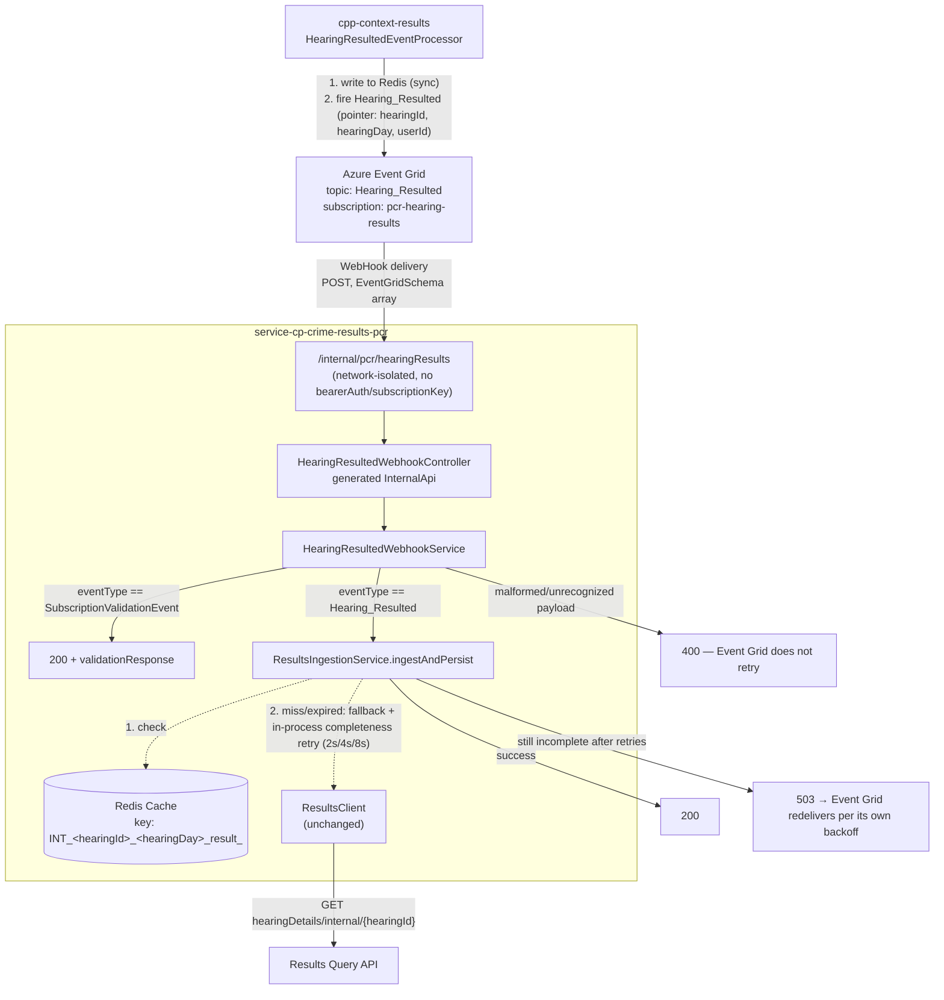
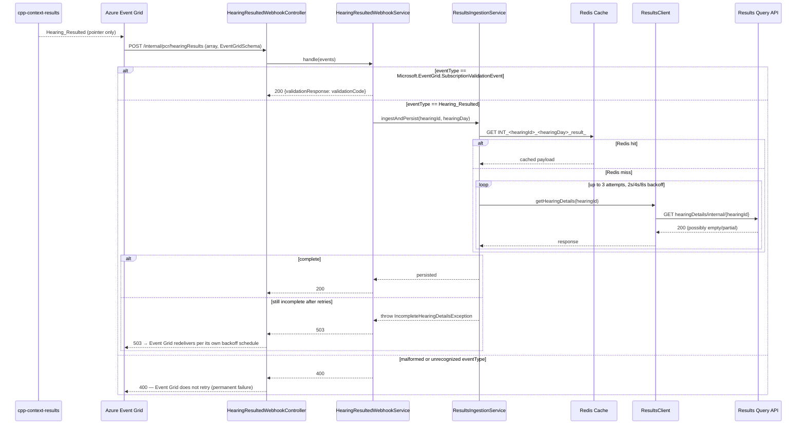

# PCR Event Grid Webhook Ingestion Design

**Status:** Accepted, 29 Jul 2026 — **partially superseded, 12 Aug 2026**. Event Grid no longer
delivers directly to this service. `pcr-eventgrid-relay-function` (a standalone Azure Function
App) now owns the Event Grid subscription and its subscription-validation handshake, and relays
`Hearing_Resulted` verbatim to this service's `/internal/hearing-results` endpoint as a plain
internal HTTP call — see [ADR-007](../pipeline/adrs/007-AMP-892-pcr-eventgrid-webhook-ingestion.md)'s
own superseded note. The Redis-first/REST-fallback/completeness-retry sections below (§1, §3.2,
§3.3a) are still accurate; the direct-Event-Grid-webhook sections (§2, §3.1, §3.1a, §3.4,
including the subscription-validation handshake) describe a surface this service no longer has.
`HearingResultedWebhookController`/`HearingResultedWebhookService` referenced throughout are now
`HearingResultedEventController`/`HearingResultedEventService`.

Replaces
[`2026-07-22-pcr-hearing-event-ingestion-design.md`](2026-07-22-pcr-hearing-event-ingestion-design.md)
("the Service Bus doc") as the target ingestion architecture — this document supersedes its
Event Grid → Service Bus → consumer sections (§2, §3.1, §3.1a, §3.4) but reuses its Redis-first/
REST-fallback/completeness sections (§1, §3.2, §3.3a) verbatim, since the data-source problem
they solve is unchanged by the transport swap.
**Jira:** AMP-892 — replace Service Bus queue ingestion with a direct Event Grid webhook. See
[`docs/pipeline/adrs/007-AMP-892-pcr-eventgrid-webhook-ingestion.md`](../pipeline/adrs/007-AMP-892-pcr-eventgrid-webhook-ingestion.md)
for the decision this design doc drives.

**Scope:** the ingestion pipeline only — Azure Event Grid POSTing directly to a new internal
endpoint on this service, replacing the self-provisioned Service Bus queue and
`HearingResultedProcessorService` listener. Does **not** cover the Decision Engine's
per-defendant fan-out, `publishedForNows` eligibility filtering, or the `cp_version` write —
those are unchanged; `ResultsIngestionService.ingestAndPersist` still owns them (see the
orchestrator and persistence-wiring design docs).

**Not carried over:** the Service Bus-specific retry/escalation design (the old §3.4's
message-level scheduled redelivery, `RetryServiceConfig`'s scheduled tier, explicit
dead-lettering) — a webhook has no queue to redeliver against. Azure Event Grid's own delivery
retry policy takes over that role (§4 below).

---

## 1. Why replace Service Bus

Per AMP-892: Event Grid can deliver directly to a webhook endpoint (`EventSubscriptionDestination`
of type `WebHook`) without an intermediate Service Bus queue. This removes:

- A self-provisioned queue (`pcr.hearing-resulted`) and its lifecycle (`HearingResultedQueueProvisioner`)
- The Service Bus SDK dependency (`com.azure:azure-messaging-servicebus`, `com.azure:azure-identity`)
- The custom scheduled-redelivery mechanism (`RetryServiceConfig`, `ServiceBusSenderClient`) —
  Event Grid's own retry policy (exponential backoff, up to 24 hours, configurable dead-letter
  destination) replaces it directly, with no bespoke code to maintain

What it does **not** remove: the completeness problem the old design doc's §1 identified (the
Results viewstore can lag behind Redis, and the REST fallback returns `200` with an empty or
partial body rather than a clean "not ready" signal). That problem is orthogonal to transport —
§3 below carries the Redis-first/REST-fallback/completeness-check logic forward unchanged, and
finally implements the in-process retry loop the old design specified but that was never actually
built (confirmed by reading the shipped `ResultsIngestionService.ingestHearingResults`, which
today checks completeness exactly once).

---

## 2. Architecture



Sequence for one hearing:



---

## 3. API spec change (`api-cp-crime-results-pcr`)

New operation, added to the existing spec (currently pinned at `3.0.2` in `build.gradle`) as an
additive minor bump to `3.1.0` — the two existing `/pcrs/...` read endpoints are untouched.

```yaml
paths:
  /internal/pcr/hearingResults:
    post:
      summary: Receive Hearing_Resulted events from Azure Event Grid
      description: >-
        Internal webhook endpoint. Azure Event Grid delivers Hearing_Resulted
        pointer events here directly (EventGridSchema, delivered as a JSON
        array), replacing the self-provisioned Service Bus queue this service
        previously consumed. Also receives Event Grid's subscription
        validation handshake on first subscribe.


        Not reachable via the public APIM gateway — secured by network
        isolation (this path is only routed from Event Grid's egress, not
        exposed publicly), not by application-level auth. See ADR-007.
      operationId: receiveHearingResultedWebhook
      tags:
        - Internal
      security: []
      requestBody:
        required: true
        content:
          application/json:
            schema:
              type: array
              items:
                oneOf:
                  - $ref: "#/components/schemas/EventGridSubscriptionValidationEvent"
                  - $ref: "#/components/schemas/HearingResultedEvent"
      responses:
        '200':
          description: >-
            Event accepted (Hearing_Resulted processed, or subscription
            validation handshake echoed back).
          content:
            application/json:
              schema:
                $ref: "#/components/schemas/WebhookAck"
        '400':
          description: Malformed payload or unrecognized eventType — Event Grid will not retry.
          content:
            application/json:
              schema:
                $ref: "#/components/schemas/ErrorResponse"
        '503':
          description: >-
            Hearing details not yet complete after in-process retries —
            Event Grid should redeliver per its own retry policy.
          content:
            application/json:
              schema:
                $ref: "#/components/schemas/ErrorResponse"

components:
  schemas:
    EventGridSubscriptionValidationEvent:
      type: object
      required: [id, eventType, data]
      properties:
        id:
          type: string
        eventType:
          type: string
          enum: [Microsoft.EventGrid.SubscriptionValidationEvent]
        subject:
          type: string
        eventTime:
          type: string
          format: date-time
        dataVersion:
          type: string
        metadataVersion:
          type: string
        topic:
          type: string
        data:
          type: object
          required: [validationCode]
          properties:
            validationCode:
              type: string
            validationUrl:
              type: string

    HearingResultedEvent:
      type: object
      required: [id, eventType, data]
      properties:
        id:
          type: string
        eventType:
          type: string
          enum: [Hearing_Resulted]
        subject:
          type: string
        eventTime:
          type: string
          format: date-time
        dataVersion:
          type: string
        metadataVersion:
          type: string
        topic:
          type: string
        data:
          type: object
          required: [hearingId, hearingDay]
          properties:
            hearingId:
              type: string
              format: uuid
            hearingDay:
              type: string
              format: date
            userId:
              type: string
              format: uuid

    WebhookAck:
      type: object
      properties:
        validationResponse:
          type: string
          description: Only present when acknowledging a subscription validation handshake.
```

**Not hardcoded into the spec:** the actual per-environment host (redacted here — an internal
ingress hostname, not for a public repo; see the platform team's own record of the Event Grid
subscription) is an infra/Event Grid-subscription detail, not part of the versioned contract —
the spec's existing `servers:` block (public APIM gateway pattern) is unaffected. Only the path,
request/response shapes, and the `security: []` override are part of this contract.

**Event Grid subscription (already provisioned on the publisher side, confirmed by the platform
team):**

| Field | Value |
|---|---|
| Subscription Name | `pcr-hearing-results` |
| Subscription Type | Webhook |
| Endpoint Name | `eg-ste-ccp0121-hearingres` |
| Webhook URL (dev) | `https://<redacted-internal-ingress-host>/internal/pcr/hearingResults` |

---

## 4. Service-side design (`service-cp-crime-results-pcr`)

### 4.1 New: controller + service

```java
@RestController
@RequiredArgsConstructor
public class HearingResultedWebhookController implements InternalApi {

    private final HearingResultedWebhookService webhookService;

    @Override
    public ResponseEntity<WebhookAck> receiveHearingResultedWebhook(final List<Object> events) {
        return webhookService.handle(events);
    }
}
```

```java
@Service
@RequiredArgsConstructor
@Slf4j
public class HearingResultedWebhookService {

    private static final String VALIDATION_EVENT_TYPE = "Microsoft.EventGrid.SubscriptionValidationEvent";
    private static final String HEARING_RESULTED_EVENT_TYPE = "Hearing_Resulted";

    private final ResultsIngestionService ingestionService;
    private final ObjectMapper objectMapper;

    public ResponseEntity<WebhookAck> handle(final List<Object> events) {
        // Event Grid delivers one event per call in practice for this subscription, but the
        // wire format is always an array — handle defensively, process the first recognized entry.
        final EventGridEnvelope envelope = toEnvelope(events);
        return switch (envelope.eventType()) {
            case VALIDATION_EVENT_TYPE -> echoValidation(envelope);
            case HEARING_RESULTED_EVENT_TYPE -> ingest(envelope);
            default -> throw new IllegalArgumentException("Unrecognized eventType: " + envelope.eventType());
        };
    }

    private ResponseEntity<WebhookAck> echoValidation(final EventGridEnvelope envelope) {
        final String validationCode = envelope.data().get("validationCode").asString();
        log.info("Echoing Event Grid subscription validation handshake");
        return ResponseEntity.ok(new WebhookAck(validationCode));
    }

    private ResponseEntity<WebhookAck> ingest(final EventGridEnvelope envelope) {
        final HearingResultedEventData data = toHearingResultedData(envelope);
        ingestionService.ingestAndPersist(data.hearingId(), data.hearingDay());
        return ResponseEntity.ok(new WebhookAck(null));
    }

    // toEnvelope/toHearingResultedData: unwrap + validate shape, throw IllegalArgumentException
    // on malformed payload — mapped to 400 by GlobalExceptionHandler (§4.3).
}
```

### 4.2 Changed: `ResultsIngestionService` — implement the missing in-process retry

`ingestHearingResults` currently checks completeness exactly once. This design finally builds the
2s/4s/8s in-process retry the Service Bus doc specified (§3.3) but that was never shipped:

```java
private static final int MAX_COMPLETENESS_RETRIES = 3;
private static final Duration INITIAL_BACKOFF = Duration.ofSeconds(2);

public HearingDetailsResponse ingestHearingResults(final UUID hearingId, final String hearingDay) {
    for (int attempt = 1; attempt <= MAX_COMPLETENESS_RETRIES; attempt++) {
        final HearingDetailsResponse response = cacheClient.get(hearingId, hearingDay)
                .map(this::deserializeCachedHearingResults)
                .orElseGet(() -> resultsClient.getHearingDetails(hearingId));
        if (isComplete(response)) {
            return response;
        }
        log.warn("Incomplete hearing details for hearingId:{} on attempt {}/{}", hearingId, attempt, MAX_COMPLETENESS_RETRIES);
        sleepUninterruptibly(backoffFor(attempt));
    }
    throw new IncompleteHearingDetailsException(hearingId);
}
```

`escalateOrDeadLetter` — **deleted**. There is no Service Bus context to escalate against;
`IncompleteHearingDetailsException` now propagates to `GlobalExceptionHandler` (§4.3) instead.

### 4.3 Changed: `GlobalExceptionHandler`

Two new handlers, following this repo's log-level convention (expected business errors at
`WARN`, not `ERROR`):

```java
@ExceptionHandler(IncompleteHearingDetailsException.class)
public ResponseEntity<ErrorResponse> handleIncompleteHearingDetails(final IncompleteHearingDetailsException e) {
    log.warn("GlobalExceptionHandler handleIncompleteHearingDetails: {}", e.getMessage());
    return ResponseEntity.status(HttpStatus.SERVICE_UNAVAILABLE).body(buildErrorResponse(e.getMessage()));
}

@ExceptionHandler(IllegalArgumentException.class)
public ResponseEntity<ErrorResponse> handleMalformedWebhookPayload(final IllegalArgumentException e) {
    log.warn("GlobalExceptionHandler handleMalformedWebhookPayload: {}", e.getMessage());
    return ResponseEntity.status(HttpStatus.BAD_REQUEST).body(buildErrorResponse(e.getMessage()));
}
```

### 4.4 Deleted

- `servicebus/` package entirely — `HearingResultedProcessorService`, `CPHearingResultedEventEnvelope`, `CPHearingResultedEventData`
  (replaced by `domain/EventGridEnvelope`/`domain/HearingResultedEventData`, same fields, new
  package since they're no longer Service-Bus-specific)
- `clients/HearingResultedServiceBusClientFactory`, `clients/HearingResultedQueueProvisioner`
- `config/RetryServiceConfig` (its scheduled-redelivery role no longer exists; the in-process
  retry in §4.2 uses fixed constants, not injected config — matches the Service Bus doc's own
  §3.3 in-process loop, which was never config-driven either)
- `com.azure:azure-messaging-servicebus`, `com.azure:azure-identity` from `build.gradle`
- Env vars: `AZURE_SERVICE_BUS_ADMIN_URI`, `AZURE_SERVICE_BUS_URI`, `PCR_HEARING_RESULTED_QUEUE`,
  `SERVICE_BUS_RETRY_DURATION`, `SERVICE_BUS_MAX_TRIES`

### 4.5 Unaffected

`HearingResultedCacheClient` (Redis, read-only), `ResultsClient` (REST fallback) — the
Redis-first/REST-fallback data-source logic is unchanged; only what happens after "still
incomplete" changes (§4.2).

---

## 5. Idempotency — still handed off, not solved here

Unchanged from the Service Bus doc's §4: Event Grid's at-least-once delivery means a redelivered
event runs `ingestAndPersist` again for the same hearing. This is now *more* likely than under
Service Bus, since Event Grid retries on any `503` this service itself now deliberately returns
for the completeness case (§4.2), in addition to genuine transport failures. Whatever eventually
dedups `cp_version` writes downstream (by `(hearingId, defendantId)`, per this repo's
`CLAUDE.md`) still owns this — this design doesn't expand scope to solve it, matching the
decision already recorded when this was raised for the webhook (not just the queue).

---

## 6. Migration / cutover

This is a full replacement, not a parallel run. Sequencing:

1. Ship this service's webhook endpoint + `HearingResultedWebhookService`, deploy to dev.
2. Confirm the Event Grid subscription `pcr-hearing-results` (webhook destination, already
   configured per §3's table) delivers the validation handshake successfully and the endpoint
   echoes it — Event Grid will not activate the subscription otherwise.
3. Verify a real `Hearing_Resulted` event flows end-to-end against dev.
4. **Ops step, not code:** delete the self-provisioned `pcr.hearing-resulted` Service Bus queue
   and remove any Service-Bus-destination Event Grid subscription that still routes to it, once
   the webhook path is confirmed live. This is a manual infra cleanup step — no code in this
   service provisions or deprovisions that queue once `HearingResultedQueueProvisioner` is
   deleted (§4.4).

---

## 7. Testing approach

| Component | Test approach |
|---|---|
| `HearingResultedWebhookService` | Unit tests replacing `HearingResultedProcessorServiceTest` 1:1: validation-event echo, successful ingest, `IncompleteHearingDetailsException` → propagates (not caught here), malformed/unrecognized payload → `IllegalArgumentException` |
| `ResultsIngestionService` in-process retry | New unit tests: resolves on attempt 2 (mocked `ResultsClient` returns incomplete then complete), exhausts after 3 attempts → `IncompleteHearingDetailsException` |
| `GlobalExceptionHandler` | New unit tests: `IncompleteHearingDetailsException` → 503, malformed-payload `IllegalArgumentException` → 400 |
| `HearingResultedWebhookController` | WireMock-backed integration test (this repo's existing pattern) — POST real Event Grid–shaped JSON fixtures (validation event, real event, malformed body) at `/internal/pcr/hearingResults`, assert response codes |

---

## 8. Open items — not resolved here

- **Idempotency (§5)** remains flagged, not designed — same status as the Service Bus doc left it.
- **Dead-letter/failure visibility** — Event Grid's own dead-letter destination (if configured)
  replaces this service's explicit dead-lettering, but nobody is confirmed to be watching it;
  same "needs a person, not just logs" pattern the Service Bus doc flagged for its own
  dead-letter sub-queue.
- **`isGroupProceedings` whole-hearing filter** — the Service Bus doc's §3.3a gap (no field
  modelled yet on `HearingDetailsResponse.HearingDetail`) is unchanged by this transport swap;
  still open, still not this document's to resolve.