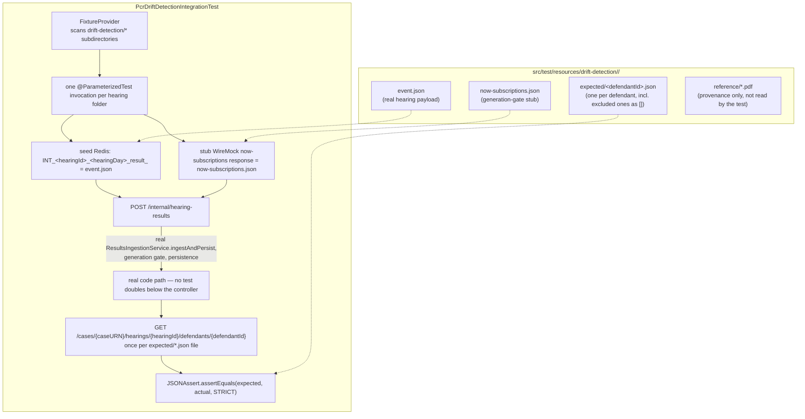

# PCR Drift Detection Integration Test Design

**Status:** Accepted, 31 Jul 2026.
**Jira:** AMP-898 — implement the drift-detection mechanism design doc §9 specified but never
built. See
[`docs/pipeline/adrs/008-AMP-898-pcr-drift-detection-integration-test.md`](../pipeline/adrs/008-AMP-898-pcr-drift-detection-integration-test.md)
for the decision this design doc drives.

**Scope:** wiring the first drift-detection fixture (`pcr-multiple-defendants-multiple-offences`)
into a reusable, parameterized integration test, per
[`2026-07-16-pcr-api-marketplace-design-v2.md`](2026-07-16-pcr-api-marketplace-design-v2.md) §9.
Does **not** change any production code — `ResultsIngestionService`, the generation gate, and
`PcrResultsMapper` are exercised as-is, not modified. Does not migrate the other existing unused
`pcr-*` fixture directories — that is future follow-on work using the same pattern.

---

## 1. Why this needs its own document

Design doc §9 fixed the *strategy* (drift-detection tests, historical hearings, before-launch +
nightly cadence) but not the *mechanism*: what the test class looks like, how fixtures are laid
out, how the diff is done, and how a fixture with fewer PDFs than defendants is handled. This
document fixes those, scoped to the first fixture being wired up.

---

## 2. Architecture



---

## 3. Fixture directory layout

```
src/test/resources/drift-detection/
  multiple-defendants-multiple-offences/
    event.json
    now-subscriptions.json
    expected/
      0f8306f4-b997-4d4c-81d6-999a646a7031.json   # MechTommie MachLarkin — def1 PDF
      dd34ddd7-4f06-4ba7-be69-ee242c0f97bc.json   # DroidAlan DotMacejkovic — def2 PDF
      9cd40664-9497-4334-8caf-bdf0ac44ac9f.json   # BobClint BotAufderhar — no PDF, expect []
    reference/
      multiple-defendants-multiple-offences-def1.pdf
      multiple-defendants-multiple-offences-def2.pdf
```

- `event.json` is a copy of the existing
  `src/test/resources/pcr-multiple-defendants-multiple-offences/multiple-defendants-multiple-offences.json`
  — same content, moved under the new fixture root so the whole hearing's test material lives in
  one folder.
- `now-subscriptions.json` — this hearing needs a subscription matching its actual vocabulary
  (in-custody, at-least-one-custodial-result — both def1's and def2's judicial results include a
  `postHearingCustodyStatus`/remand result). The existing shared fixture
  (`src/test/resources/referencedata/now-subscriptions-prison-court-register-fixture.json`) may
  already match; confirmed empirically when the test is written — copy it in as a per-fixture
  file regardless, so each fixture's generation-gate stub is self-contained and not silently
  coupled to a shared file another test could change independently.
- `reference/*.pdf` — copied from the existing `pcr-multiple-defendants-multiple-offences/`
  directory unchanged. Not read by any code; kept so a human re-verifying `expected/*.json` later
  has the original source at hand without digging through git history.

---

## 4. Test flow

`PcrDriftDetectionIntegrationTest extends IngestionE2ETestBase` (same base as
`HearingResultedIngestionE2EIntegrationTest` — real Postgres/Redis via
`PostgresInitialise`/`RedisInitialise`, `mockMvc` autoconfigured).

For each fixture folder, resolved via a `FixtureProvider` (`ArgumentsProvider`) that lists
`drift-detection/*` subdirectories on the classpath:

1. Parse `hearingId` (`hearing.id`), `hearingDay` (date portion of
   `hearing.hearingDays[0].sittingDay`), and `caseURN`
   (`hearing.prosecutionCases[0].prosecutionCaseIdentifier.caseURN`) out of `event.json`.
2. Stub the `now-subscriptions` WireMock endpoint with `now-subscriptions.json`.
3. Seed Redis at `INT_{hearingId}_{hearingDay}_result_` with `event.json`'s raw content.
4. POST the relayed Event Grid event wrapper (same shape as
   `src/test/resources/events/hearing-resulted-event.json`, formatted with the parsed
   `hearingId`/`hearingDay`) to `/internal/hearing-results`, assert `200`.
5. For every file under `expected/`, `GET
   /cases/{caseURN}/hearings/{hearingId}/defendants/{defendantId}` (defendantId = file's base
   name) and assert the response body equals that file's content via
   `JSONAssert.assertEquals(expectedJson, actualJson, JSONCompareMode.STRICT)`.

Step 5 covers both kinds of file transparently: a defendant with a real PDF has a non-empty
expected array; the excluded defendant's file is literally `[]`, and `GET /pcr` already returns
`200` with an empty array for "nothing recorded" (per this repo's settled no-404 design), so no
special-casing is needed in the test itself — the fixture data does the work.

---

## 5. Comparison mechanism

`org.skyscreamer.jsonassert.JSONAssert.assertEquals(expected, actual, JSONCompareMode.STRICT)` —
already available transitively via `spring-boot-starter-test`, no new dependency. `STRICT` mode
means every field and array element must match, in order, with nothing extra and nothing missing
— chosen because `PcrResultsMapper` (checked directly, see ADR-008) never surfaces any
DB-generated field (`cpVersionPk`, `eventId`, `createdAt`, `expiresAt`) into the response body, so
there is no volatile field that would need an ignore-list. On mismatch, `JSONAssert` reports the
exact path and both values, satisfying the "shows you exactly what's off" requirement directly.

---

## 6. First fixture: `multiple-defendants-multiple-offences`

Concrete facts, confirmed by reading `event.json` and both reference PDFs directly:

| Field | Value |
|---|---|
| `hearingId` | `f15a49db-812e-43d2-bfc5-7f3c7ee9ede1` |
| `hearingDay` | `2026-07-31` |
| `caseURN` | `AS231157673` |
| Court | `B52CM00` / Bristol Magistrates' Court |

Three defendants share this one case, two of them with a generated PDF:

| defendantId | Name | PDF? | Offences (code — title) |
|---|---|---|---|
| `0f8306f4-b997-4d4c-81d6-999a646a7031` | MechTommie MachLarkin | `def1.pdf` | `TH68013A` Attempt theft of motor vehicle; `CA03012` Possess/control TV set with intent... |
| `dd34ddd7-4f06-4ba7-be69-ee242c0f97bc` | DroidAlan DotMacejkovic | `def2.pdf` | `FS13012` Keep cooked/reheated food below 63°C; `BC90005` Offer to supply a foreign satellite programme |
| `9cd40664-9497-4334-8caf-bdf0ac44ac9f` | BobClint BotAufderhar | **none** | `RC86851` Vehicle defect; `TH68023` Robbery |

The third defendant's absent PDF is the concrete case the "excluded defendant asserts `[]`" rule
(§4/ADR-008) exists for — this fixture is exactly where that rule first gets exercised, not a
hypothetical.

Both PDFs show a `Result text` of `RI - Remanded in custody` on every offence, despite the
header field `Post-hearing custody status: Not Applicable` — the header field and the per-offence
result text are two different data points (case-level custody flag vs. this specific result's
custody status) and both need to be checked independently against the mapped `CustodyLocation`/
`JudicialResult.postHearingCustodyStatus` fields when `expected/*.json` is authored — don't assume
one implies the other.

---

## 7. Testing approach

| Component | Test approach |
|---|---|
| `PcrDriftDetectionIntegrationTest` | New `@ParameterizedTest`, `IngestionE2ETestBase` subclass — real Postgres/Redis, WireMock for `now-subscriptions` only |
| `FixtureProvider` | Plain unit test (no Spring context) asserting it discovers all subdirectories under `drift-detection/` |
| `expected/*.json` authoring | Not test code — a one-time manual step per fixture: run the real ingestion once, capture the actual `GET /pcr` response, verify every value against the archived PDF, save as the expected file |

Runs in the existing `src/test` suite (`./gradlew test`), against `docker compose up -d postgres
redis` — no new `apiTest`/docker-compose project, matching design doc §9's cadence (one-time
before-launch check, then nightly after launch) with the CI wiring this repo already has.

---

## 8. Open items — not resolved here

- **Migrating the other existing unused `pcr-*` fixture directories** into `drift-detection/` —
  deliberately out of scope; this document only wires up the first one. Each future migration
  follows §3/§4 unchanged.
- **Nightly scheduled run** — design doc §9's "after launch: nightly" cadence needs a CI schedule
  entry once this test exists; not addressed by this document, which only covers the test itself.
- **`now-subscriptions.json`'s exact content for this fixture** — §3 assumes the existing shared
  fixture matches this hearing's vocabulary; confirmed empirically when the test is implemented,
  not guaranteed here.