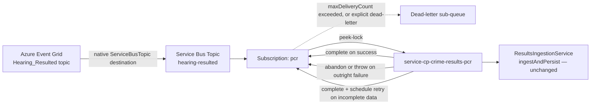
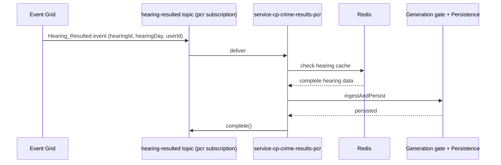
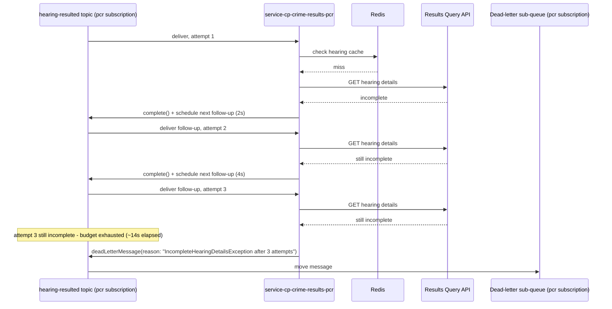
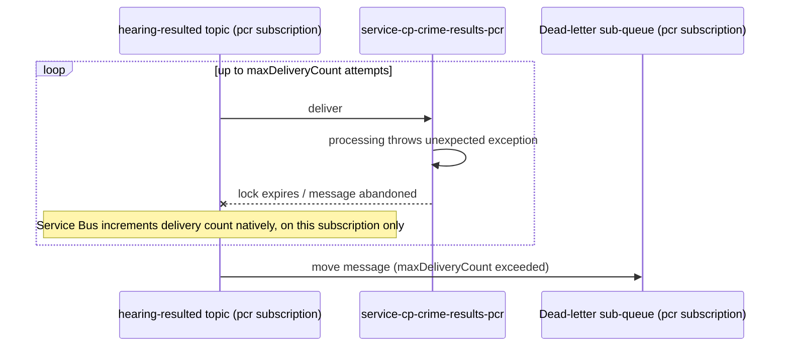

# PCR Event Grid → Service Bus Ingestion Design

**Status:** Agreed, 20 Aug 2026.
**ADR:** [009-AMP-1030](../pipeline/adrs/009-AMP-1030-pcr-eventgrid-servicebus-topic-ingestion.md) — Accepted.

**Context:** `pcr-eventgrid-relay-function` (the Function App relaying `Hearing_Resulted` to
`/internal/hearing-results`) is being retired. This document replaces it: Event Grid delivers
directly to a Service Bus **Topic**, `hearing-resulted`, consumed via this service's own
`pcr` Subscription.

**Cutover is staged, not immediate** — `pcr-eventgrid-relay-function` stays live in production
through the coming release; the Service Bus path is built and proven in parallel, behind a switch,
before either environment cuts over.

**Headline decisions:**

- **One Service Bus Topic**, `hearing-resulted`, with PCR's own `pcr` Subscription.
- **Payload unchanged:** `hearingId`, `hearingDay`, `userId` — the same
  `HearingResultedWebhookEventData` fields the relay already forwards. No new shared key.

---

## 1. Retry mechanism

**Native `maxDeliveryCount` + dead-lettering.** Event Grid delivers straight to the
`hearing-resulted` topic — no relay code in between. PCR's `pcr` subscription:

- Receives via **peek-lock**.
- `complete()` on success.
- Throws / lets the lock expire on failure → Service Bus redelivers natively, no app code
  involved.
- `maxDeliveryCount` exceeded → auto-moved to the subscription's own dead-letter sub-queue
  (durable, queryable — not silently lost).

---

## 2. Proposed architecture

One of three outcomes per message, all handled on the one `pcr` subscription:

1. **Success** — hearing data complete, PCR persisted it. `complete()`.
2. **Outright failure** — unexpected break. Consumer abandons; native redelivery retries,
   then dead-letters once `maxDeliveryCount` is exceeded.
3. **Incomplete data** — not ready yet. Consumer completes the message and schedules a
   follow-up.

Scoped to the ingress/trigger mechanism only — generation gate, persistence, `GET /pcr`, and the
public contract are unaffected.

### 2.1 Security

- Event Grid → Service Bus: a system-assigned managed identity on the Event Grid subscription,
  granted `Azure Service Bus Data Sender` on `hearing-resulted`.
- Service Bus access via Managed Identity.

### 2.2 Provisioning

**Event Grid's own event subscription** (routing `Hearing_Resulted` → this Service Bus topic) is a
separate resource, provisioned via **Terraform** (IaC).

**Service Bus topic & subscription:** created via idempotent create-if-not-exists at startup
(`createTopicIfNotExists`/`createSubscriptionIfNotExists`), not Terraform/Bicep. Uses the existing
shared per-environment Service Bus namespace.

| Property | Value for `pcr` | Why |
| --- | --- | --- |
| Receive mode | Peek-lock (client-side, not a subscription property) | Required for at-least-once delivery and for `maxDeliveryCount`/dead-lettering to apply |
| `LockDuration` | `PT1M` (capped `PT5M`) | Only needs to cover one completeness check |
| `MaxDeliveryCount` | Explicit, no deliberate delayed first retry (immediate-until-exhausted) | Bounds the outright-failure tier — further retry-timing tuning is separate follow-up work |
| `DefaultMessageTimeToLive` | Explicit, generously longer than ~14s + processing time | Avoids a message silently expiring before completion |
| `DeadLetteringOnMessageExpiration` | `true` | Without it an expired message is deleted with no trace |

**Completeness retry mechanism** — relocates `ResultsIngestionService`'s existing 2s/4s/8s schedule
off the consumer thread, unchanged in shape:

- On an incomplete result: `complete()` the message, then publish one scheduled follow-up
  (`ScheduledEnqueueTimeUtc`), carrying the attempt count as an application property.
- After the 3rd attempt: dead-letter explicitly via `deadLetterMessage(reason, description)` — e.g.
  `"IncompleteHearingDetailsException after 3 attempts"` — clearly flagged, not an unexplained
  generic dead-letter.

### 2.3 Local dev / test story

Matches this repo's real-infrastructure testing convention (`PostgresInitialise`, `docker-compose`
Redis) — same discipline for Service Bus: **the official Azure Service Bus emulator**, run via
`docker-compose`, not a shared dev namespace/topic.

---

## 3. Sequence diagrams

### 3.1 Happy path — Redis cache hit

### 3.2 Completeness retry, then success

### 3.3 Completeness retries exhausted — explicit dead-letter

### 3.4 Outright processing failure — native redelivery exhausts `maxDeliveryCount`

---

## 4. Migration outline

1. Provision the topic, subscription, and Event Grid event subscription (§2.2) — both channels now
   receive events in parallel.
2. Deploy the Service Bus consumer behind a switch, off by default in every environment.
3. Enable the switch in lower environments only to validate end-to-end — never both channels active
   in the same environment.
4. Once proven, flip the switch in all env's, disabling the relay function at the same
   time.
5. Decommission `pcr-eventgrid-relay-function` and its Event Grid webhook subscription;
   `/internal/hearing-results` retires with it.