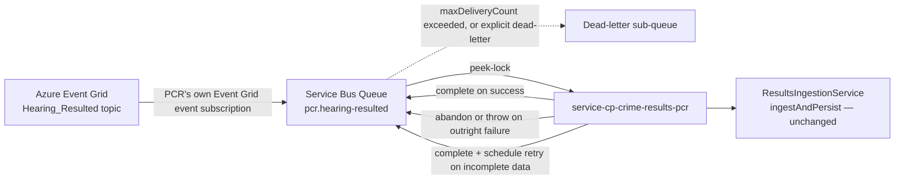
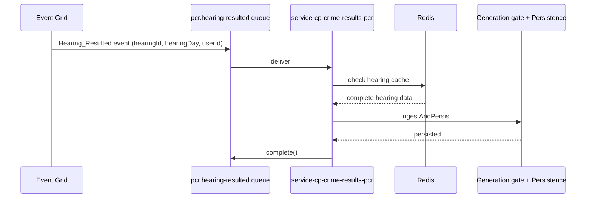
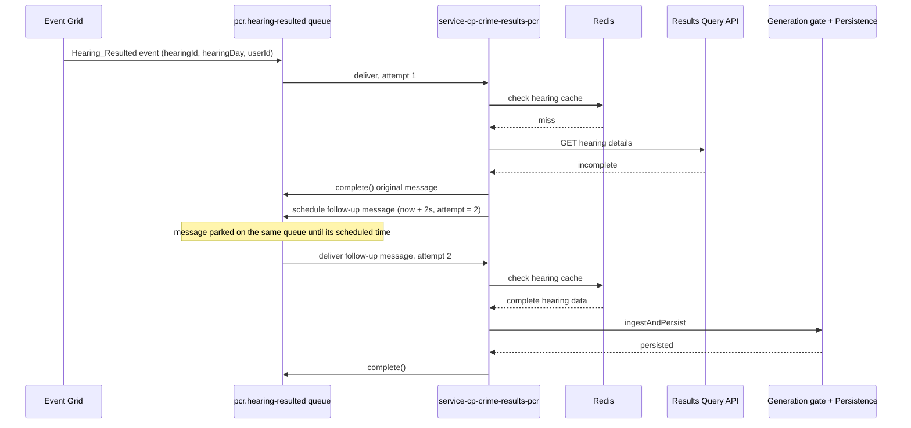
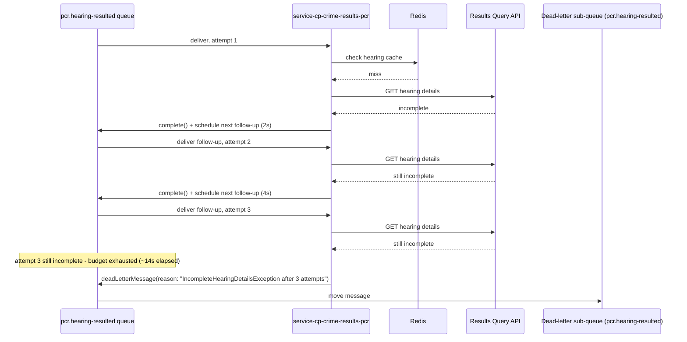
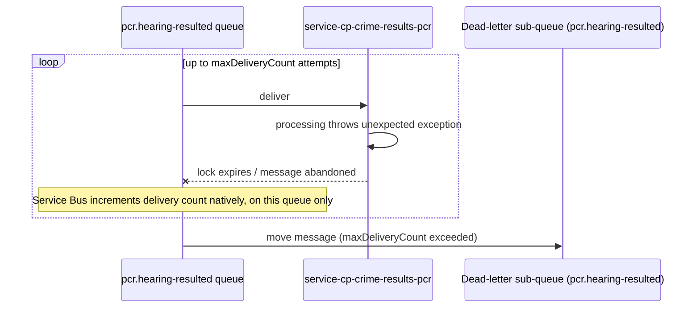

# PCR Event Grid → Service Bus Ingestion Design

**Status:** Agreed, 25 Aug 2026.
**ADR:** [009-AMP-1030](../pipeline/adrs/009-AMP-1030-pcr-eventgrid-servicebus-queue-ingestion.md) — Accepted.

**Context:** `pcr-eventgrid-relay-function` (the Function App relaying `Hearing_Resulted` to
`/internal/hearing-results`) is being retired. This document replaces it: Event Grid delivers
directly to a Service Bus **Queue** owned solely by this service, `pcr.hearing-resulted`, via its
own independent Event Grid event subscription.

**Cutover is staged, not immediate** — `pcr-eventgrid-relay-function` stays live in production
through the coming release; the Service Bus path is built and proven in parallel, behind a switch,
before either environment cuts over.

**Headline decisions:**

- **One dedicated Service Bus Queue per consuming service.** PCR owns `pcr.hearing-resulted`
  outright; NOW will own its own separate queue when built. No Service Bus resource is shared
  between them.
- **Each queue is fed by its own independent Event Grid event subscription** off the same
  `Hearing_Resulted` source event — Event Grid's native support for multiple event subscriptions
  provides the fan-out.
- **Payload unchanged:** `hearingId`, `hearingDay`, `userId` — the same
  `HearingResultedWebhookEventData` fields the relay already forwards. No new shared key.

---

## 1. Retry mechanism

**Native `maxDeliveryCount` + dead-lettering.** Event Grid delivers straight to PCR's own
`pcr.hearing-resulted` queue — no relay code in between. PCR:

- Receives via **peek-lock**.
- `complete()` on success.
- Throws / lets the lock expire on failure → Service Bus redelivers natively, no app code
  involved.
- `maxDeliveryCount` exceeded → auto-moved to the queue's own dead-letter sub-queue (durable,
  queryable — not silently lost).

---

## 2. Proposed architecture

NOW's own queue and Event Grid event subscription, when built, are entirely separate resources
provisioned on its own timeline — nothing here depends on or coordinates with PCR's.

One of three outcomes per message, all handled on PCR's own queue:

1. **Success** — hearing data complete, PCR persisted it. `complete()`.
2. **Outright failure** — unexpected break. Consumer abandons; native redelivery retries,
   then dead-letters once `maxDeliveryCount` is exceeded.
3. **Incomplete data** — not ready yet. Consumer completes the message and schedules a
   follow-up.

Scoped to the ingress/trigger mechanism only — generation gate, persistence, `GET /pcr`, and the
public contract are unaffected.

### 2.1 Security

- Event Grid → Service Bus: a system-assigned managed identity on PCR's own Event Grid event
  subscription, granted `Azure Service Bus Data Sender` on `pcr.hearing-resulted`.
- Service Bus access via Managed Identity.

### 2.2 Provisioning

**Both the Event Grid event subscription and the Service Bus queue are provisioned via
Terraform** (IaC). The app never creates the queue itself — at startup it only verifies the queue
exists (`ServiceBusProvisioningService.queueExists`) and fails startup if it doesn't, naming
Terraform as the expected owner. Uses the existing shared per-environment Service Bus namespace —
only the queue itself belongs solely to PCR, not the namespace.

| Property | Value for `pcr.hearing-resulted` | Why |
| --- | --- | --- |
| Receive mode | Peek-lock (client-side, not a queue property) | Required for at-least-once delivery and for `maxDeliveryCount`/dead-lettering to apply |
| `LockDuration` | `PT1M` (capped `PT5M`) | Only needs to cover one completeness check |
| `MaxDeliveryCount` | Explicit, no deliberate delayed first retry (immediate-until-exhausted) | Bounds the outright-failure tier — further retry-timing tuning is separate follow-up work |
| `DefaultMessageTimeToLive` | Explicit, generously longer than ~14s + processing time | Avoids a message silently expiring before completion |
| `DeadLetteringOnMessageExpiration` | `true` | Without it an expired message is deleted with no trace |

**Completeness retry mechanism** — relocates `ResultsIngestionService`'s existing 2s/4s/8s schedule
off the consumer thread, unchanged in shape:

- On an incomplete result: `complete()` the message, then publish one scheduled follow-up
  (`ScheduledEnqueueTimeUtc`), carrying the attempt count as an application property.
- After the 3rd attempt: dead-letter explicitly via `deadLetterMessage(reason, description)` — e.g.
  `"IncompleteHearingDetailsException after 3 attempts"` — clearly flagged, not an unexplained
  generic dead-letter.

### 2.3 Local dev / test story

Matches this repo's real-infrastructure testing convention (`PostgresInitialise`, `docker-compose`
Redis) — same discipline for Service Bus: **the official Azure Service Bus emulator**, run via
`docker-compose`, provisioning the same `pcr.hearing-resulted` queue as production.

---

## 3. Sequence diagrams

### 3.1 Happy path — Redis cache hit

### 3.2 Completeness retry, then success

### 3.3 Completeness retries exhausted — explicit dead-letter

### 3.4 Outright processing failure — native redelivery exhausts `maxDeliveryCount`

### 3.5 Dead-letter retention

Azure Service Bus does not expire dead-lettered messages on its own — without an explicit purge
they sit in the DLQ indefinitely. `DeadLetterPurgeService` runs a daily scheduled job
(`dead-letter.purge.cron`, default `0 0 3 * * *`) that removes anything older than
`dead-letter.purge.retention-days` (default `30`), mirroring
service-cp-crime-hearing-results-document-subscription's own `DeadLetterPurgeService` exactly —
same receive/complete/abandon-by-age mechanism, same defaults.

**Purges blindly by age, with no "reviewed" check** — same as HRDS. A message that dead-letters
and is never looked at is gone after the retention window regardless. This was raised as an open
question in an earlier draft of this document (whether purge should require an explicit
resolved/accepted marker first, to avoid silently losing an unreviewed failure) — resolved in
favour of mirroring HRDS's existing, already-proven pattern rather than introducing a new
tracking mechanism.

---

## 4. Migration outline

1. Provision PCR's own queue and its own Event Grid event subscription (§2.2) — both channels now
   receive events in parallel. NOW provisions its own queue and event subscription independently,
   on its own timeline — no coordination with PCR needed.
2. Deploy the Service Bus consumer behind a switch, off by default in every environment.
3. Enable the switch in lower environments only to validate end-to-end — never both channels active
   in the same environment.
4. Once proven, flip the switch in all env's, disabling the relay function at the same
   time.
5. Decommission `pcr-eventgrid-relay-function` and its Event Grid webhook subscription;
   `/internal/hearing-results` retires with it.
